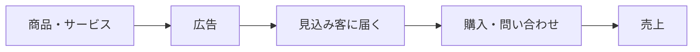
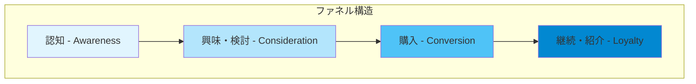
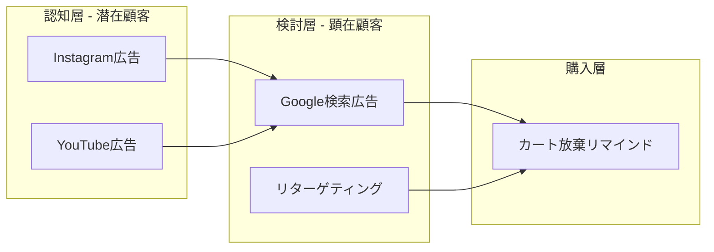
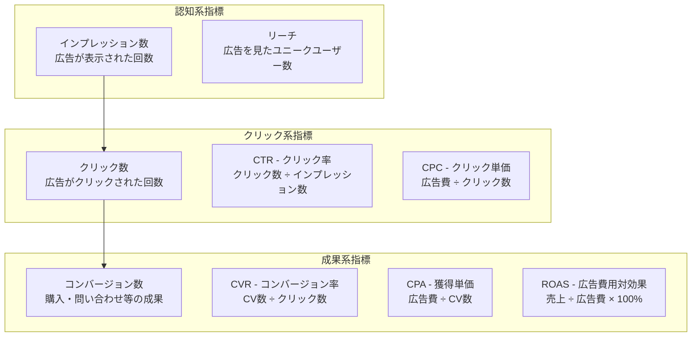
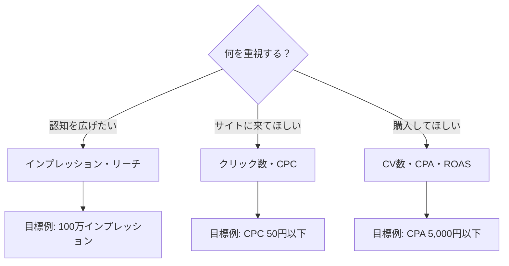
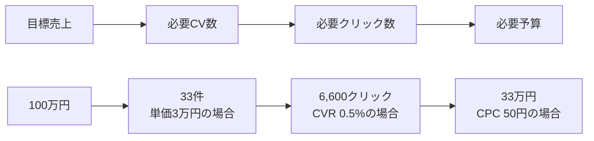
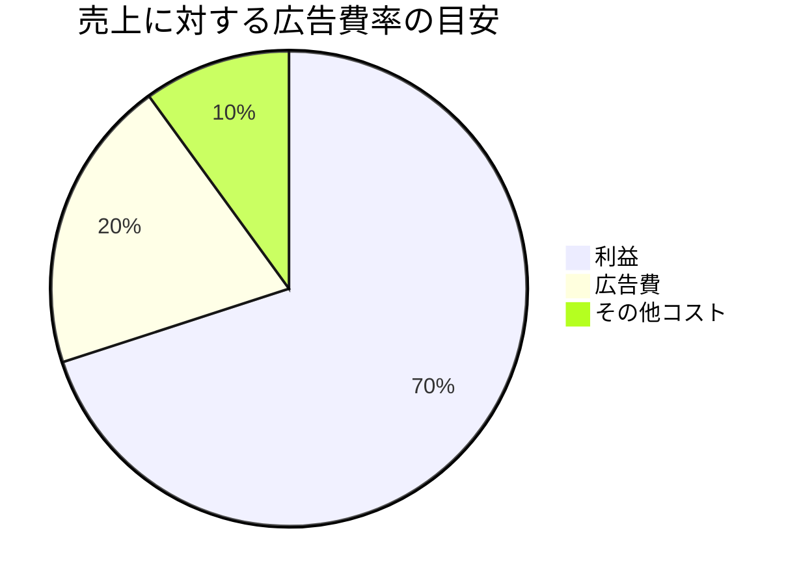
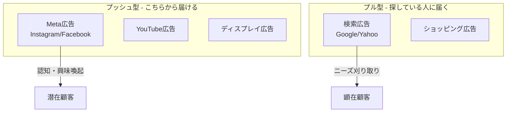
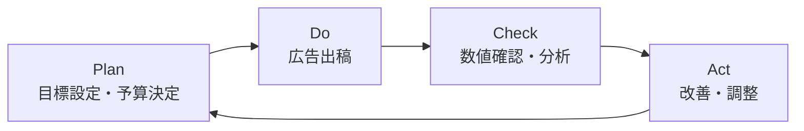
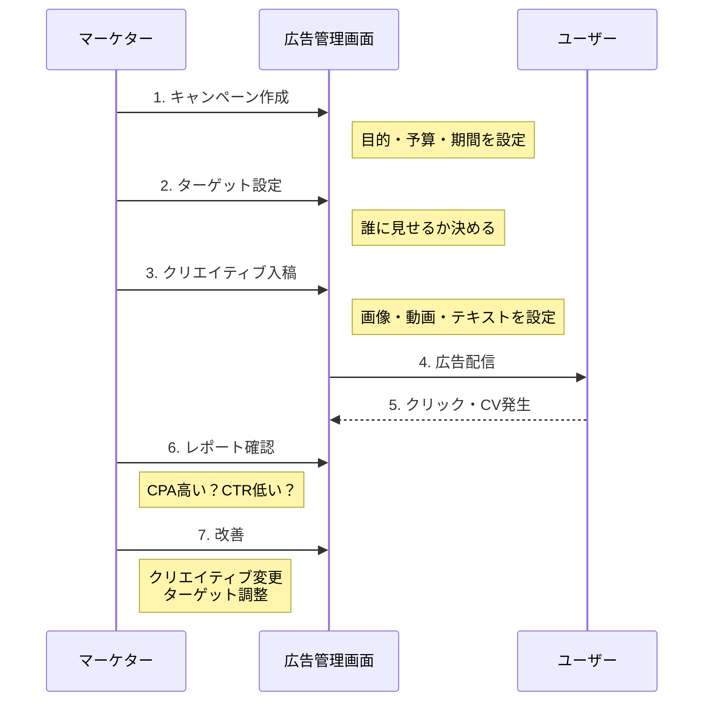

# 広告の基礎

広告運用を理解するための基本概念をまとめる。

---

## 1. なぜ広告を出すのか

### 広告の役割

**広告 = お金を払って、見込み客に自社を知ってもらう手段**

### ACRIQUEの場合

| 状況 | 課題 |
|------|------|
| 新規ブランド | 誰も「ACRIQUE」を知らない |
| 高単価商品 | 衝動買いされにくい |
| BtoB寄り | 店舗オーナーに届けたい |

→ **広告で「存在を知らせる」→「興味を持たせる」→「購入させる」** が必要

---

## 2. マーケティングファネル

「ファネル」= 漏斗（じょうご）。上から下に進むほど人数が減る。

### 各段階の説明

| 段階 | 状態 | 例（ACRIQUE） |
|------|------|---------------|
| **認知** | 存在を知る | 「アクリルで高級感出せるんだ」 |
| **検討** | 比較・調査 | 「他社と何が違う？」「価格は？」 |
| **購入** | 買う | カートに入れて決済 |
| **継続** | リピート・紹介 | 「また頼もう」「友人に勧めよう」 |

### ファネルと広告の関係

| ファネル段階 | 適した広告 | ACRIQUEでの使い方 |
|-------------|-----------|------------------|
| 認知 | Meta広告（Instagram/Facebook） | 「1cmの厚み」の映像で衝撃を与える |
| 検討 | Google検索広告 | 「アクリル オーダー 高級」で検索した人を獲得 |
| 購入 | リターゲティング | サイト訪問者に再アプローチ |

---

## 3. 広告の基本指標（KPI）

### 指標一覧

### 指標の計算例

**シナリオ**: 広告費10万円で運用した結果

| 指標 | 値 | 計算式 |
|------|-----|--------|
| インプレッション | 100,000回 | - |
| クリック数 | 2,000回 | - |
| CTR | 2% | 2,000 ÷ 100,000 |
| CPC | 50円 | 100,000円 ÷ 2,000 |
| コンバージョン | 10件 | - |
| CVR | 0.5% | 10 ÷ 2,000 |
| CPA | 10,000円 | 100,000円 ÷ 10 |
| 売上 | 300,000円 | 単価30,000円 × 10件 |
| ROAS | 300% | 300,000円 ÷ 100,000円 |

### 重要な指標の使い分け

---

## 4. 広告費の考え方

### 予算設定の基本

### 逆算の例（ACRIQUE）

| 項目 | 値 | 備考 |
|------|-----|------|
| 目標月商 | 100万円 | |
| 平均単価 | 30,000円 | |
| 必要CV数 | 34件 | 100万 ÷ 3万 |
| 想定CVR | 1% | サイト来訪者の1%が購入 |
| 必要クリック数 | 3,400回 | 34 ÷ 1% |
| 想定CPC | 100円 | |
| **必要広告費** | **34万円** | 3,400 × 100円 |

### 広告費率の目安

一般的な目安：**売上の10〜30%** が広告費

---

## 5. 広告の種類

### プラットフォーム別の特徴

### ACRIQUEでの使い分け

| 広告種類 | 用途 | 具体例 |
|---------|------|--------|
| **Meta広告** | 視覚的インパクトで認知拡大 | 1cmの厚みを見せる動画 |
| **Google検索** | 検索ニーズの獲得 | 「アクリル板 高級 オーダー」 |

---

## 6. 運用の流れ

### 一般的なPDCAサイクル

### 具体的な運用作業

---

## 7. まとめ

### 覚えておくべき3つのこと

1. **ファネルで考える**
   - 認知 → 検討 → 購入 の流れを意識
   - 段階ごとに適した広告がある

2. **数字で判断する**
   - CTR、CPC、CVR、CPA、ROAS
   - 感覚ではなくデータで改善

3. **目標から逆算する**
   - 売上目標 → 必要CV → 必要予算
   - 闇雲に出すのではなく計画的に

### 次のステップ

- [02-Meta広告の手順](./02-Meta広告の手順.md) - Instagram/Facebook広告の具体的な出し方
- [03-Google広告の手順](./03-Google広告の手順.md) - 検索広告の具体的な出し方
