# Meta広告の手順

Instagram / Facebook に広告を出す具体的な手順を解説する。

---

## 1. Meta広告とは

### 配信先

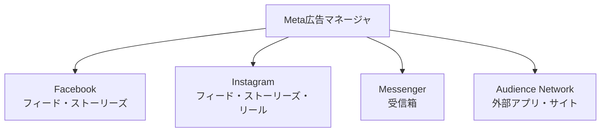

**1つの管理画面から4つの配信先に広告を出せる**

### ACRIQUEでの活用

| 配信先 | 用途 |
|--------|------|
| **Instagram** | メイン。ビジュアル訴求に最適 |
| Facebook | サブ。年齢層高めの経営者向け |
| Messenger | 使わない |
| Audience Network | 使わない（品質管理が難しい） |

---

## 2. アカウント構造

### 3層構造

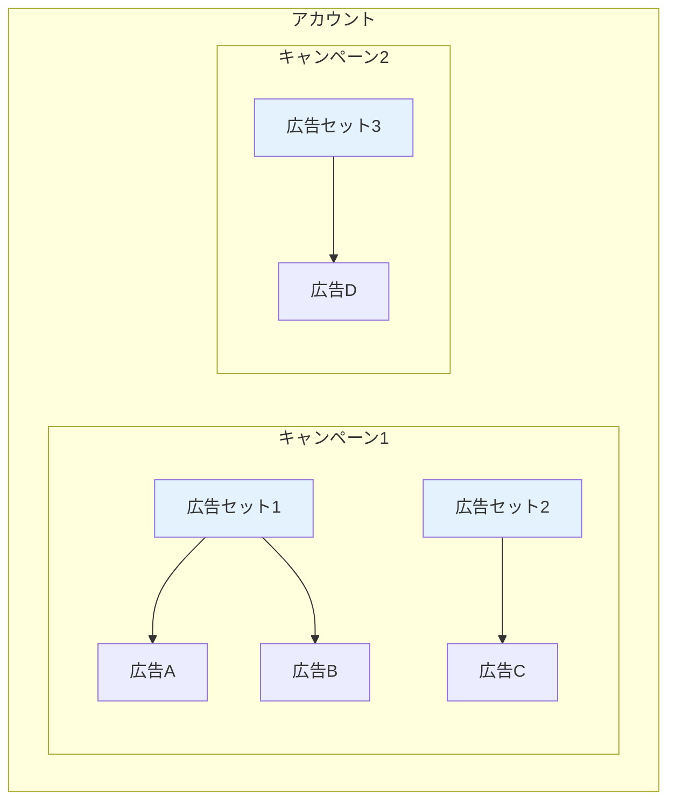

### 各層で設定すること

| 層 | 設定項目 | 具体例 |
|----|---------|--------|
| **キャンペーン** | 目的・全体予算 | 「コンバージョン獲得」「月30万円」 |
| **広告セット** | ターゲット・配置・予算・スケジュール | 「30-50歳女性」「Instagram」「日1万円」 |
| **広告** | クリエイティブ・テキスト・リンク | 画像、「1cmの厚みが〜」、ECサイトURL |

### 命名規則の例

```
キャンペーン: CV_ACRIQUE_ブランド認知_2025Q1
広告セット:  30-50歳_女性_興味インテリア
広告:        動画A_1cmの厚み訴求
```

---

## 3. 出稿手順

### 全体フロー

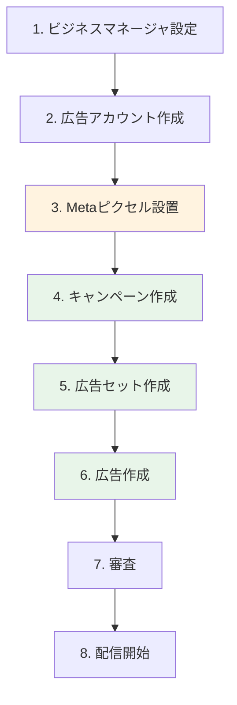

---

### Step 1: ビジネスマネージャ設定

**やること**: 会社としてのMeta広告アカウントを作る

```
URL: business.facebook.com
```

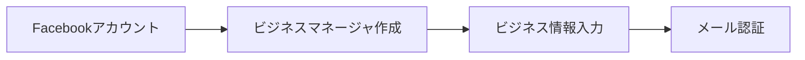

| 入力項目 | 例 |
|---------|-----|
| ビジネス名 | 株式会社グーナ |
| メールアドレス | ads@ghoona.co.jp |
| ビジネスの住所 | 東京都... |

---

### Step 2: 広告アカウント作成

**やること**: 実際に広告を出す「財布」を作る

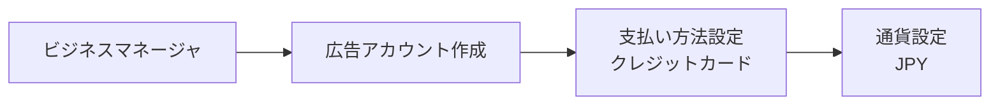

| 設定項目 | 推奨 |
|---------|------|
| アカウント名 | ACRIQUE_広告 |
| タイムゾーン | 日本時間 |
| 通貨 | JPY（日本円） |

---

### Step 3: Metaピクセル設置

**やること**: サイト訪問者を追跡するコードを埋め込む

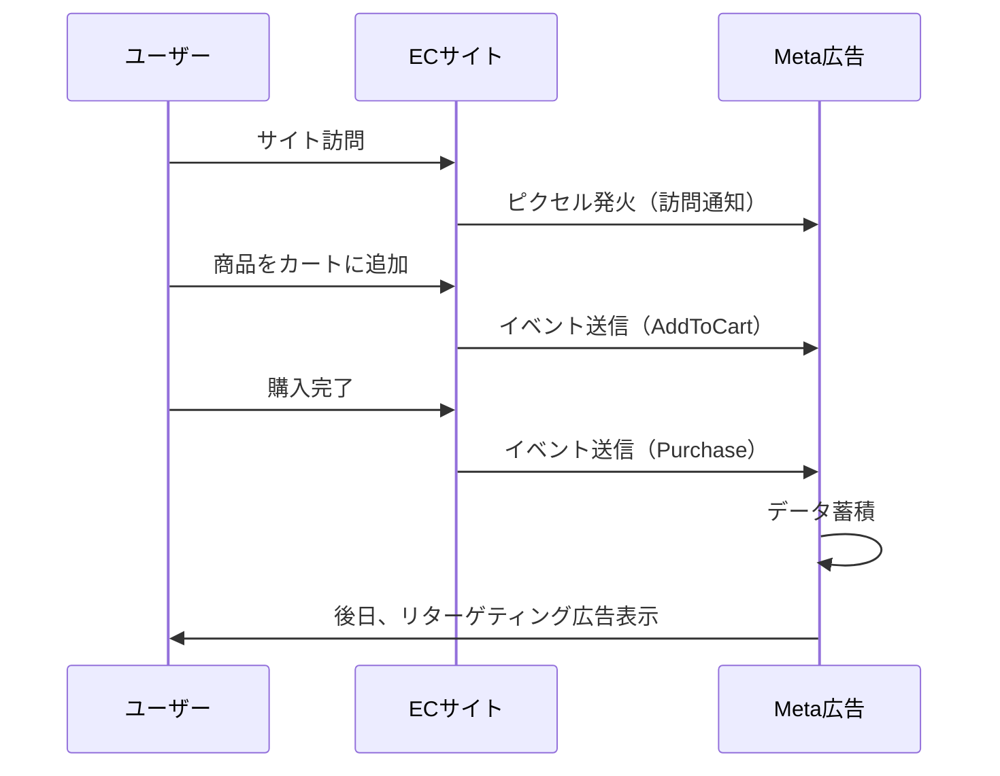

#### 標準イベント一覧

| イベント名 | 発火タイミング | 用途 |
|-----------|--------------|------|
| `PageView` | ページ閲覧 | 訪問者数計測 |
| `ViewContent` | 商品詳細閲覧 | 興味度計測 |
| `AddToCart` | カート追加 | 購入意欲の高いユーザー特定 |
| `InitiateCheckout` | 決済開始 | カート放棄の検知 |
| `Purchase` | 購入完了 | **コンバージョン計測**（最重要） |

#### 設置方法

```html
<!-- Metaピクセル基本コード（<head>内に設置） -->
<script>
!function(f,b,e,v,n,t,s)
{if(f.fbq)return;n=f.fbq=function(){n.callMethod?
n.callMethod.apply(n,arguments):n.queue.push(arguments)};
if(!f._fbq)f._fbq=n;n.push=n;n.loaded=!0;n.version='2.0';
n.queue=[];t=b.createElement(e);t.async=!0;
t.src=v;s=b.getElementsByTagName(e)[0];
s.parentNode.insertBefore(t,s)}(window, document,'script',
'https://connect.facebook.net/en_US/fbevents.js');
fbq('init', 'YOUR_PIXEL_ID');
fbq('track', 'PageView');
</script>
```

```javascript
// 購入完了時（サンクスページで発火）
fbq('track', 'Purchase', {
  value: 30000,        // 購入金額
  currency: 'JPY'
});
```

---

### Step 4: キャンペーン作成

**やること**: 広告の「目的」を決める

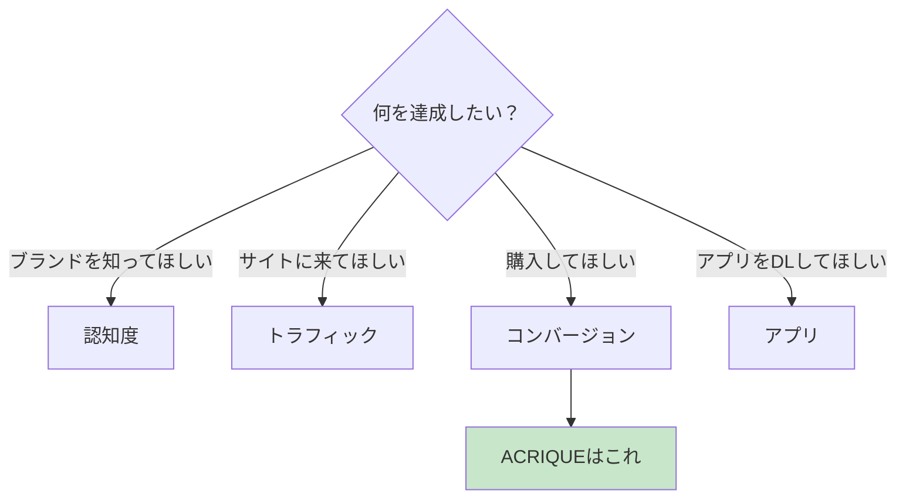

#### 管理画面での操作

```
広告マネージャ → [+作成] → キャンペーン目的を選択
```

| 選択肢 | 説明 | ACRIQUE |
|--------|------|---------|
| 認知度 | 多くの人に見せる | △ 初期は使う |
| トラフィック | サイト訪問を増やす | △ |
| エンゲージメント | いいね・コメントを増やす | × |
| リード | 問い合わせを増やす | △ BtoB用 |
| アプリの宣伝 | アプリDL | × |
| **売上** | 購入を増やす | **◎ メイン** |

#### 予算設定

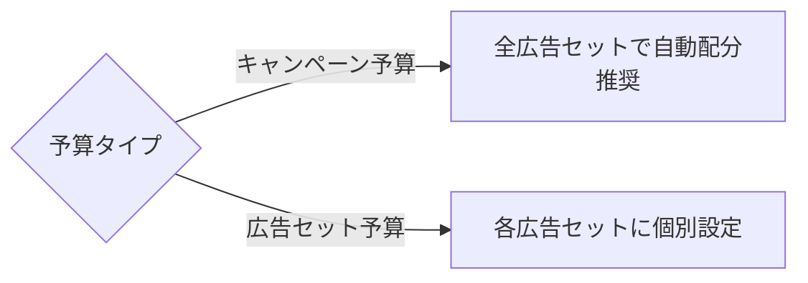

| 設定 | 推奨値（初期） |
|------|--------------|
| 1日の予算 | 3,000〜10,000円 |
| 通算予算 | 月10〜30万円 |

---

### Step 5: 広告セット作成

**やること**: 「誰に」「いつ」「どこで」見せるか決める

#### ターゲティング設定

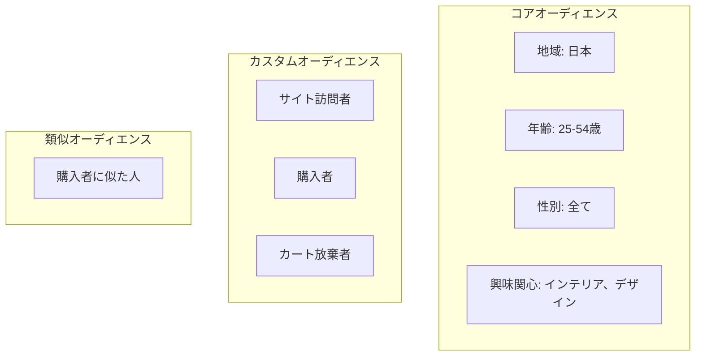

#### ACRIQUEのターゲット例

| ターゲット名 | 設定内容 |
|-------------|---------|
| **店舗オーナー** | 興味: 小売、店舗経営、ビジネス |
| **推し活層** | 興味: アイドル、アニメ、コレクション |
| **インテリア好き** | 興味: インテリアデザイン、北欧家具 |
| **リターゲティング** | 過去30日のサイト訪問者 |

#### 配置設定

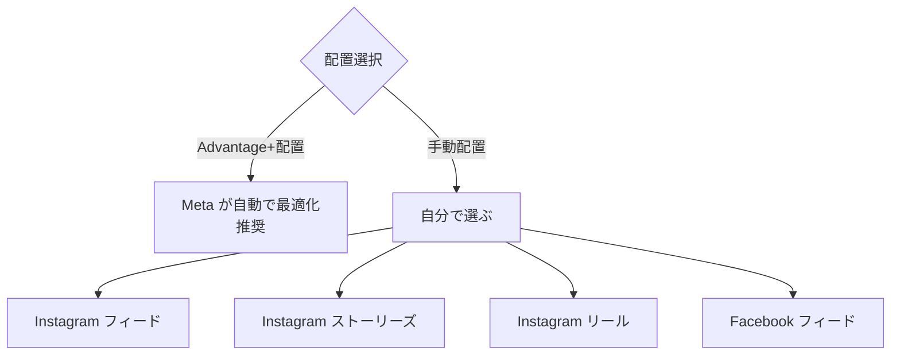

| 配置 | 特徴 | ACRIQUE向き |
|------|------|------------|
| Instagramフィード | じっくり見てもらえる | ◎ |
| Instagramストーリーズ | 全画面で没入感 | ◎ |
| Instagramリール | 動画で訴求 | ◎ |
| Facebookフィード | 年齢層高め | ○ |

---

### Step 6: 広告作成

**やること**: 実際に表示する画像・動画・テキストを設定

#### クリエイティブの種類

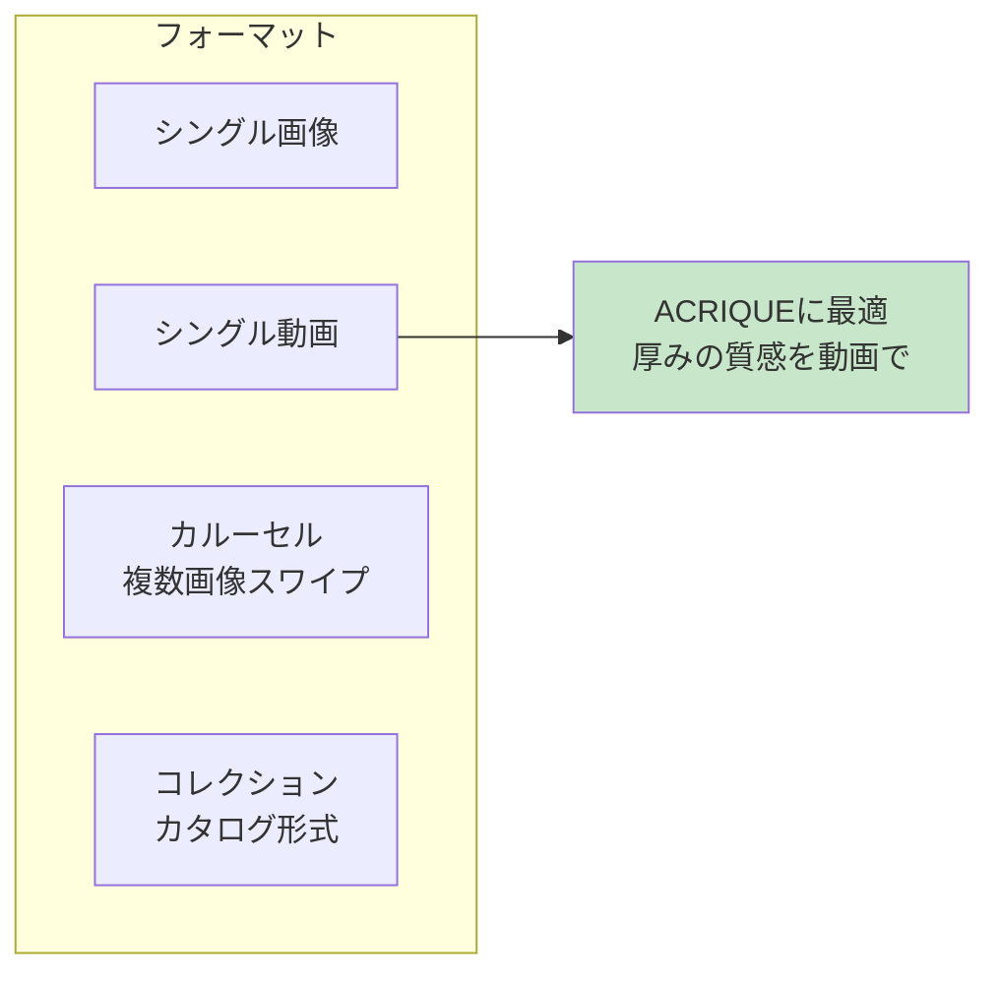

#### 入力項目

| 項目 | 説明 | ACRIQUE例 |
|------|------|----------|
| メディア | 画像 or 動画 | 1cmアクリルの動画 |
| メインテキスト | 投稿本文 | 「プロが選ぶ、1cmの存在感。」 |
| 見出し | 太字タイトル | 高級アクリル専門店 ACRIQUE |
| 説明 | 補足テキスト | 店舗什器からコレクションケースまで |
| CTA | ボタン文言 | 「詳しくはこちら」「購入する」 |
| リンク先URL | 遷移先 | https://acrique.jp/products/xxx |

#### クリエイティブの推奨サイズ

| 配置 | アスペクト比 | サイズ |
|------|------------|--------|
| フィード | 1:1 | 1080×1080px |
| ストーリーズ/リール | 9:16 | 1080×1920px |
| 動画の長さ | - | 15秒以内推奨 |

---

### Step 7-8: 審査と配信開始

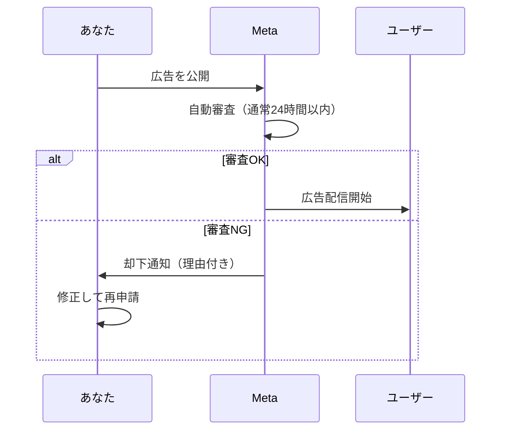

#### よくある審査落ちの理由

| 理由 | 対策 |
|------|------|
| テキストが画像の20%以上 | 文字を減らす |
| 誇大広告（「絶対」「100%」） | 表現を控えめに |
| ビフォーアフター | 使用しない |
| 個人を特定する表現 | 「あなたは〇〇ですか？」を避ける |

---

## 4. 運用中の確認ポイント

### 管理画面で見る指標

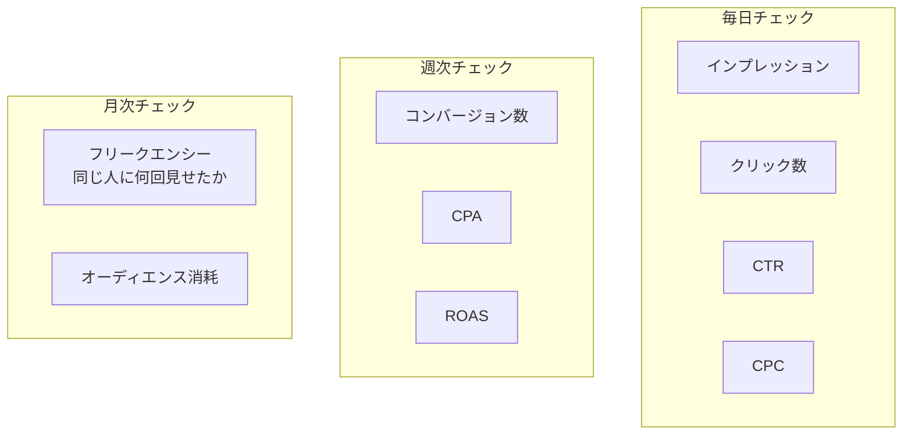

### 改善アクション

| 状況 | 原因 | アクション |
|------|------|-----------|
| CTR低い（1%未満） | クリエイティブが弱い | 画像/動画を変更 |
| CPC高い（200円以上） | 競合が多い/ターゲット狭い | ターゲット拡大 |
| CVR低い（0.5%未満） | LP（着地ページ）が弱い | LP改善 |
| CPA高い | 上記全て | 総合的に見直し |
| フリークエンシー高い（5以上） | 同じ人に見せすぎ | オーディエンス変更 |

---

## 5. ACRIQUEの広告設定例

### キャンペーン構成案

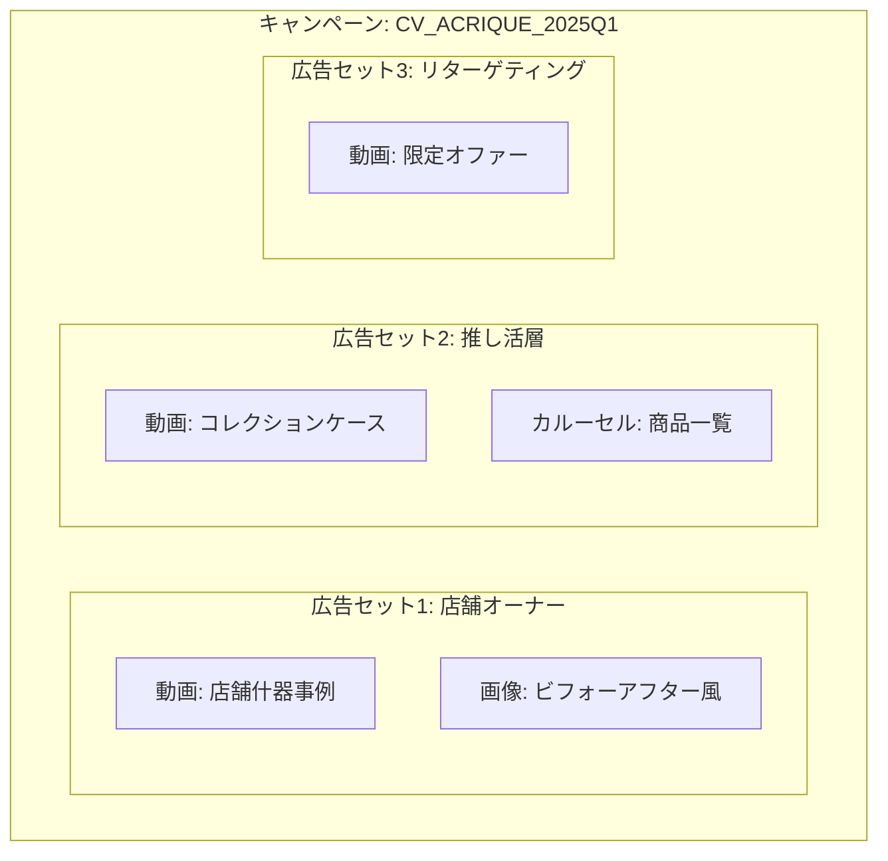

### 初期設定の数値目標

| 指標 | 目標値 |
|------|--------|
| 日予算 | 5,000円 |
| CTR | 1%以上 |
| CPC | 100円以下 |
| CVR | 1%以上 |
| CPA | 10,000円以下 |

---

## 6. まとめ

### 出稿チェックリスト

- [ ] ビジネスマネージャ設定済み
- [ ] 広告アカウント作成済み
- [ ] Metaピクセル設置済み
- [ ] コンバージョンイベント設定済み（Purchase）
- [ ] キャンペーン目的 = 売上
- [ ] ターゲット設定済み
- [ ] クリエイティブ準備済み（画像/動画）
- [ ] 審査通過
- [ ] 配信開始

### 次のステップ

- [01-広告の基礎](./01-広告の基礎.md) - 基本概念に戻る
- [03-Google広告の手順](./03-Google広告の手順.md) - 検索広告の出し方
