# Google広告の手順

Google検索結果に広告を出す（リスティング広告）具体的な手順を解説する。

---

## 1. Google広告とは

### 広告の種類

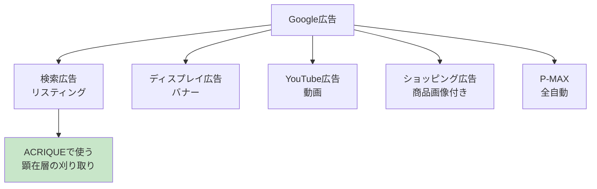

### 検索広告の表示位置

```
┌─────────────────────────────────────┐
│  Google 検索: アクリル板 オーダー 高級  │
├─────────────────────────────────────┤
│  [広告] ACRIQUE - 高級アクリル専門店   │  ← 検索広告（上部）
│  1cmの厚みが生む、圧倒的な存在感。     │
│  https://acrique.jp                  │
├─────────────────────────────────────┤
│  [広告] 競合A - アクリル板通販         │
├─────────────────────────────────────┤
│  自然検索結果1                        │  ← SEO（無料）
│  自然検索結果2                        │
│  ...                                 │
├─────────────────────────────────────┤
│  [広告] 競合B                         │  ← 検索広告（下部）
└─────────────────────────────────────┘
```

### Meta広告との違い

| 項目 | Meta広告 | Google検索広告 |
|------|---------|---------------|
| 表示タイミング | SNS閲覧中 | 検索した時 |
| ユーザーの状態 | 「なんとなく見てる」 | 「探してる」 |
| 訴求方法 | ビジュアル（動画/画像） | テキスト |
| 向いている層 | 潜在顧客（認知） | 顕在顧客（刈り取り） |

---

## 2. アカウント構造

### 3層構造

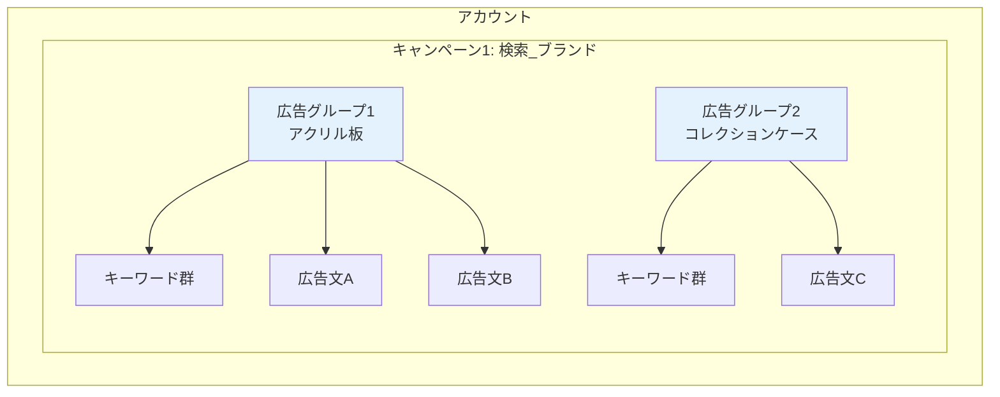

### 各層で設定すること

| 層 | 設定項目 | 具体例 |
|----|---------|--------|
| **キャンペーン** | 予算・配信地域・入札戦略 | 「日1万円」「日本全国」「CV最大化」 |
| **広告グループ** | キーワード・広告文 | 「アクリル板 オーダー」「高級感を演出」 |
| **広告** | 見出し・説明文・URL | テキスト広告の内容 |

### Meta広告との構造比較

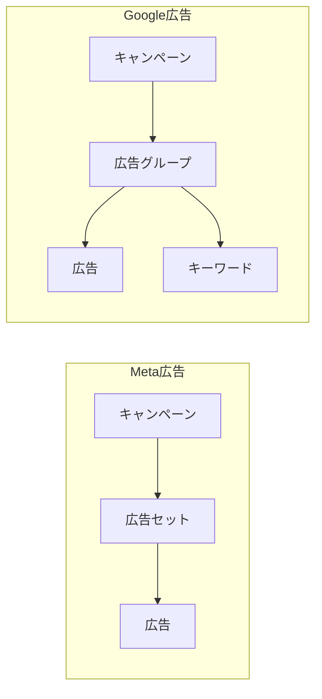

**違い**: Google広告には「キーワード」という概念がある

---

## 3. キーワードの基本

### キーワードとは

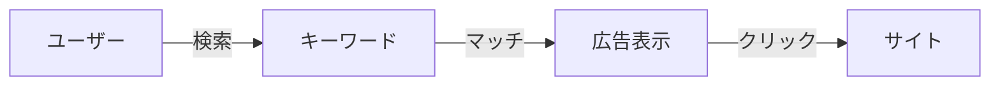

「ユーザーが検索する言葉」と「設定したキーワード」が一致すると広告が表示される

### マッチタイプ

```mermaid
graph TB
    subgraph マッチタイプ
        A[完全一致<br>[アクリル板 オーダー]]
        B[フレーズ一致<br>"アクリル板 オーダー"]
        C[部分一致<br>アクリル板 オーダー]
    end

    A --> A1[その言葉ぴったり]
    B --> B1[その言葉を含む]
    C --> C1[関連する言葉も]
```

| マッチタイプ | 記法 | 検索例 | 表示される？ |
|-------------|------|--------|------------|
| **完全一致** | [アクリル板 オーダー] | アクリル板 オーダー | ◎ |
| | | アクリル板 オーダー 価格 | × |
| **フレーズ一致** | "アクリル板 オーダー" | アクリル板 オーダー 価格 | ◎ |
| | | オーダー アクリル板 | ◎ |
| | | アクリル 注文 | × |
| **部分一致** | アクリル板 オーダー | アクリル 特注 | ◎ |
| | | プラスチック板 カスタム | △（関連と判断されれば） |

### ACRIQUEのキーワード例

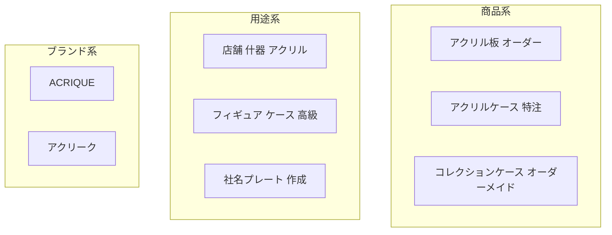

| カテゴリ | キーワード例 | 想定CPC |
|---------|-------------|---------|
| 商品系 | アクリル板 オーダー | 100-200円 |
| 用途系 | 店舗什器 アクリル | 150-300円 |
| ブランド系 | ACRIQUE | 50-100円（競合少） |

---

## 4. 出稿手順

### 全体フロー

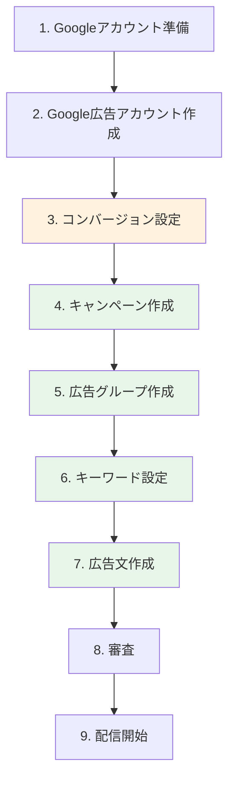

---

### Step 1-2: アカウント作成

```
URL: ads.google.com
```

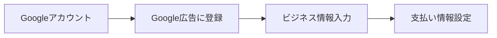

| 入力項目 | 例 |
|---------|-----|
| ビジネス名 | 株式会社グーナ |
| ウェブサイト | https://acrique.jp |
| 支払い方法 | クレジットカード |
| 請求先住所 | 東京都... |

**注意**: 初回は「スマートアシストキャンペーン」に誘導されるが、「エキスパートモード」に切り替えること

---

### Step 3: コンバージョン設定

**やること**: 購入完了を計測できるようにする

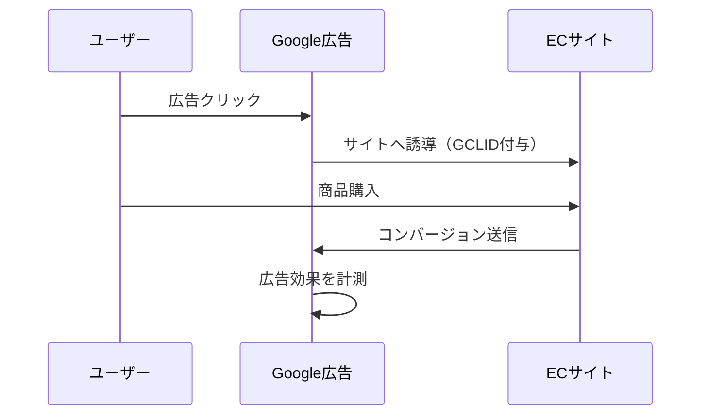

#### 設定方法

```
Google広告 → 目標 → コンバージョン → 新しいコンバージョンアクション
```

| 設定項目 | 選択/入力 |
|---------|----------|
| コンバージョンの種類 | ウェブサイト |
| カテゴリ | 購入 |
| コンバージョン名 | Purchase |
| 値 | 購入金額を動的に取得 |
| カウント方法 | 全件 |

#### タグ設置（GTM推奨）

```html
<!-- Google タグ（<head>内に設置） -->
<script async src="https://www.googletagmanager.com/gtag/js?id=AW-XXXXXXXXX"></script>
<script>
  window.dataLayer = window.dataLayer || [];
  function gtag(){dataLayer.push(arguments);}
  gtag('js', new Date());
  gtag('config', 'AW-XXXXXXXXX');
</script>
```

```javascript
// 購入完了時（サンクスページで発火）
gtag('event', 'conversion', {
  'send_to': 'AW-XXXXXXXXX/YYYYYYY',
  'value': 30000,           // 購入金額
  'currency': 'JPY',
  'transaction_id': 'ORDER-12345'
});
```

---

### Step 4: キャンペーン作成

```
Google広告 → キャンペーン → [+] → 新しいキャンペーン
```

#### 目標選択

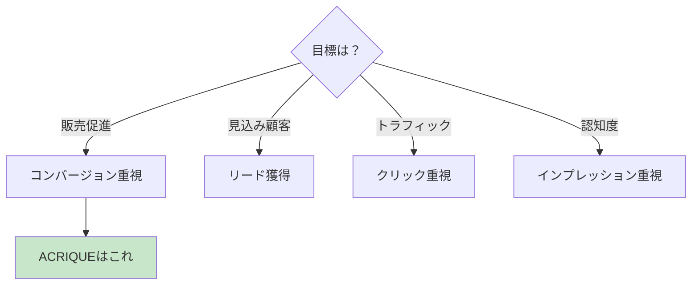

#### キャンペーンタイプ

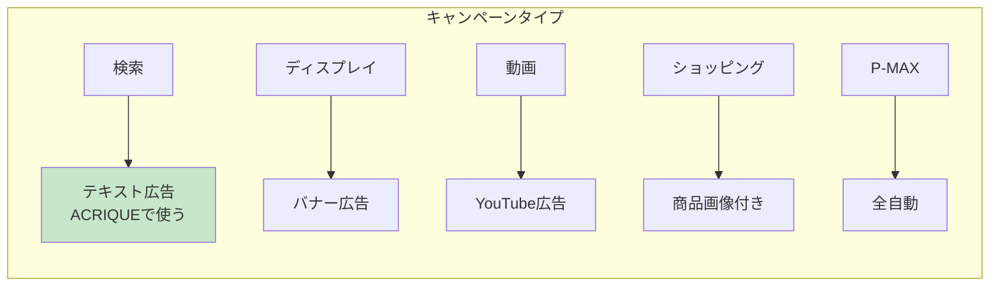

| タイプ | 説明 | ACRIQUE |
|--------|------|---------|
| **検索** | 検索結果に表示 | **◎ メイン** |
| ディスプレイ | 他サイトにバナー | △ リターゲ用 |
| 動画 | YouTube | △ 認知用 |
| ショッピング | 商品画像付き | ○ EC向け |
| P-MAX | 全自動 | △ 初心者向け |

#### キャンペーン設定

| 設定項目 | 推奨値 |
|---------|--------|
| キャンペーン名 | 検索_ACRIQUE_2025Q1 |
| ネットワーク | **検索ネットワークのみ**（ディスプレイOFF） |
| 地域 | 日本 |
| 言語 | 日本語 |
| 予算 | 3,000〜10,000円/日 |
| 入札戦略 | コンバージョン数の最大化（初期） |

**重要**: 「検索パートナーを含める」「ディスプレイネットワークを含める」は**OFF**にする

---

### Step 5: 広告グループ作成

**やること**: キーワードと広告をグループ化

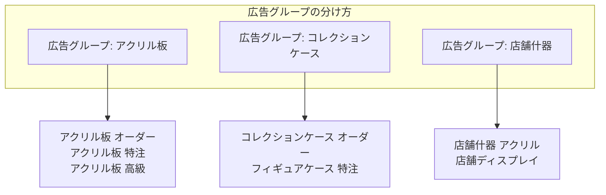

| 設定項目 | 例 |
|---------|-----|
| 広告グループ名 | AG_アクリル板_オーダー |
| 入札単価 | 自動（キャンペーン設定に従う） |

---

### Step 6: キーワード設定

#### キーワードプランナーで調査

```
Google広告 → ツール → キーワードプランナー
```

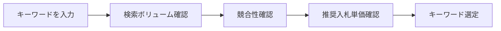

#### ACRIQUEのキーワード設計

| 広告グループ | キーワード | マッチタイプ |
|-------------|-----------|-------------|
| アクリル板 | [アクリル板 オーダー] | 完全一致 |
| | "アクリル板 特注" | フレーズ一致 |
| | "アクリル板 高級" | フレーズ一致 |
| コレクションケース | [コレクションケース オーダーメイド] | 完全一致 |
| | "フィギュアケース 特注" | フレーズ一致 |

#### 除外キーワード

**表示させたくない検索語句を除外**

| 除外キーワード | 理由 |
|--------------|------|
| 無料 | 購入意欲なし |
| DIY | 自作したい人 |
| 100均 | 低価格志向 |
| 中古 | 新品を売りたい |
| 求人 | 関係ない |

---

### Step 7: 広告文作成

#### レスポンシブ検索広告（RSA）

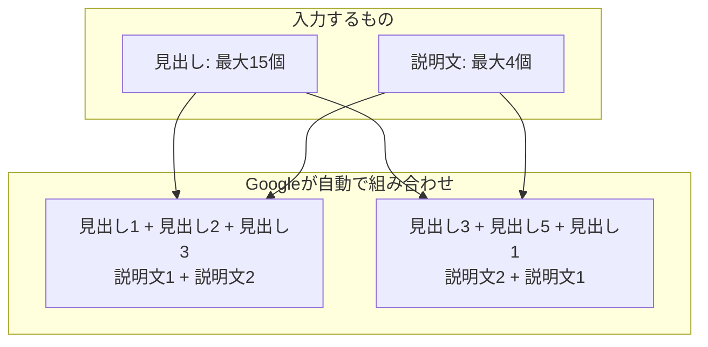

#### 文字数制限

| 要素 | 文字数 | 個数 |
|------|--------|------|
| 見出し | 全角15文字（半角30文字） | 最大15個（最低3個） |
| 説明文 | 全角45文字（半角90文字） | 最大4個（最低2個） |

#### ACRIQUEの広告文例

**見出し（15個用意）**

| # | 見出し |
|---|--------|
| 1 | 高級アクリル専門店 ACRIQUE |
| 2 | 1cmの厚みが生む存在感 |
| 3 | プロが選ぶアクリル板 |
| 4 | オーダーメイドで製作 |
| 5 | 店舗什器に最適 |
| 6 | コレクションケース特注 |
| 7 | 送料無料キャンペーン中 |
| 8 | 最短2週間でお届け |
| 9 | 法人様お見積り対応 |
| 10 | 厚さ1cm〜対応 |

**説明文（4個用意）**

| # | 説明文 |
|---|--------|
| 1 | 高級アクリル専門店ACRIQUEでは、1cm以上の厚みを持つ高品質なアクリル板をオーダーメイドで製作。店舗什器からコレクションケースまで。 |
| 2 | 光の屈折が美しい、厚みのあるアクリル板。店舗の高級感を演出します。サイズ・形状はご要望に合わせて製作可能。 |
| 3 | フィギュア・グッズのコレクションに最適な特注アクリルケース。推し活をワンランク上に。 |
| 4 | 法人様向けお見積り対応。店舗什器、ディスプレイ、サインプレートなど、まとめてご相談ください。 |

---

### Step 8: 広告表示オプション

**広告の表示面積を増やし、クリック率を上げる**

```
┌─────────────────────────────────────┐
│  [広告] ACRIQUE - 高級アクリル専門店   │
│  1cmの厚みが生む、圧倒的な存在感。     │
│  https://acrique.jp                  │
│  ────────────────────────────────── │
│  📍 東京都渋谷区  📞 03-XXXX-XXXX     │  ← 住所・電話
│  🔗 アクリル板 | ケース | 什器 | お見積り │  ← サイトリンク
│  ✓ オーダーメイド対応  ✓ 最短2週間     │  ← コールアウト
└─────────────────────────────────────┘
```

| オプション | 説明 | 設定例 |
|-----------|------|--------|
| **サイトリンク** | 追加のリンク | 商品一覧、事例、お見積り |
| **コールアウト** | 特徴を箇条書き | 送料無料、最短2週間、法人対応 |
| **構造化スニペット** | カテゴリ表示 | 商品: アクリル板, ケース, 什器 |
| **電話番号** | タップで電話 | 03-XXXX-XXXX |
| **住所** | 店舗情報 | 東京都渋谷区... |

---

### Step 9: 審査と配信開始

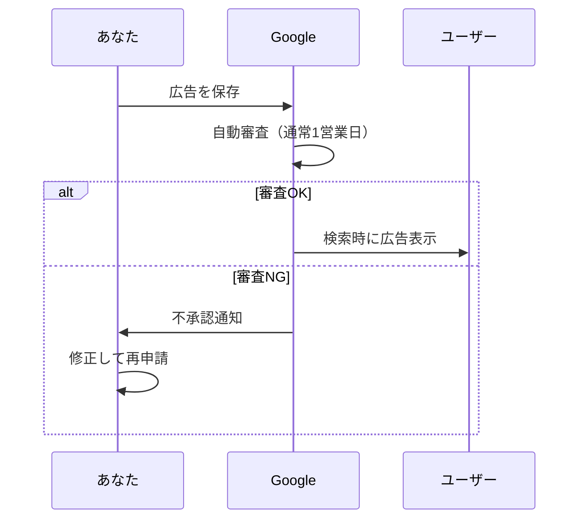

#### よくある審査落ちの理由

| 理由 | 対策 |
|------|------|
| 商標侵害 | 他社ブランド名を使わない |
| 誇大表現 | 「日本一」「絶対」を避ける |
| 句読点の過剰使用 | 「！！！」を使わない |
| キーワードと広告の不一致 | 関連性を高める |

---

## 5. 運用中の確認ポイント

### 検索語句レポート

**実際にどんな言葉で検索されて広告が表示されたか確認**

```
Google広告 → キーワード → 検索語句
```

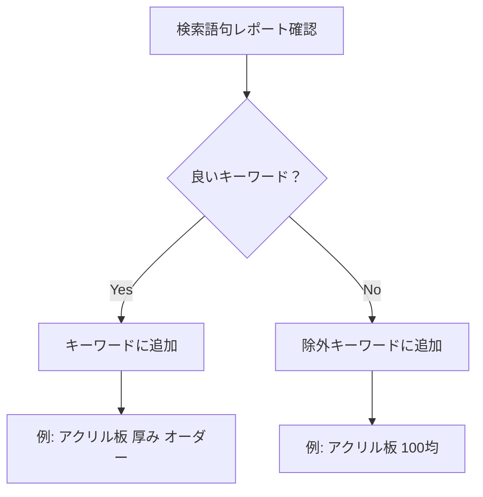

### 品質スコア

**広告の「成績表」。高いほど安く上位表示される**

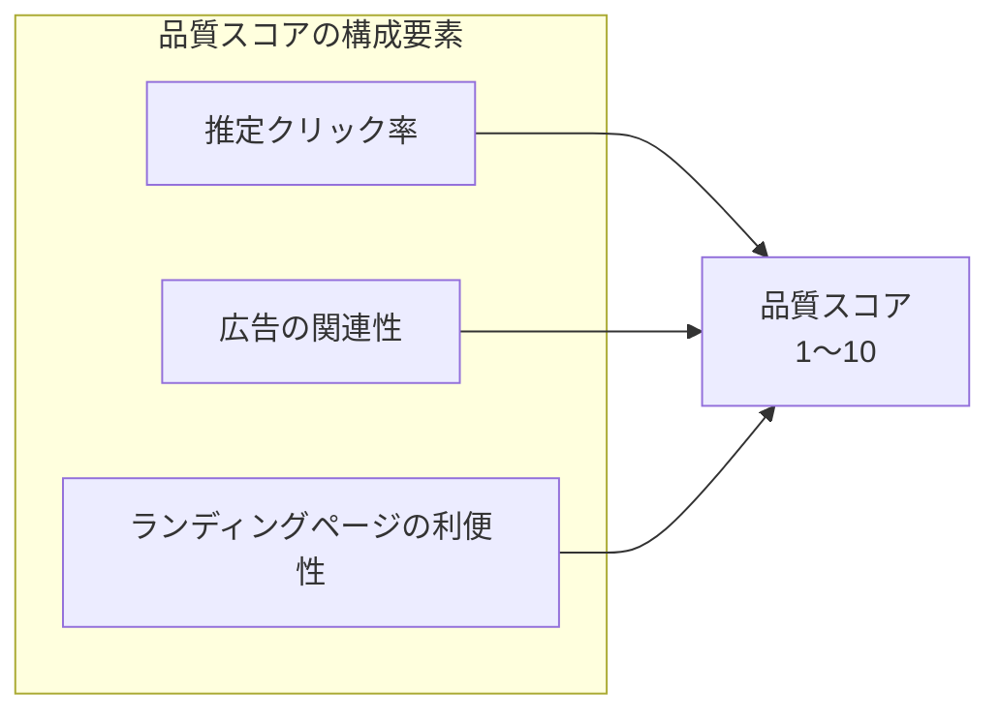

| スコア | 評価 | アクション |
|--------|------|-----------|
| 8-10 | 良好 | 維持 |
| 5-7 | 普通 | 改善余地あり |
| 1-4 | 低い | 要改善 |

### 改善アクション

| 状況 | 原因 | アクション |
|------|------|-----------|
| インプレッション少ない | 入札が低い / キーワード少ない | 入札上げる / キーワード追加 |
| CTR低い（2%未満） | 広告文が弱い | 見出し・説明文を改善 |
| CPC高い | 競合が強い / 品質スコア低い | 品質スコア改善 |
| CVR低い | LP（着地ページ）が弱い | LP改善 |

---

## 6. ACRIQUEの広告設定例

### キャンペーン構成案

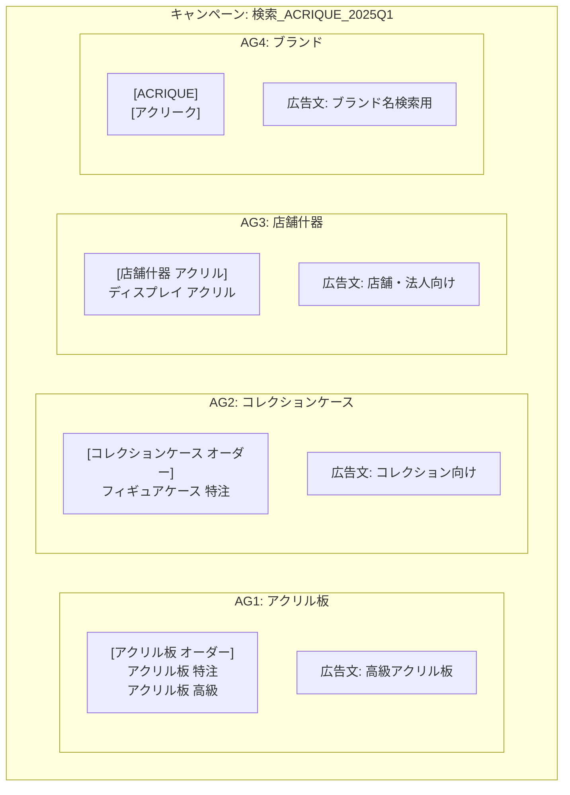

### 初期設定の数値目標

| 指標 | 目標値 |
|------|--------|
| 日予算 | 5,000円 |
| CTR | 3%以上 |
| CPC | 150円以下 |
| CVR | 2%以上 |
| CPA | 7,500円以下 |

---

## 7. まとめ

### 出稿チェックリスト

- [ ] Google広告アカウント作成済み
- [ ] エキスパートモードに切り替え済み
- [ ] コンバージョンタグ設置済み
- [ ] キャンペーンタイプ = 検索
- [ ] ネットワーク = 検索のみ（ディスプレイOFF）
- [ ] キーワード設定済み
- [ ] 除外キーワード設定済み
- [ ] 広告文作成済み（見出し10個以上）
- [ ] 広告表示オプション設定済み
- [ ] 審査通過
- [ ] 配信開始

### Meta広告との使い分け

```mermaid
graph LR
    subgraph 認知・興味喚起
        META[Meta広告<br>Instagram/Facebook]
    end

    subgraph 検討・刈り取り
        GOOGLE[Google検索広告]
    end

    META -->|興味を持った人が| GOOGLE
    GOOGLE -->|購入| CV[コンバージョン]
```

| 段階 | 広告 | 役割 |
|------|------|------|
| 認知 | Meta広告 | 「ACRIQUEって良さそう」と思わせる |
| 検討 | Google検索 | 「アクリル板 オーダー」で検索した人を獲得 |

### 次のステップ

- [01-広告の基礎](./01-広告の基礎.md) - 基本概念に戻る
- [02-Meta広告の手順](./02-Meta広告の手順.md) - Instagram/Facebook広告の出し方
