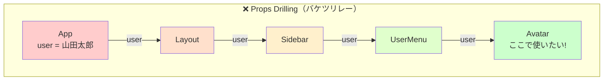
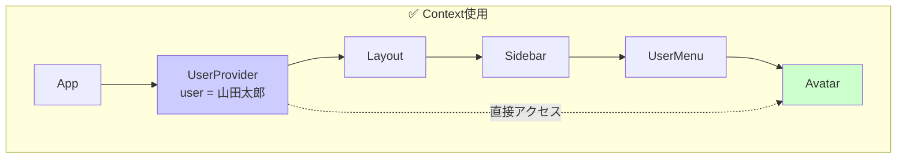
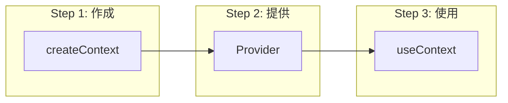
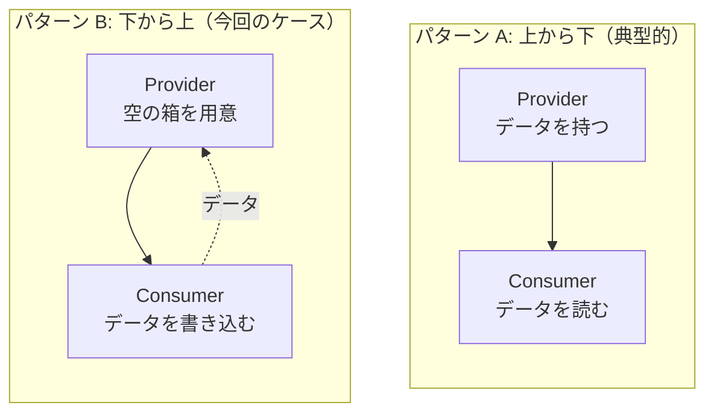
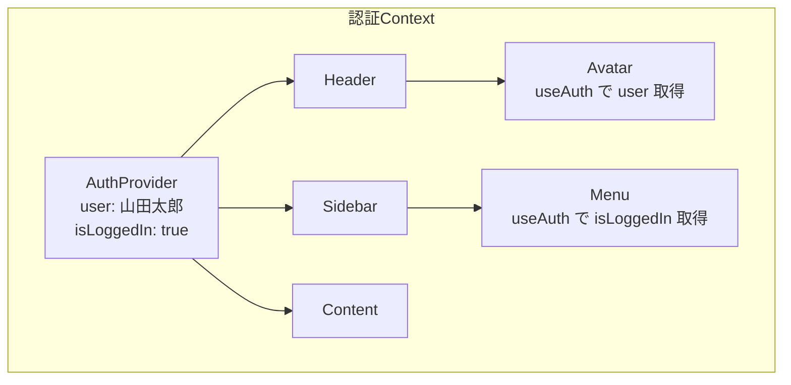
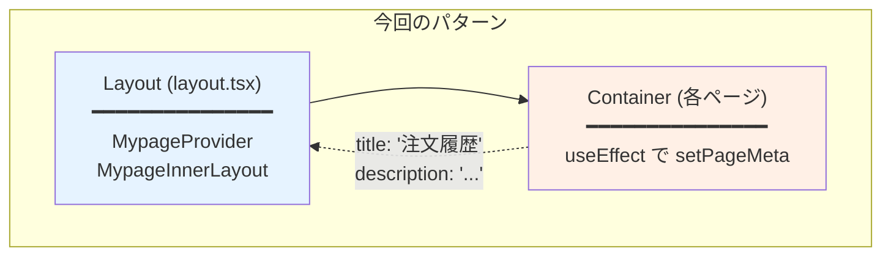
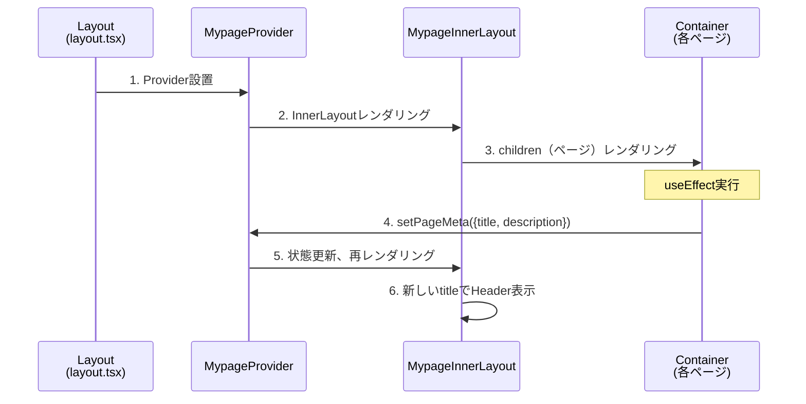
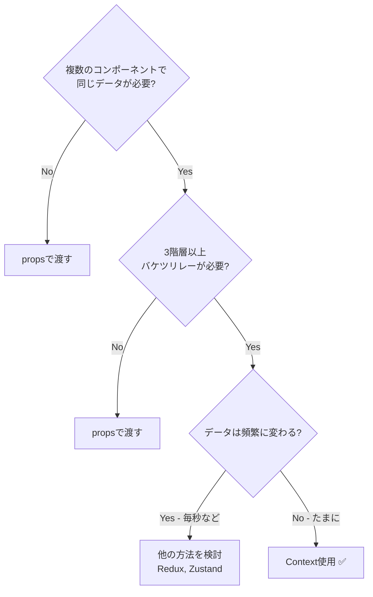

# React Context パターン完全理解ガイド

React Contextの概念を日常例から段階的に理解し、実践で使えるレベルまで習得する。

---

## 目次

1. [日常例で理解する「共有」の概念](#1-日常例で理解する共有の概念)
2. [Props Drilling問題（バケツリレー問題）](#2-props-drilling問題バケツリレー問題)
3. [Contextの基本構造](#3-contextの基本構造)
4. [典型的なユースケース](#4-典型的なユースケース)
5. [今回のMypageContext（逆方向パターン）](#5-今回のmypagecontext逆方向パターン)
6. [Contextを使う判断基準](#6-contextを使う判断基準)
7. [実践ガイドライン](#7-実践ガイドライン)

---

## 1. 日常例で理解する「共有」の概念

### 1.1 会社のWi-Fiパスワード

会社に新しいWi-Fiが設置されたとする。

```
❌ 悪い方法：伝言ゲーム

社長 → 部長 → 課長 → 係長 → 新入社員

「パスワードは ABC123 だって」
「え、ABD123？」
「いや、ABC133...?」
```

```
✅ 良い方法：掲示板に貼る

┌────────────────────────────┐
│  📋 社内掲示板             │
│                            │
│  Wi-Fiパスワード: ABC123   │
│                            │
└────────────────────────────┘
     ↑      ↑      ↑
   社長   課長   新入社員

誰でも直接見に行ける！
```

**Context = 社内掲示板**

みんながアクセスできる「共有の場所」を作ることで、伝言ゲームを避ける。

### 1.2 Reactでの対応関係

| 日常例 | React |
|--------|-------|
| 掲示板を設置する | `createContext()` |
| 掲示板にパスワードを貼る | `<Context.Provider value={...}>` |
| 掲示板を見に行く | `useContext()` |

---

## 2. Props Drilling問題（バケツリレー問題）

### 2.1 問題の図解

Contextがない世界では、深い階層にデータを渡すために「バケツリレー」が必要。



```typescript
// ❌ 問題のあるコード：4階層もバケツリレー

function App() {
  const user = { name: '山田太郎' };
  return <Layout user={user} />;  // 渡す
}

function Layout({ user }) {
  return <Sidebar user={user} />;  // また渡す（使わないのに）
}

function Sidebar({ user }) {
  return <UserMenu user={user} />;  // また渡す（使わないのに）
}

function UserMenu({ user }) {
  return <Avatar user={user} />;  // また渡す
}

function Avatar({ user }) {
  return ;  // やっと使う！
}
```

**何が問題か？**
- Layout, Sidebar, UserMenu は `user` を使わないのに受け取って渡している
- 途中の階層を変更するとき、全部修正が必要
- コードが冗長で読みにくい

### 2.2 Contextで解決



```typescript
// ✅ Contextを使ったコード

// 1. Context作成
const UserContext = createContext(null);

// 2. Providerで包む（掲示板を設置）
function App() {
  const user = { name: '山田太郎' };
  return (
    <UserContext.Provider value={user}>
      <Layout />  {/* propsなし！ */}
    </UserContext.Provider>
  );
}

// 3. 途中の階層はスッキリ
function Layout() { return <Sidebar />; }
function Sidebar() { return <UserMenu />; }
function UserMenu() { return <Avatar />; }

// 4. 必要な場所で直接取得（掲示板を見に行く）
function Avatar() {
  const user = useContext(UserContext);
  return ;
}
```

---

## 3. Contextの基本構造

### 3.1 3ステップの構造



### 3.2 基本テンプレート

```typescript
// ===== contexts/ThemeContext.tsx =====

'use client';

import { createContext, useContext, useState, ReactNode } from 'react';

// ----- Step 1: 型定義 -----
interface ThemeContextValue {
  theme: 'light' | 'dark';
  toggleTheme: () => void;
}

// ----- Step 2: Context作成（初期値null） -----
const ThemeContext = createContext<ThemeContextValue | null>(null);

// ----- Step 3: Provider作成（状態管理を内包） -----
export function ThemeProvider({ children }: { children: ReactNode }) {
  const [theme, setTheme] = useState<'light' | 'dark'>('light');

  const toggleTheme = () => {
    setTheme(prev => prev === 'light' ? 'dark' : 'light');
  };

  return (
    <ThemeContext.Provider value={{ theme, toggleTheme }}>
      {children}
    </ThemeContext.Provider>
  );
}

// ----- Step 4: カスタムフック（安全に使うため） -----
export function useTheme() {
  const context = useContext(ThemeContext);
  if (!context) {
    throw new Error('useTheme must be used within ThemeProvider');
  }
  return context;
}
```

### 3.3 なぜカスタムフックを作るか

```typescript
// ❌ 直接 useContext を使う場合
function Button() {
  const context = useContext(ThemeContext);
  // context が null の可能性がある
  // 毎回 null チェックが必要
  if (!context) return null;
  return <button className={context.theme}>...</button>;
}

// ✅ カスタムフックを使う場合
function Button() {
  const { theme } = useTheme();
  // null チェック済み、型も確定
  return <button className={theme}>...</button>;
}
```

---

## 4. 典型的なユースケース

### 4.1 データの流れパターン



### 4.2 よくあるユースケース一覧

| ユースケース | 共有するもの | パターン |
|-------------|-------------|---------|
| **認証情報** | user, isLoggedIn | A（上→下） |
| **テーマ** | theme, toggleTheme | A（上→下） |
| **言語設定** | locale, setLocale | A（上→下） |
| **カート** | items, addItem, removeItem | A（上→下） |
| **モーダル状態** | isOpen, open, close | A（上→下） |
| **ページメタ** | title, setTitle | B（下→上） ← 今回 |

### 4.3 認証Contextの例（パターンA）



```typescript
// 典型的な「上から下」のパターン

interface AuthContextValue {
  user: User | null;
  isLoggedIn: boolean;
  login: (email: string, password: string) => Promise<void>;
  logout: () => void;
}

export function AuthProvider({ children }) {
  const [user, setUser] = useState<User | null>(null);

  // APIからユーザー情報を取得
  useEffect(() => {
    fetchCurrentUser().then(setUser);
  }, []);

  const login = async (email, password) => {
    const user = await api.login(email, password);
    setUser(user);
  };

  const logout = () => {
    api.logout();
    setUser(null);
  };

  return (
    <AuthContext.Provider value={{
      user,
      isLoggedIn: !!user,
      login,
      logout,
    }}>
      {children}
    </AuthContext.Provider>
  );
}

// 使う側
function Avatar() {
  const { user } = useAuth();
  return ;
}
```

---

## 5. 今回のMypageContext（逆方向パターン）

### 5.1 なぜ特殊なのか

通常のContext：**親がデータを持ち、子が読む**
今回のContext：**親が「箱」を用意し、子が書き込む**



### 5.2 問題の背景

```
なぜこのパターンが必要だったか？

┌─ layout.tsx ─────────────────────────┐
│  ┌─ MypageInnerLayout ─────────────┐ │
│  │  ┌─ Hero Header ──────────────┐ │ │
│  │  │  タイトル: ??? ← 各ページで違う │ │ │
│  │  │  説明: ???                  │ │ │
│  │  └────────────────────────────┘ │ │
│  │  ┌─ Sidebar ──────────────────┐ │ │
│  │  │  ...                       │ │ │
│  │  └────────────────────────────┘ │ │
│  │  ┌─ {children} ───────────────┐ │ │
│  │  │  ← ここに各ページが入る     │ │ │
│  │  └────────────────────────────┘ │ │
│  └────────────────────────────────┘ │
└──────────────────────────────────────┘

問題：Header は layout.tsx にあるが、
     タイトルは children（各ページ）が知っている
```

### 5.3 解決策の図解



### 5.4 コードの対応関係

```typescript
// ===== shared/contexts/MypageContext.tsx =====

interface PageMeta {
  title: string;
  description?: string;
}

interface MypageContextValue {
  pageMeta: PageMeta;                    // 読み取り用
  setPageMeta: (meta: PageMeta) => void; // 書き込み用 ← これがポイント
}

export function MypageProvider({ children }) {
  // 初期値（子がセットするまでの仮値）
  const [pageMeta, setPageMetaState] = useState<PageMeta>({
    title: 'マイページ',
  });

  return (
    <MypageContext.Provider value={{ pageMeta, setPageMeta }}>
      {children}
    </MypageContext.Provider>
  );
}
```

```typescript
// ===== widgets/layout/mypage-inner-layout/ui/MypageInnerLayout.tsx =====

export function MypageInnerLayout({ children }) {
  const { pageMeta } = useMypageContext();  // 読み取り

  return (
    <div>
      {/* Contextから読んだ値を表示 */}
      <h1>{pageMeta.title}</h1>
      <p>{pageMeta.description}</p>

      {/* 子コンポーネント（ここがsetPageMetaを呼ぶ） */}
      {children}
    </div>
  );
}
```

```typescript
// ===== page-components/mypage/orders-home/ui/OrdersHomeContainer.tsx =====

export function OrdersPage() {
  const { setPageMeta } = useMypageContext();  // 書き込み用

  // マウント時にページ情報をセット
  useEffect(() => {
    setPageMeta({
      title: '注文履歴',
      description: '過去のご注文を確認できます',
    });
  }, [setPageMeta]);

  return <div>注文一覧...</div>;
}
```

### 5.5 このパターンの注意点

```
⚠️ useEffect が必要な理由

子 → 親 の方向でデータを流すと、
レンダリング中に状態更新が発生してエラーになる

❌ NG
function OrdersPage() {
  const { setPageMeta } = useMypageContext();
  setPageMeta({ title: '...' });  // レンダリング中に状態更新 → エラー！
  return <div>...</div>;
}

✅ OK
function OrdersPage() {
  const { setPageMeta } = useMypageContext();
  useEffect(() => {
    setPageMeta({ title: '...' });  // マウント後に実行 → OK
  }, [setPageMeta]);
  return <div>...</div>;
}
```

---

## 6. Contextを使う判断基準

### 6.1 使うべき場合



### 6.2 使わないほうがいい場合

| 状況 | 理由 | 代替案 |
|------|------|--------|
| 1-2階層のprops渡し | 過剰設計 | 普通にprops |
| 高頻度更新データ | パフォーマンス問題 | Zustand, Jotai |
| サーバー状態 | 専用ライブラリが優秀 | TanStack Query |
| フォーム状態 | 専用ライブラリが優秀 | React Hook Form |

### 6.3 判断フローチャート

```
Q: このデータ、Contextにすべき？

1. そのデータは複数の離れた場所で使う？
   → No → propsで渡す

2. バケツリレーが3階層以上になる？
   → No → propsで渡す

3. サーバーから取得するデータ？
   → Yes → TanStack Query を使う

4. フォームの状態？
   → Yes → React Hook Form を使う

5. 毎秒レベルで更新される？
   → Yes → Zustand/Jotai を検討

6. 上記すべてNo
   → Context を使う ✅
```

---

## 7. 実践ガイドライン

### 7.1 ファイル配置

```
shared/
└── contexts/
    ├── MypageContext.tsx    # マイページ用
    ├── AuthContext.tsx      # 認証用（もし作るなら）
    └── ThemeContext.tsx     # テーマ用（もし作るなら）
```

### 7.2 命名規則

```typescript
// Context名: XxxContext
const MypageContext = createContext(...);

// Provider名: XxxProvider
export function MypageProvider({ children }) { ... }

// フック名: useXxx または useXxxContext
export function useMypageContext() { ... }
```

### 7.3 テンプレート

```typescript
// ===== 新しいContextを作るときのテンプレート =====

'use client';

import { createContext, useContext, useState, useCallback, ReactNode } from 'react';

// 1. 型定義
interface XxxContextValue {
  // 状態
  someState: string;
  // アクション
  setSomeState: (value: string) => void;
}

// 2. Context作成
const XxxContext = createContext<XxxContextValue | null>(null);

// 3. Provider
export function XxxProvider({ children }: { children: ReactNode }) {
  const [someState, setSomeStateInternal] = useState('initial');

  // useCallbackで関数をメモ化（パフォーマンス最適化）
  const setSomeState = useCallback((value: string) => {
    setSomeStateInternal(value);
  }, []);

  return (
    <XxxContext.Provider value={{ someState, setSomeState }}>
      {children}
    </XxxContext.Provider>
  );
}

// 4. カスタムフック
export function useXxxContext() {
  const context = useContext(XxxContext);
  if (!context) {
    throw new Error('useXxxContext must be used within XxxProvider');
  }
  return context;
}
```

### 7.4 よくある間違いと対策

```typescript
// ❌ 間違い1: valueをインラインで書く（毎回新オブジェクト）
<XxxContext.Provider value={{ state, setState }}>

// ✅ 対策: useMemoでメモ化
const value = useMemo(() => ({ state, setState }), [state, setState]);
<XxxContext.Provider value={value}>


// ❌ 間違い2: Providerの外でuseContextを使う
function App() {
  const { user } = useAuth();  // ← Providerの外！
  return (
    <AuthProvider>
      <Content />
    </AuthProvider>
  );
}

// ✅ 対策: Providerの中で使う
function App() {
  return (
    <AuthProvider>
      <Content />  {/* この中でuseAuthを使う */}
    </AuthProvider>
  );
}
```

---

## まとめ

```
┌────────────────────────────────────────────────────────────┐
│  Context = 複数コンポーネントで共有したいデータの「掲示板」  │
└────────────────────────────────────────────────────────────┘

基本パターン（上→下）:
  Provider がデータを持ち、Consumer が読む
  例: 認証情報、テーマ、言語設定

逆方向パターン（下→上）:
  Provider が「箱」を用意し、Consumer が書き込む
  例: 今回のページタイトル

使用判断:
  - 3階層以上のバケツリレー回避
  - サーバー状態 → TanStack Query
  - フォーム → React Hook Form
  - 高頻度更新 → Zustand/Jotai
```
