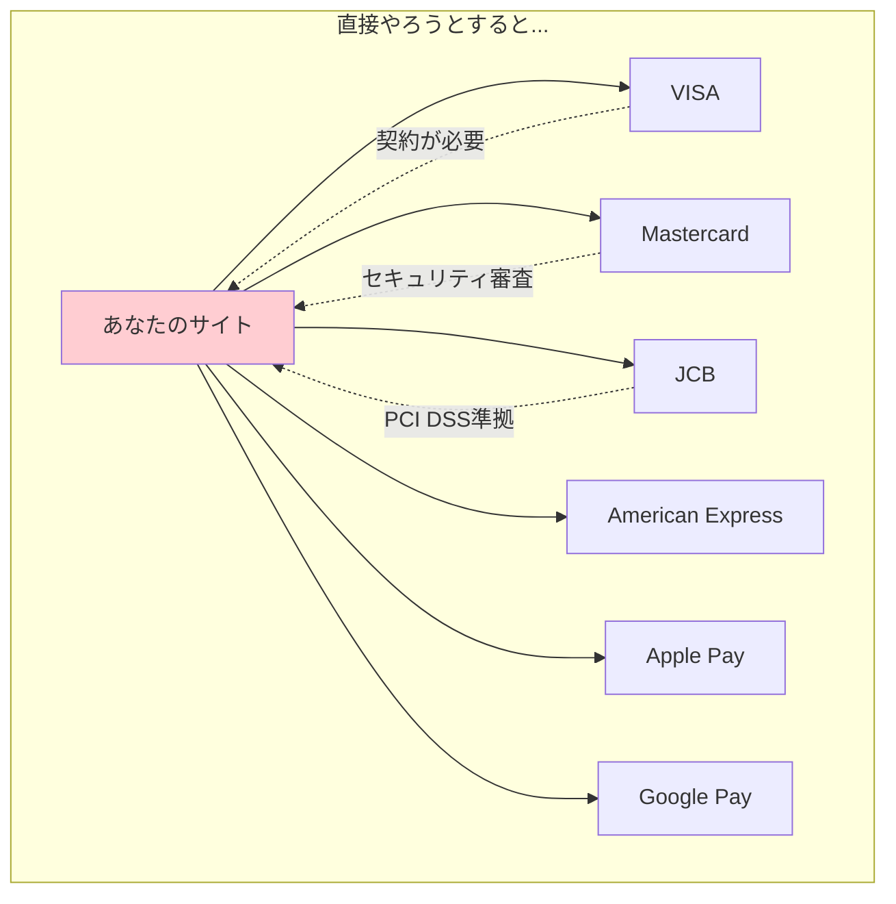
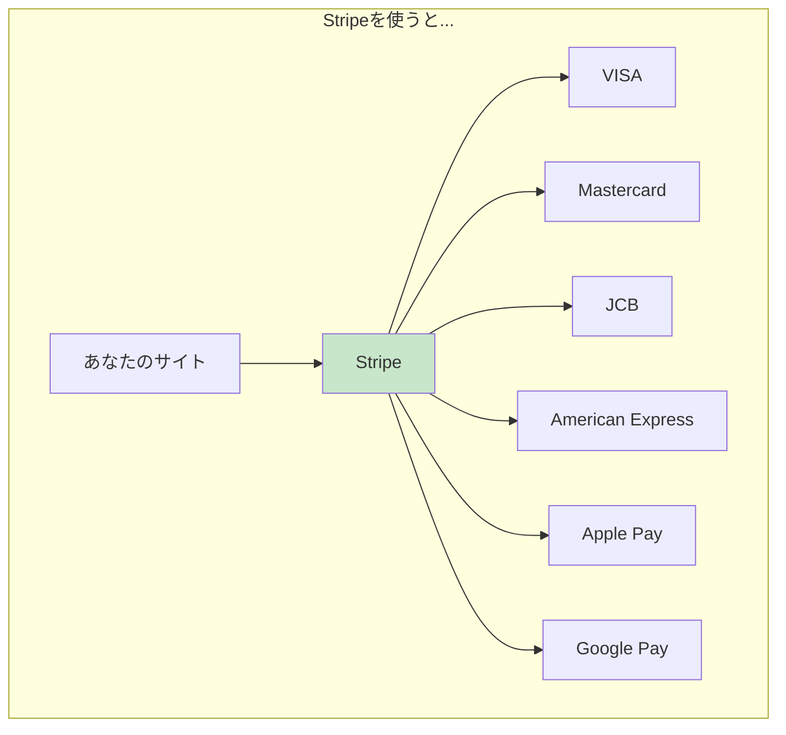
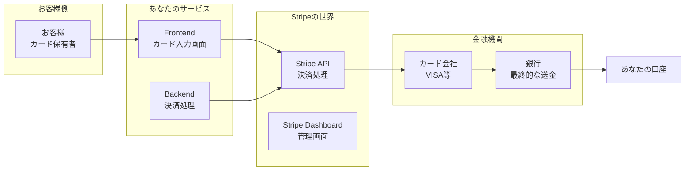
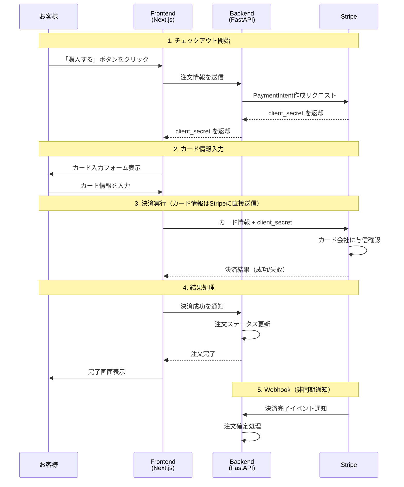
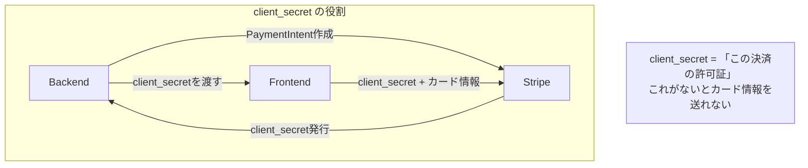
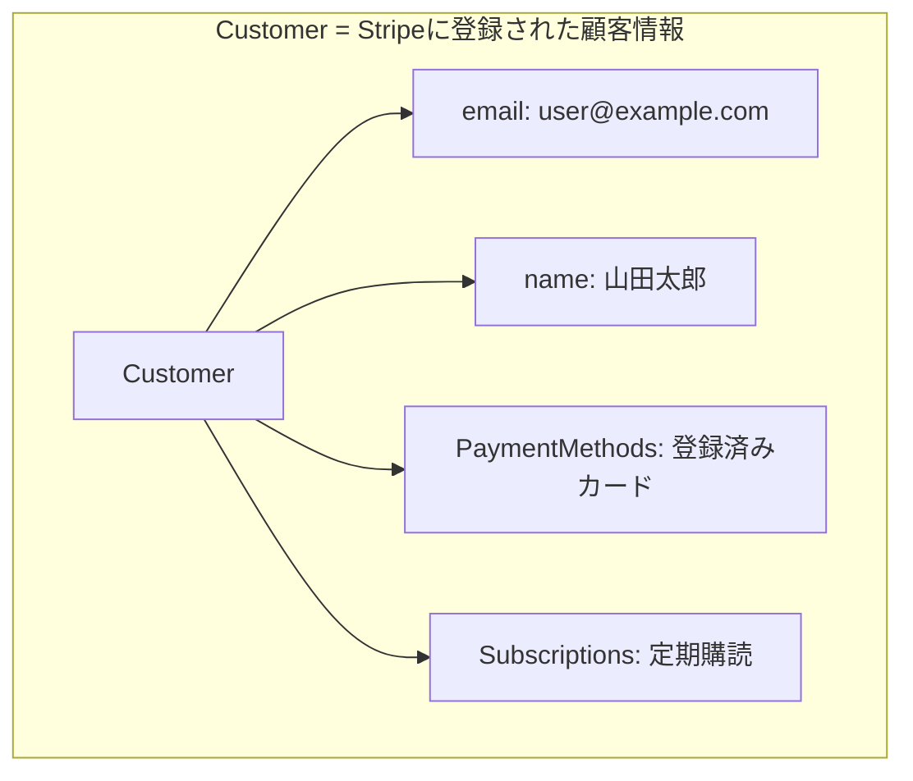
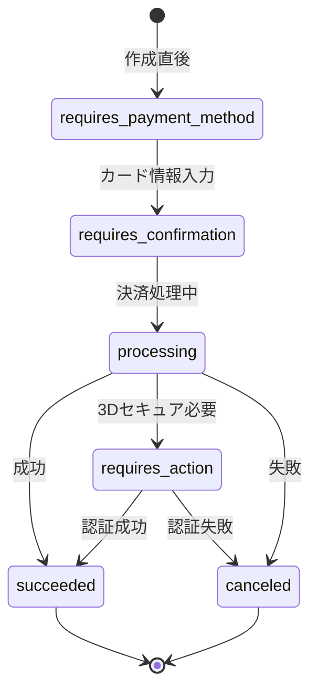
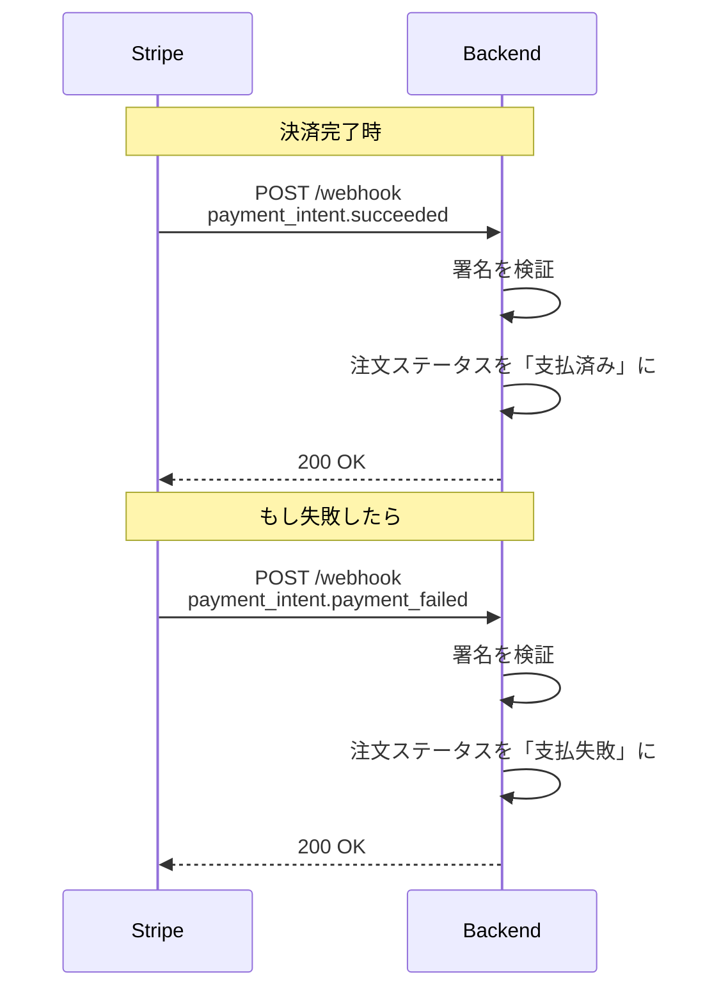
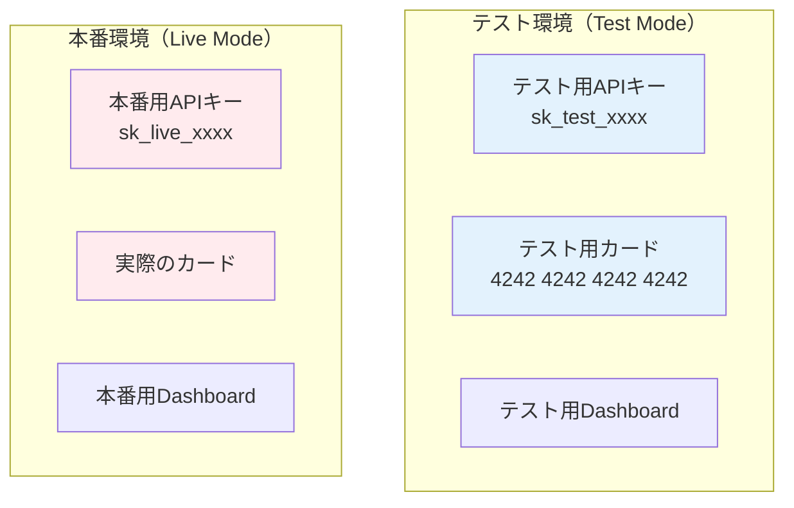
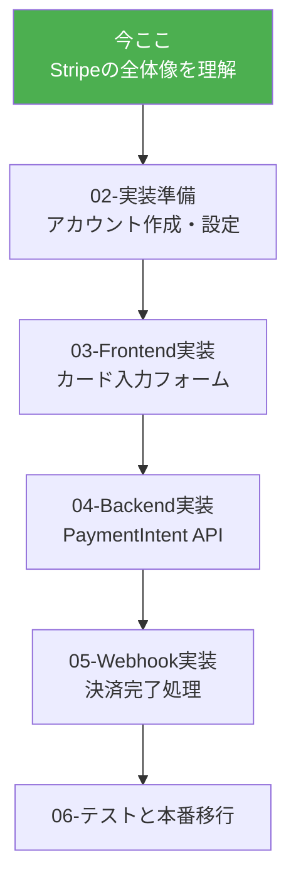

# Stripe入門 - オンライン決済の仕組み

Stripe未経験者のための、日常例から始めるオンライン決済入門。
ACRIQUEプロジェクトを具体例として、決済機能の実装に必要な知識を身につけよう。

---

## 目次

1. [オンライン決済ってそもそも何？](#1-オンライン決済ってそもそも何)
2. [Stripeとは何者？](#2-stripeとは何者)
3. [決済の「登場人物」を理解する](#3-決済の登場人物を理解する)
4. [決済フローを完全理解](#4-決済フローを完全理解)
5. [Stripeの主要概念](#5-stripeの主要概念)
6. [テスト環境と本番環境](#6-テスト環境と本番環境)
7. [次のステップ](#7-次のステップ)

---

## 1. オンライン決済ってそもそも何？

### 日常の例で考える

**実店舗でのクレジットカード決済**を思い出してみよう。

```
1. あなた：カードを店員に渡す
2. 店員：カードリーダーに通す
3. カード会社：「この人、お金払えますか？」を確認
4. カード会社：「OK！」と承認
5. 店員：「お支払い完了です」とレシートを渡す
6. 後日：カード会社があなたの口座から引き落とし、お店に入金
```

**オンライン決済も基本は同じ！**

```
1. あなた：カード番号をWebサイトに入力
2. Webサイト：Stripeに「この人のカード、使えますか？」と確認
3. Stripe：カード会社に確認
4. Stripe：「OK！」と承認
5. Webサイト：「お支払い完了です」と表示
6. 後日：Stripeがお店の口座に入金
```

### なぜ「決済代行サービス」が必要？



**問題点：**
- 各カード会社と個別契約が必要（数ヶ月かかる）
- PCI DSS（セキュリティ基準）への準拠が必要（数千万円）
- 不正利用対策も自分でやる必要がある



**Stripeが代わりにやってくれること：**
- 全カードブランドとの契約
- セキュリティ対策（PCI DSS準拠）
- 不正利用検知
- 返金処理
- 入金管理

---

## 2. Stripeとは何者？

### Stripeの基本情報

```
Stripe = 「世界最大級のオンライン決済プラットフォーム」

- 2010年創業（アイルランド・サンフランシスコ）
- 190カ国以上で利用可能
- Shopify, Amazon, Googleも利用
- 日本では2016年から本格展開
```

### なぜStripeが選ばれる？

| 比較項目 | Stripe | 他社（PayPay, Square等） |
|---------|--------|------------------------|
| **開発者体験** | 最高（APIが美しい） | 普通 |
| **ドキュメント** | 日本語対応、充実 | まちまち |
| **料金** | 3.6% | 3.25〜3.74% |
| **導入の簡単さ** | 最短1日 | 審査に時間がかかる場合あり |
| **カスタマイズ性** | 非常に高い | 制限がある場合も |

### ACRIQUEでStripeを選んだ理由

1. **開発者フレンドリー** - APIとSDKが使いやすい
2. **テスト環境が充実** - 本番と同じ環境でテスト可能
3. **日本語サポート** - ドキュメント・管理画面が日本語対応
4. **豊富な決済方法** - クレジットカード、コンビニ払い、銀行振込に対応

---

## 3. 決済の「登場人物」を理解する

### 登場人物一覧



### それぞれの役割（レストランに例えると）

| 登場人物 | 決済の世界では | レストランでは |
|---------|---------------|---------------|
| **お客様** | カード保有者 | お客さん |
| **Frontend** | カード入力フォーム | メニューと注文表 |
| **Backend** | 決済リクエスト送信 | キッチン |
| **Stripe** | 決済代行 | クレジット決済端末 |
| **カード会社** | 与信・承認 | カード会社 |
| **銀行** | 送金 | 銀行 |

---

## 4. 決済フローを完全理解

### ACRIQUEでの決済フロー



### 重要ポイント：なぜこんな複雑なフロー？

**セキュリティのため！**

```
【悪い例】カード情報がBackendを通過する場合
お客様 → Frontend → Backend → Stripe
                      ↑
              ここでカード情報が漏洩するリスク！
              PCI DSS準拠が必要（高コスト）

【良い例】カード情報が直接Stripeに行く場合
お客様 → Frontend → Stripe（カード情報）
         ↓
       Backend（決済の指示だけ）

→ カード情報はあなたのサーバーを通らない
→ PCI DSS準拠が不要！
```

### client_secret とは？



**日常例で理解：**
```
client_secret = ホテルの予約番号

1. 予約サイトで部屋を予約（Backend → Stripe）
2. 予約番号を受け取る（client_secret）
3. ホテルに行って予約番号を見せる（Frontend → Stripe）
4. 部屋に入れる（決済完了）

予約番号がないと、勝手に部屋には入れない！
```

---

## 5. Stripeの主要概念

### Customer（顧客）



**ACRIQUEでの使い方：**
```python
# ユーザー登録時にStripe Customerも作成
customer = stripe.Customer.create(
    email="user@example.com",
    name="山田太郎",
    metadata={"acrique_user_id": "123"}
)
# customer.id = "cus_xxxxx" をDBに保存
```

### PaymentIntent（支払い意図）

```
PaymentIntent = 「この金額を、このお客様から、受け取りたい」という意図

特徴：
- 1回の決済につき1つ作成
- 金額、通貨、顧客情報を含む
- 状態（未払い→処理中→完了）を持つ
```



**ACRIQUEでの使い方：**
```python
# チェックアウト時にPaymentIntent作成
payment_intent = stripe.PaymentIntent.create(
    amount=15000,  # 15,000円（最小単位で指定）
    currency="jpy",
    customer="cus_xxxxx",
    metadata={"order_id": "order_123"}
)
# payment_intent.client_secret をFrontendに返す
```

### PaymentMethod（支払い方法）

```
PaymentMethod = カード情報やその他の支払い手段

種類：
- card: クレジットカード
- konbini: コンビニ払い
- bank_transfer: 銀行振込
```

**カード情報の構造：**
```json
{
  "id": "pm_xxxxx",
  "type": "card",
  "card": {
    "brand": "visa",
    "last4": "4242",
    "exp_month": 12,
    "exp_year": 2025
  }
}
```

### Webhook（通知）



**なぜWebhookが必要？**
```
問題：Frontendからの「決済成功」通知だけを信じると危険

悪意あるユーザー：
「決済成功したことにして」とFrontendを改ざん
→ お金を払わずに商品を手に入れる

解決策：
Stripeから直接Backendに通知（Webhook）
→ 改ざん不可能な正式な通知
→ これを信じて注文を確定する
```

---

## 6. テスト環境と本番環境

### Stripeの2つの環境



### テスト用カード番号

| カード番号 | 説明 |
|-----------|------|
| `4242 4242 4242 4242` | 成功するカード |
| `4000 0000 0000 0002` | 常に拒否されるカード |
| `4000 0025 0000 3155` | 3Dセキュア認証が必要 |
| `4000 0000 0000 9995` | 残高不足で拒否 |

**有効期限・CVC：**
- 有効期限：未来の日付なら何でもOK（例：12/30）
- CVC：任意の3桁（例：123）

### 環境変数の設定

```bash
# .env（開発環境）
STRIPE_SECRET_KEY=sk_test_xxxxxx
STRIPE_PUBLISHABLE_KEY=pk_test_xxxxxx
STRIPE_WEBHOOK_SECRET=whsec_xxxxxx

# .env.production（本番環境）
STRIPE_SECRET_KEY=sk_live_xxxxxx
STRIPE_PUBLISHABLE_KEY=pk_live_xxxxxx
STRIPE_WEBHOOK_SECRET=whsec_xxxxxx
```

### APIキーの種類

| キー | プレフィックス | 用途 | 公開範囲 |
|-----|--------------|------|---------|
| **Secret Key** | `sk_` | Backend用 | 絶対に公開しない |
| **Publishable Key** | `pk_` | Frontend用 | 公開OK |
| **Webhook Secret** | `whsec_` | Webhook署名検証 | 絶対に公開しない |

```
⚠️ 重要：Secret Key が漏洩すると...

- あなたの代わりに決済ができる
- 返金処理ができる
- 顧客情報が見られる

→ GitHubに絶対にコミットしない！
→ 環境変数で管理する！
```

---

## 7. 次のステップ

### 学習ロードマップ



### 次に読むべきドキュメント

1. **02-Stripe実装準備** - アカウント作成からAPIキー取得まで
2. **03-Stripe Frontend実装** - Stripe ElementsでカードフォームをNext.jsに組み込む
3. **04-Stripe Backend実装** - FastAPIでPaymentIntent APIを作る
4. **05-Stripe Webhook実装** - 決済完了を確実に処理する

### 今日のまとめ

```
1. オンライン決済 = 「カード会社とのやり取りを代行してもらう」

2. Stripeを使う理由
   - 各カード会社との契約が不要
   - セキュリティ対策が不要（Stripeがやってくれる）
   - 開発者フレンドリーなAPI

3. 決済フローの基本
   - Backend: PaymentIntent作成 → client_secret取得
   - Frontend: client_secret + カード情報 → Stripeに送信
   - カード情報は絶対にBackendを通さない！

4. 主要な概念
   - Customer: 顧客情報
   - PaymentIntent: 支払い意図
   - PaymentMethod: カード情報
   - Webhook: 決済完了の通知

5. 環境の使い分け
   - テスト: sk_test_xxxx（テストカードで動作確認）
   - 本番: sk_live_xxxx（実際のカードで決済）
```

---

## 参考リンク

- [Stripe 公式ドキュメント（日本語）](https://stripe.com/docs/japan)
- [Stripe Dashboard](https://dashboard.stripe.com/)
- [Stripe テストカード一覧](https://stripe.com/docs/testing#cards)

---

**作成日**: 2025-01-10
**対象**: Stripe未経験の開発者
**所要時間**: 約20分
