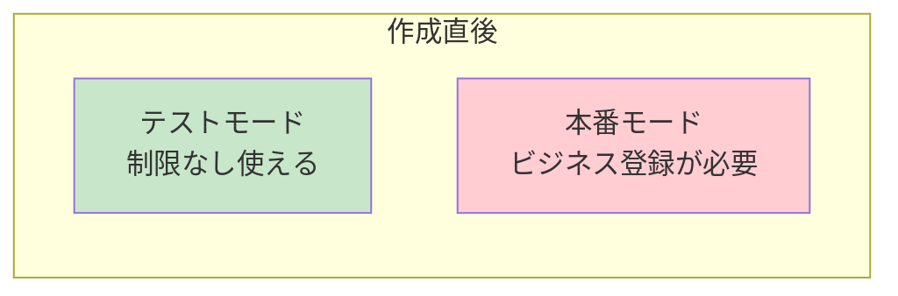
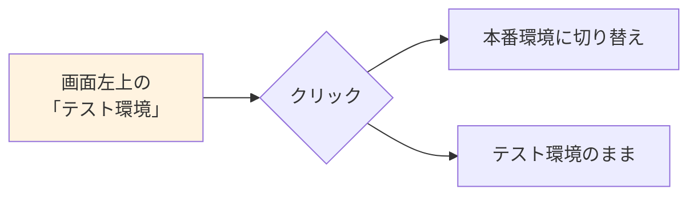
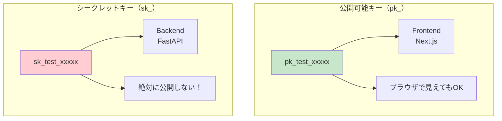
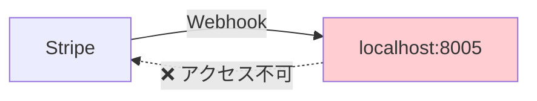
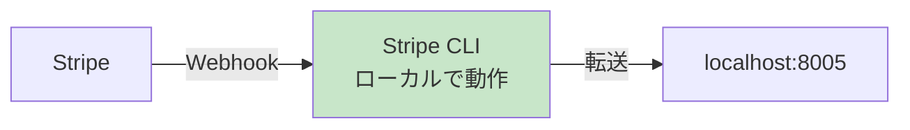

# Stripe実装準備 - アカウント作成からAPIキー取得まで

Stripeを使った決済機能を実装するための準備ガイド。
アカウント作成から開発環境のセットアップまで、ステップバイステップで解説。

---

## 目次

1. [Stripeアカウントの作成](#1-stripeアカウントの作成)
2. [Dashboardの基本操作](#2-dashboardの基本操作)
3. [APIキーの取得](#3-apiキーの取得)
4. [開発環境のセットアップ](#4-開発環境のセットアップ)
5. [Webhook Endpointの設定](#5-webhook-endpointの設定)
6. [動作確認](#6-動作確認)

---

## 1. Stripeアカウントの作成

### 手順

1. [Stripe公式サイト](https://stripe.com/jp)にアクセス
2. 「今すぐ始める」をクリック
3. メールアドレス、パスワードを入力
4. メール認証を完了

```
⏱️ 所要時間: 約5分
💰 費用: 無料（決済発生時のみ手数料）
```

### アカウント作成直後の状態



**ポイント：**
- テストモードはすぐに使える
- 本番モードは「ビジネス情報の登録」が必要（後でOK）

---

## 2. Dashboardの基本操作

### Dashboard画面の見方

```
┌─────────────────────────────────────────────────────────┐
│  🔧 テスト環境 ▼        Stripe Dashboard                 │
├─────────────────────────────────────────────────────────┤
│                                                          │
│  📊 ホーム     │  今日の売上: ¥0                         │
│  💳 支払い     │  ━━━━━━━━━━━━━━━━━━━━━━━━━━━           │
│  👥 顧客       │                                         │
│  📦 商品       │  最近の支払い                           │
│  🔗 開発者     │  まだ支払いがありません                  │
│  ⚙️ 設定      │                                         │
│                │                                         │
└─────────────────────────────────────────────────────────┘
```

### テストモード/本番モードの切り替え



**重要：開発中は常に「テスト環境」を使う！**

---

## 3. APIキーの取得

### APIキーの場所

1. Dashboard → 「開発者」→ 「APIキー」
2. または直接アクセス: https://dashboard.stripe.com/test/apikeys

### 取得するキー

```
┌─────────────────────────────────────────────────────────┐
│  APIキー                                                 │
├─────────────────────────────────────────────────────────┤
│                                                          │
│  公開可能キー                                            │
│  pk_test_51xxxxxxxxxxxxxxxxxxxxxxxxxxxxx                │
│  [コピー]                                                │
│                                                          │
│  シークレットキー                                         │
│  sk_test_51xxxxxxxxxxxxxxxxxxxxxxxxxxxxx    [表示]      │
│  [コピー]                                                │
│                                                          │
└─────────────────────────────────────────────────────────┘
```

### キーの使い分け



---

## 4. 開発環境のセットアップ

### Backend（FastAPI）の設定

**1. パッケージのインストール**

```bash
# requirements.txt に追加
stripe==7.0.0
```

**2. 環境変数の設定**

```bash
# backend/.env
STRIPE_SECRET_KEY=sk_test_51xxxxxxxxxxxxxxxxxxxxxxxxxxxxx
STRIPE_WEBHOOK_SECRET=whsec_xxxxx  # 後で設定
```

**3. Stripeクライアントの初期化**

```python
# backend/app/config.py に追加
import os

class Settings(BaseSettings):
    # ... 既存の設定 ...

    # Stripe
    stripe_secret_key: str = os.getenv("STRIPE_SECRET_KEY", "")
    stripe_webhook_secret: str = os.getenv("STRIPE_WEBHOOK_SECRET", "")
```

```python
# backend/app/infrastructure/payment/stripe_client.py
import stripe
from app.config import get_settings

settings = get_settings()
stripe.api_key = settings.stripe_secret_key
```

### Frontend（Next.js）の設定

**1. パッケージのインストール**

```bash
cd frontend
npm install @stripe/stripe-js @stripe/react-stripe-js
```

**2. 環境変数の設定**

```bash
# frontend/.env.local
NEXT_PUBLIC_STRIPE_PUBLISHABLE_KEY=pk_test_51xxxxxxxxxxxxxxxxxxxxxxxxxxxxx
```

**3. Stripeの初期化**

```typescript
// frontend/src/shared/lib/stripe.ts
import { loadStripe } from '@stripe/stripe-js';

export const stripePromise = loadStripe(
  process.env.NEXT_PUBLIC_STRIPE_PUBLISHABLE_KEY!
);
```

### ディレクトリ構成（ACRIQUEの場合）

```
backend/
├── app/
│   ├── infrastructure/
│   │   └── payment/
│   │       ├── stripe_client.py      # Stripe初期化
│   │       └── stripe_service.py     # 決済ロジック
│   ├── application/
│   │   └── use_cases/
│   │       └── payment_usecase.py    # 決済ユースケース
│   └── presentation/
│       └── api/
│           ├── payment_api.py        # 決済API
│           └── webhook_api.py        # Webhook受信

frontend/
├── src/
│   ├── shared/
│   │   └── lib/
│   │       └── stripe.ts             # Stripe初期化
│   ├── features/
│   │   └── payment/
│   │       ├── api/                  # API呼び出し
│   │       ├── lib/                  # hooks
│   │       └── ui/                   # カードフォーム
│   └── page-components/
│       └── checkout/                 # チェックアウト画面
```

---

## 5. Webhook Endpointの設定

### ローカル開発でのWebhookテスト

**問題：Stripeはlocalhost:8005にアクセスできない**



**解決策：Stripe CLIを使う**



### Stripe CLIのセットアップ

**1. インストール**

```bash
# macOS
brew install stripe/stripe-cli/stripe

# Windows
scoop install stripe

# その他
# https://stripe.com/docs/stripe-cli#install
```

**2. ログイン**

```bash
stripe login
# ブラウザが開くので認証
```

**3. Webhookの転送を開始**

```bash
stripe listen --forward-to localhost:8005/api/v1/webhook/stripe
```

**出力例：**
```
> Ready! Your webhook signing secret is whsec_xxxxxxxxxxxxx
```

この `whsec_xxxxx` を `.env` の `STRIPE_WEBHOOK_SECRET` に設定

### 本番環境でのWebhook設定

1. Dashboard → 「開発者」→ 「Webhook」
2. 「エンドポイントを追加」
3. 設定内容：

```
エンドポイントURL: https://api.acrique.jp/api/v1/webhook/stripe

リッスンするイベント:
- payment_intent.succeeded（決済成功）
- payment_intent.payment_failed（決済失敗）
- charge.refunded（返金）
```

---

## 6. 動作確認

### CLIでテスト決済を発行

```bash
# PaymentIntentを作成
stripe payment_intents create \
  --amount 1000 \
  --currency jpy

# 結果例
{
  "id": "pi_xxxxx",
  "amount": 1000,
  "currency": "jpy",
  "status": "requires_payment_method",
  "client_secret": "pi_xxxxx_secret_xxxxx"
}
```

### Webhookの受信テスト

```bash
# 別ターミナルで
stripe trigger payment_intent.succeeded

# Backend側でイベントを受信できれば成功
```

### チェックリスト

```
□ Stripeアカウントを作成した
□ テストモードのAPIキーを取得した
  □ pk_test_xxxxx（公開可能キー）
  □ sk_test_xxxxx（シークレットキー）
□ Backend（FastAPI）にstripeパッケージをインストールした
□ Frontend（Next.js）に@stripe/stripe-jsをインストールした
□ 環境変数を設定した
□ Stripe CLIをインストールした
□ stripe login で認証した
□ stripe listen でWebhook転送を確認した
□ whsec_xxxxx を環境変数に設定した
```

---

## よくあるトラブル

### 1. APIキーが違う

```
stripe.error.AuthenticationError: Invalid API Key provided
```

**対処：**
- テストモードのキーを使っているか確認
- 環境変数が正しく読み込まれているか確認

### 2. Webhookの署名検証エラー

```
stripe.error.SignatureVerificationError
```

**対処：**
- `STRIPE_WEBHOOK_SECRET` が正しいか確認
- Stripe CLIを再起動して新しいsecretを取得

### 3. CLIでログインできない

**対処：**
- ブラウザでStripeにログイン済みか確認
- VPNを使っている場合は一時的にOFF

---

## 次のステップ


**次に読むドキュメント:**
- **03-Stripe Frontend実装** - Stripe Elementsでカードフォームを作る

---

**作成日**: 2025-01-10
**対象**: Stripe未経験の開発者
**所要時間**: 約30分（セットアップ込み）
