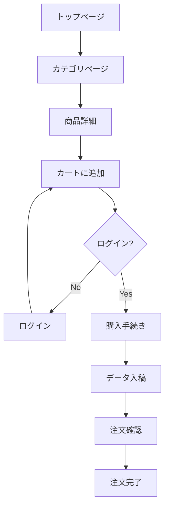
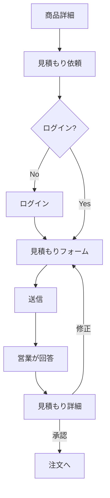
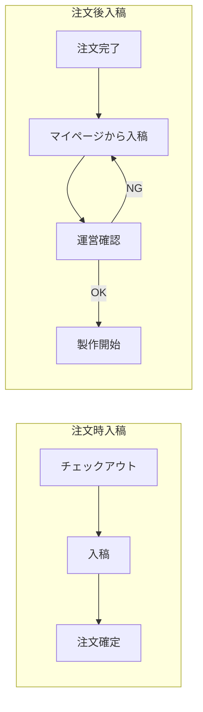
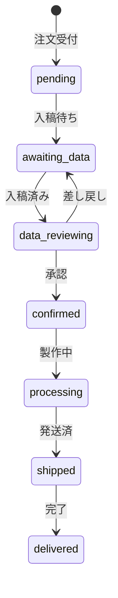
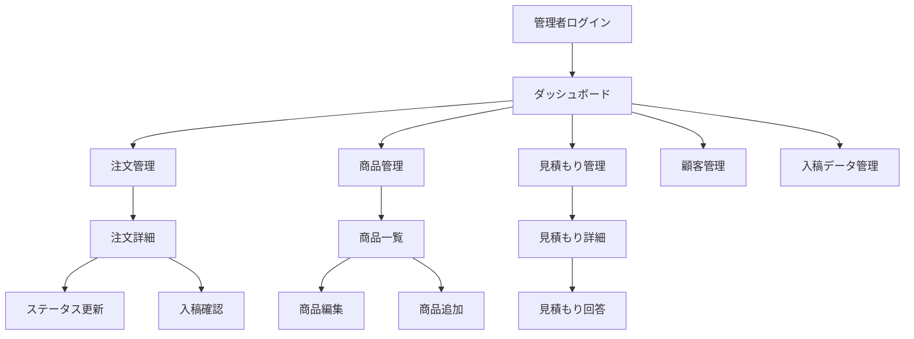

# ACRIQUE 画面遷移図

## 1. 購入フロー

## 2. 見積もりフロー

## 3. データ入稿フロー

## 4. 注文ステータス

---

## 5. 画面一覧

### Public（認証不要）

| Path | ページ名 | 状況 |
|------|---------|-----|
| `/` | トップ | 完了 |
| `/about` | About | 完了 |
| `/contact` | お問い合わせ | 完了 |
| `/shop` | 店舗向け | 完了 |
| `/office` | オフィス向け | 完了 |
| `/you` | 個人向け | 完了 |
| `/[category]/[id]` | 商品詳細 | 完了 |
| `/guide` | ご利用ガイド | - |
| `/faq` | FAQ | - |
| `/privacy` | プライバシーポリシー | - |
| `/terms` | 利用規約 | - |
| `/law` | 特商法表記 | - |
| `/login` | ログイン | 既存 |
| `/register` | 会員登録 | - |
| `/password-reset` | パスワードリセット依頼 | - |
| `/password-reset/confirm` | パスワード再設定 | - |

### Authenticated（認証必要）

| Path | ページ名 | 状況 |
|------|---------|-----|
| `/mypage` | マイページ | 既存 |
| `/mypage/orders` | 注文履歴 | - |
| `/mypage/orders/[id]` | 注文詳細 | - |
| `/mypage/orders/[id]/upload` | データ入稿 | - |
| `/mypage/profile` | プロフィール | - |
| `/mypage/addresses` | 配送先管理 | - |
| `/cart` | カート | - |
| `/checkout` | 購入手続き | - |
| `/checkout/upload` | データ入稿 | - |
| `/checkout/confirm` | 注文確認 | - |
| `/checkout/complete` | 注文完了 | - |
| `/estimate` | 見積もり一覧 | - |
| `/estimate/[id]` | 見積もり詳細 | - |
| `/estimate/request` | 見積もり依頼 | - |

---

## 6. 管理画面フロー

### Admin（管理画面）

| Path | ページ名 | 状況 |
|------|---------|-----|
| `/admin/login` | 管理者ログイン | - |
| `/admin` | ダッシュボード | - |
| `/admin/orders` | 注文一覧 | - |
| `/admin/orders/[id]` | 注文詳細・編集 | - |
| `/admin/products` | 商品一覧 | - |
| `/admin/products/new` | 商品追加 | - |
| `/admin/products/[id]` | 商品編集 | - |
| `/admin/categories` | カテゴリ管理 | - |
| `/admin/estimates` | 見積もり一覧 | - |
| `/admin/estimates/[id]` | 見積もり詳細・回答 | - |
| `/admin/uploads` | 入稿データ一覧 | - |
| `/admin/uploads/[id]` | 入稿確認・承認 | - |
| `/admin/users` | 顧客一覧 | - |
| `/admin/users/[id]` | 顧客詳細 | - |
| `/admin/admins` | 管理者一覧 | - |
| `/admin/logs` | 操作ログ | - |
| `/admin/settings` | サイト設定 | - |

---

## 7. 入稿データ

| 商品タイプ | データ | 形式 |
|-----------|--------|------|
| ロゴ系 | ロゴデータ | AI, EPS, PDF, SVG |
| QRコード系 | URL or 画像 | URL / PNG |
| 写真系 | 写真 | JPG, PNG（300dpi+） |
| 名入れ系 | テキスト | フォーム入力 |
