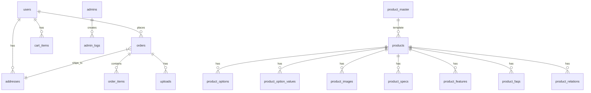

# ACRIQUE データベース設計

## ER図



---

## ユーザー系

### users

| Column | Type | Null | Description |
|--------|------|------|-------------|
| id | SERIAL | PK | |
| email | VARCHAR(255) | NOT NULL, UNIQUE | |
| password_hash | VARCHAR(255) | NOT NULL | |
| name | VARCHAR(100) | | 氏名 |
| name_kana | VARCHAR(100) | | フリガナ |
| phone | VARCHAR(20) | | |
| company | VARCHAR(200) | | 会社名 |
| stripe_customer_id | VARCHAR(255) | | |
| email_verified_at | TIMESTAMP | | |
| created_at | TIMESTAMP | NOT NULL | |
| updated_at | TIMESTAMP | NOT NULL | |

### addresses

| Column | Type | Null | Description |
|--------|------|------|-------------|
| id | SERIAL | PK | |
| user_id | INT | FK | |
| label | VARCHAR(50) | | 自宅/会社等 |
| name | VARCHAR(100) | NOT NULL | 宛名 |
| postal_code | VARCHAR(10) | NOT NULL | |
| prefecture | VARCHAR(20) | NOT NULL | |
| city | VARCHAR(100) | NOT NULL | |
| address1 | VARCHAR(255) | NOT NULL | |
| address2 | VARCHAR(255) | | |
| phone | VARCHAR(20) | NOT NULL | |
| is_default | BOOLEAN | DEFAULT false | |
| created_at | TIMESTAMP | | |

### admins

| Column | Type | Null | Description |
|--------|------|------|-------------|
| id | SERIAL | PK | |
| email | VARCHAR(255) | NOT NULL, UNIQUE | |
| password_hash | VARCHAR(255) | NOT NULL | |
| name | VARCHAR(100) | NOT NULL | |
| role | VARCHAR(20) | NOT NULL | super_admin / admin / staff |
| is_active | BOOLEAN | DEFAULT true | |
| last_login_at | TIMESTAMP | | |
| created_at | TIMESTAMP | | |

### admin_logs

| Column | Type | Null | Description |
|--------|------|------|-------------|
| id | SERIAL | PK | |
| admin_id | INT | FK | |
| action | VARCHAR(50) | NOT NULL | create/update/delete |
| target_type | VARCHAR(50) | NOT NULL | product/order/user等 |
| target_id | VARCHAR(100) | | |
| details | JSONB | | 変更内容 |
| ip_address | VARCHAR(50) | | |
| created_at | TIMESTAMP | | |

---

## 商品系

### product_master

形状テンプレート（Canvas, Round, Silhouette等）を定義。

| Column | Type | Null | Description |
|--------|------|------|-------------|
| id | VARCHAR(100) | PK | canvas, round, silhouette等 |
| name | VARCHAR(200) | NOT NULL | 日本語名 |
| name_en | VARCHAR(200) | NOT NULL | 英語名（The Canvas等） |
| model_category | VARCHAR(50) | NOT NULL | signature/standard/free-cut/structure |
| tagline | VARCHAR(255) | | 形状のキャッチコピー |
| description | TEXT | | 形状の説明 |
| base_lead_time_days | INT | | 基準納期（目安） |
| is_active | BOOLEAN | DEFAULT true | |
| sort_order | INT | DEFAULT 0 | |
| created_at | TIMESTAMP | | |
| updated_at | TIMESTAMP | | |

**model_category:**
- `signature` - シグネチャーモデル（定型四角）
- `standard` - スタンダードモデル（円形、アーチ等）
- `free-cut` - フリーカットモデル（輪郭切り抜き、文字等）
- `structure` - ストラクチャーモデル（異素材構造）

### products

| Column | Type | Null | Description |
|--------|------|------|-------------|
| id | VARCHAR(100) | PK | shop-canvas-photo等 |
| master_id | VARCHAR(100) | FK → product_master | 形状テンプレート参照 |
| category_id | VARCHAR(50) | NOT NULL | shop/office/you |
| production_type | VARCHAR(50) | NOT NULL | standard/template/custom |
| name | VARCHAR(200) | NOT NULL | 英語名 |
| name_ja | VARCHAR(200) | NOT NULL | 日本語名 |
| slug | VARCHAR(200) | UNIQUE | URL用 |
| tagline | VARCHAR(255) | | キャッチコピー |
| description | TEXT | | 短い説明 |
| long_description | TEXT | | 詳細説明 |
| base_price | INT | NOT NULL | 税抜基本価格 |
| price_note | VARCHAR(255) | | 価格補足 |
| lead_time_days | INT | | 標準納期 |
| lead_time_note | VARCHAR(255) | | 納期補足 |
| upload_requirements | JSONB | | 入稿要件（後述） |
| is_active | BOOLEAN | DEFAULT true | |
| is_featured | BOOLEAN | DEFAULT false | おすすめ |
| sort_order | INT | DEFAULT 0 | |
| created_at | TIMESTAMP | | |
| updated_at | TIMESTAMP | | |

**production_type:**
- `standard` - 標準デザイン（入稿不要、価格安め）
- `template` - テンプレートカスタム（テキスト/URL入力）
- `custom` - フルカスタム（ファイル入稿）

**upload_requirements:**
```jsonc
// standard の場合
null

// template の場合（例: 結婚証明書）
{
  "inputs": [
    { "type": "text", "key": "groom_name", "label": "新郎のお名前", "required": true },
    { "type": "text", "key": "bride_name", "label": "新婦のお名前", "required": true },
    { "type": "date", "key": "wedding_date", "label": "挙式日", "required": true }
  ]
}

// custom の場合（例: フォトキャンバス）
{
  "inputs": [
    { "type": "file", "key": "photo", "label": "写真", "required": true, "accept": "image/*" }
  ]
}
```

### product_images

| Column | Type | Null | Description |
|--------|------|------|-------------|
| id | SERIAL | PK | |
| product_id | VARCHAR(100) | FK | |
| s3_url | VARCHAR(500) | NOT NULL | S3画像URL |
| alt | VARCHAR(255) | | |
| is_main | BOOLEAN | DEFAULT false | |
| sort_order | INT | DEFAULT 0 | |

### product_options

| Column | Type | Null | Description |
|--------|------|------|-------------|
| id | SERIAL | PK | |
| product_id | VARCHAR(100) | FK | |
| name | VARCHAR(100) | NOT NULL | サイズ/厚み等 |
| is_required | BOOLEAN | DEFAULT true | |
| sort_order | INT | DEFAULT 0 | |

### product_option_values

| Column | Type | Null | Description |
|--------|------|------|-------------|
| id | SERIAL | PK | |
| option_id | INT | FK | |
| label | VARCHAR(100) | NOT NULL | 50mm角 |
| price_diff | INT | DEFAULT 0 | 価格差分 |
| description | VARCHAR(255) | | コンパクト等 |
| sort_order | INT | DEFAULT 0 | |

### product_specs

| Column | Type | Null | Description |
|--------|------|------|-------------|
| id | SERIAL | PK | |
| product_id | VARCHAR(100) | FK | |
| label | VARCHAR(100) | NOT NULL | サイズ |
| value | VARCHAR(255) | NOT NULL | 50mm〜80mm角 |
| sort_order | INT | DEFAULT 0 | |

### product_features

| Column | Type | Null | Description |
|--------|------|------|-------------|
| id | SERIAL | PK | |
| product_id | VARCHAR(100) | FK | |
| title | VARCHAR(200) | NOT NULL | |
| description | TEXT | | |
| sort_order | INT | DEFAULT 0 | |

### product_faqs

| Column | Type | Null | Description |
|--------|------|------|-------------|
| id | SERIAL | PK | |
| product_id | VARCHAR(100) | FK | |
| question | TEXT | NOT NULL | |
| answer | TEXT | NOT NULL | |
| sort_order | INT | DEFAULT 0 | |

### product_relations

| Column | Type | Null | Description |
|--------|------|------|-------------|
| id | SERIAL | PK | |
| product_id | VARCHAR(100) | FK | |
| related_product_id | VARCHAR(100) | FK | |
| sort_order | INT | DEFAULT 0 | |

---

## カート

### cart_items

| Column | Type | Null | Description |
|--------|------|------|-------------|
| id | SERIAL | PK | |
| user_id | INT | FK | |
| product_id | VARCHAR(100) | FK | |
| quantity | INT | NOT NULL | |
| options | JSONB | | 選択オプション |
| created_at | TIMESTAMP | | |
| updated_at | TIMESTAMP | | |

---

## 注文系

### orders

| Column | Type | Null | Description |
|--------|------|------|-------------|
| id | SERIAL | PK | |
| user_id | INT | FK | |
| order_number | VARCHAR(20) | UNIQUE | ACQ-240101-001 |
| status | VARCHAR(30) | NOT NULL | |
| shipping_address_id | INT | FK → addresses | |
| subtotal | INT | NOT NULL | 小計 |
| shipping_fee | INT | DEFAULT 0 | |
| tax | INT | NOT NULL | 消費税 |
| total | INT | NOT NULL | 合計 |
| payment_method | VARCHAR(30) | | stripe/bank_transfer |
| stripe_payment_intent_id | VARCHAR(255) | | |
| paid_at | TIMESTAMP | | |
| confirmed_at | TIMESTAMP | | |
| shipped_at | TIMESTAMP | | |
| tracking_number | VARCHAR(100) | | 追跡番号 |
| delivered_at | TIMESTAMP | | |
| cancelled_at | TIMESTAMP | | |
| cancel_reason | TEXT | | |
| notes | TEXT | | 顧客備考 |
| admin_notes | TEXT | | 管理者メモ |
| created_at | TIMESTAMP | | |
| updated_at | TIMESTAMP | | |

**status:**
- `pending` - 支払い待ち（注文作成〜支払い完了）
- `reviewing` - 入稿審査中（Admin確認待ち）
- `revision_required` - 再入稿待ち（Admin差し戻し後）
- `confirmed` - 製作待ち（審査完了 or 入稿不要）
- `processing` - 製作中
- `shipped` - 発送済み
- `delivered` - 完了
- `cancelled` - キャンセル

### order_items

| Column | Type | Null | Description |
|--------|------|------|-------------|
| id | SERIAL | PK | |
| order_id | INT | FK | |
| product_id | VARCHAR(100) | FK | |
| product_name | VARCHAR(200) | NOT NULL | スナップショット |
| product_name_ja | VARCHAR(200) | | |
| quantity | INT | NOT NULL | |
| unit_price | INT | NOT NULL | |
| options | JSONB | | 選択オプション |
| subtotal | INT | NOT NULL | |

---

## 入稿データ

### uploads

| Column | Type | Null | Description |
|--------|------|------|-------------|
| id | SERIAL | PK | |
| user_id | INT | FK | |
| order_id | INT | FK, nullable | 注文確定後に紐付け |
| order_item_id | INT | FK, nullable | 明細単位 |
| quantity_index | INT | | 何個目の入稿か（1始まり） |
| file_name | VARCHAR(255) | NOT NULL | 元ファイル名 |
| s3_key | VARCHAR(500) | NOT NULL | S3オブジェクトキー |
| file_url | VARCHAR(500) | NOT NULL | CloudFront配信URL |
| file_type | VARCHAR(100) | | MIMEタイプ |
| file_size | INT | | bytes |
| upload_type | VARCHAR(50) | | logo/qr/photo/text |
| text_content | TEXT | | テキスト入稿の場合 |
| status | VARCHAR(30) | NOT NULL | |
| admin_notes | TEXT | | 差し戻し理由など |
| reviewed_by | INT | FK → admins | |
| reviewed_at | TIMESTAMP | | |
| created_at | TIMESTAMP | | |

**status:**　（要件変更0111）
- `pending` - アップロード完了（注文前）
- `submitted` - 注文に紐付け済み
- `reviewing` - Admin審査中
- `approved` - 承認
- `rejected` - 差し戻し

---

## Stripe連携

| ACRIQUE | Stripe |
|---------|--------|
| users.stripe_customer_id | Customer ID |
| orders.stripe_payment_intent_id | PaymentIntent ID |

---

## インデックス

```sql
-- 検索
CREATE INDEX idx_products_category ON products(category_id);
CREATE INDEX idx_products_active ON products(is_active);
CREATE INDEX idx_orders_user ON orders(user_id);
CREATE INDEX idx_orders_status ON orders(status);
CREATE INDEX idx_orders_created ON orders(created_at DESC);
CREATE INDEX idx_uploads_order ON uploads(order_id);
CREATE INDEX idx_uploads_status ON uploads(status);
CREATE INDEX idx_admin_logs_admin ON admin_logs(admin_id);
CREATE INDEX idx_admin_logs_created ON admin_logs(created_at DESC);
```
