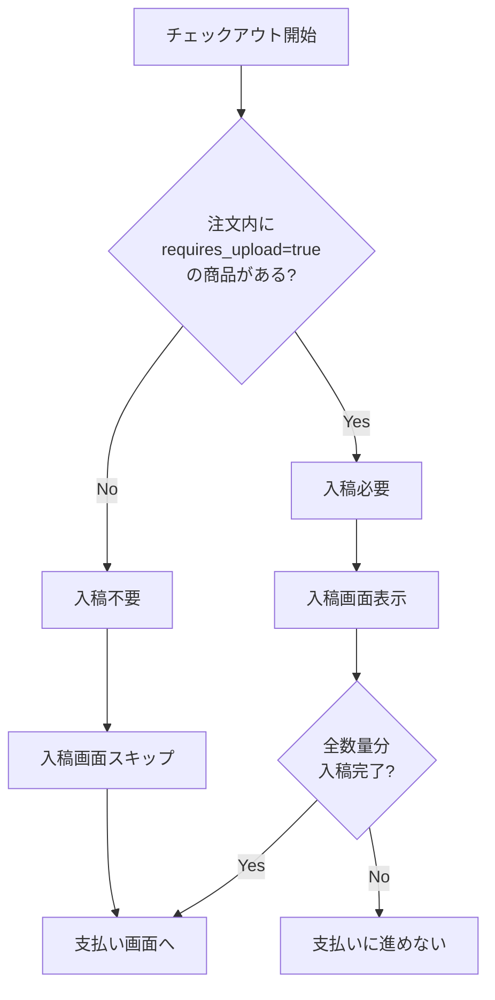
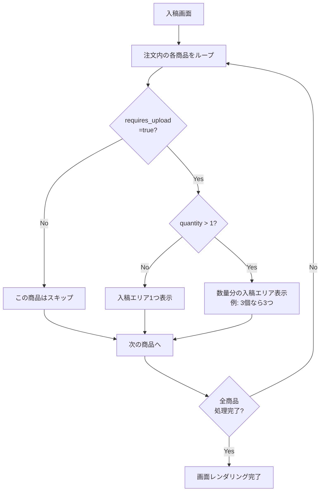
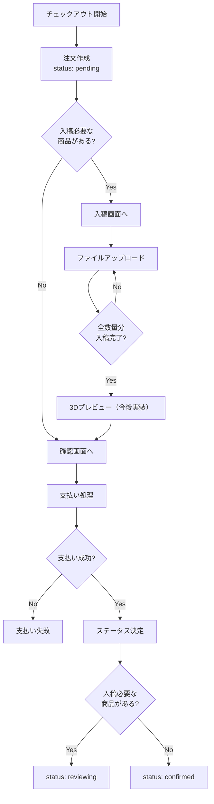
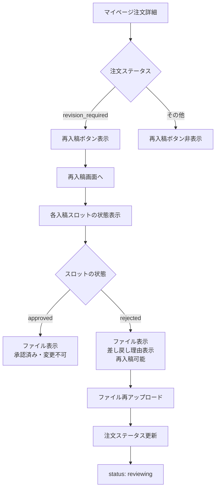
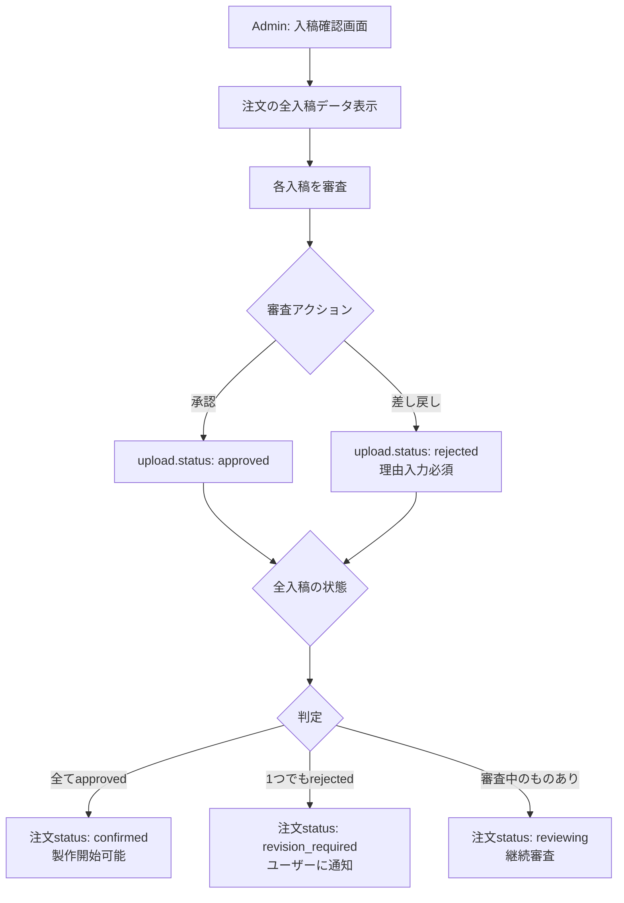
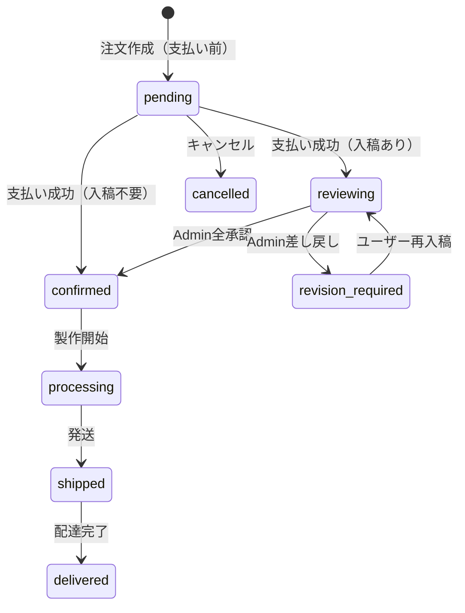
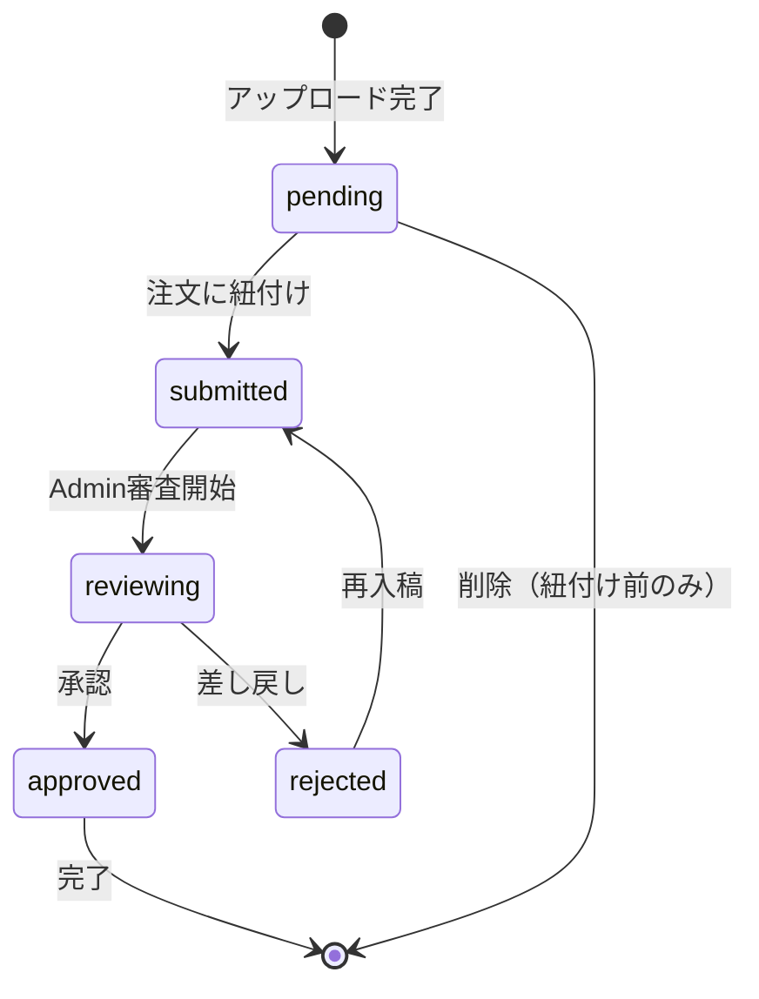
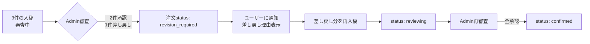
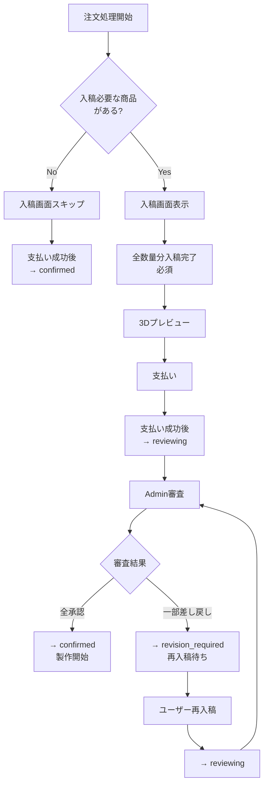

# データ入稿フロー 要件定義

## 概要

商品によっては、ロゴ・QRコード・写真等のデータ入稿が必要。
**入稿必要商品は、支払い前に入稿を完了させる必要がある。**

---

## 1. 入稿要否の判定



---

## 2. 入稿画面での表示ロジック



### 表示例

```
注文内容:
- 商品A（入稿必要）× 2個
- 商品B（入稿不要）× 1個
- 商品C（入稿必要）× 1個

入稿画面の表示:
┌─────────────────────────────┐
│ 商品A                        │
│ ├─ 1個目: [Dropzone]        │
│ └─ 2個目: [Dropzone]        │
├─────────────────────────────┤
│ 商品C                        │
│ └─ [Dropzone]               │
└─────────────────────────────┘
※商品Bは表示されない
```

---

## 3. チェックアウトフロー



**ポイント:**
- 入稿必要商品がある場合、全数量分の入稿が完了しないと支払いに進めない
- 支払い完了時点で入稿は完了している前提

---

## 4. マイページ再入稿フロー（差し戻し時のみ）



**ポイント:**
- マイページでの入稿は**差し戻し時のみ**発生
- 通常フローではチェックアウト時に入稿完了

---

## 5. Admin審査フロー



---

## 6. 注文ステータス遷移図



### ステータス一覧

| ステータス | 意味 |
|-----------|------|
| `pending` | 支払い待ち（注文作成〜支払い完了） |
| `reviewing` | 入稿審査中（Admin確認待ち） |
| `revision_required` | 再入稿待ち（Admin差し戻し後） |
| `confirmed` | 製作待ち（審査完了 or 入稿不要） |
| `processing` | 製作中 |
| `shipped` | 発送済み |
| `delivered` | 完了 |
| `cancelled` | キャンセル |

---

## 7. 入稿データステータス遷移図



---

## 8. エッジケース

### 8.1 Admin審査で一部差し戻し



---

## 9. DBスキーマ要件

### uploads テーブル

| カラム | 型 | 説明 |
|--------|-----|------|
| id | INT | PK |
| user_id | INT | FK → users |
| order_id | INT | FK → orders（紐付け後） |
| order_item_id | INT | FK → order_items（紐付け後） |
| quantity_index | INT | 何個目の入稿か（1始まり） |
| file_name | VARCHAR | ファイル名 |
| s3_key | VARCHAR | S3キー |
| file_url | VARCHAR | ファイルURL |
| file_type | VARCHAR | MIMEタイプ |
| file_size | INT | ファイルサイズ |
| upload_type | VARCHAR | logo / qr / photo / text |
| text_content | TEXT | テキスト入稿の場合 |
| status | VARCHAR | pending / submitted / reviewing / approved / rejected |
| admin_notes | TEXT | 差し戻し理由など |
| reviewed_by | INT | FK → admins |
| reviewed_at | TIMESTAMP | 審査日時 |
| created_at | TIMESTAMP | 作成日時 |

---

## 10. API要件

### 支払い成功時のステータス決定

```python
def determine_status_after_payment(order) -> OrderStatus:
    """支払い成功後のステータスを決定"""
    has_upload_required = any(
        get_product(item.product_id).requires_upload
        for item in order.items
    )

    if not has_upload_required:
        return OrderStatus.CONFIRMED  # 入稿不要 → 製作待ち

    # 入稿必要商品がある場合、支払い前に入稿完了済みなので
    return OrderStatus.REVIEWING  # 審査待ち
```

---

## 11. フロントエンド要件

### 入稿画面の状態管理

```typescript
interface UploadSlot {
  orderItemId: number;
  quantityIndex: number;  // 1, 2, 3...
  productName: string;
  uploadType: 'logo' | 'qr' | 'photo' | 'text';
  status: 'empty' | 'pending' | 'submitted' | 'approved' | 'rejected';
  upload?: Upload;  // 入稿済みの場合
}

// 表示用のスロット配列を生成
function generateUploadSlots(order: Order): UploadSlot[] {
  const slots: UploadSlot[] = [];

  for (const item of order.items) {
    if (!item.requires_upload) continue;

    for (let i = 1; i <= item.quantity; i++) {
      slots.push({
        orderItemId: item.id,
        quantityIndex: i,
        productName: item.product_name_ja || item.product_name,
        uploadType: getUploadType(item.product_name),
        status: 'empty',
        upload: findUpload(item.id, i),
      });
    }
  }

  return slots;
}
```

### チェックアウト時のバリデーション

```typescript
function canProceedToPayment(order: Order, uploads: Upload[]): boolean {
  for (const item of order.items) {
    if (!item.requires_upload) continue;

    // 各数量に対応する入稿があるかチェック
    for (let i = 1; i <= item.quantity; i++) {
      const hasUpload = uploads.some(
        u => u.orderItemId === item.id && u.quantityIndex === i
      );
      if (!hasUpload) return false;
    }
  }
  return true;
}
```

---

## 12. 通知要件

| イベント | 通知先 | 通知方法 |
|----------|--------|----------|
| 支払い完了（入稿あり） | Admin | メール / 管理画面通知 |
| 差し戻し | ユーザー | メール |
| 全承認 → 製作開始 | ユーザー | メール |

---

## 13. まとめ: 判定フローチャート


