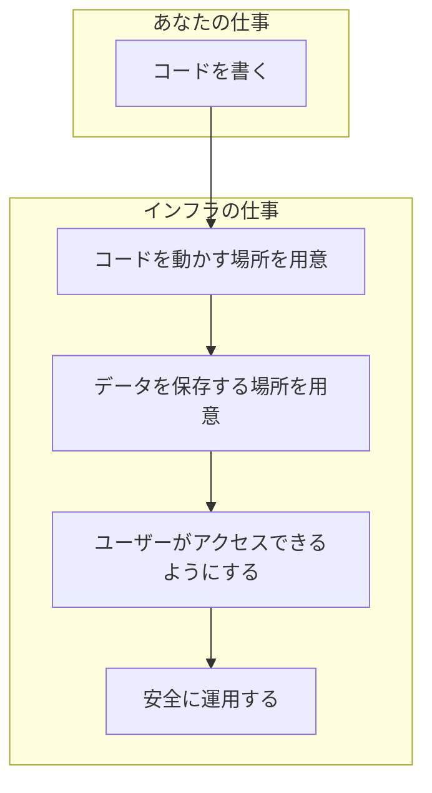
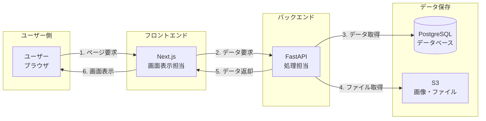
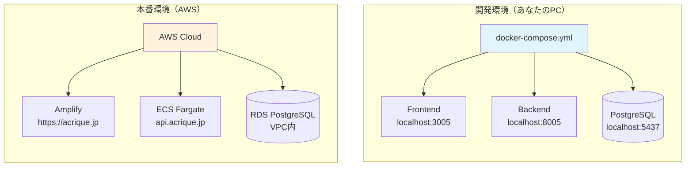
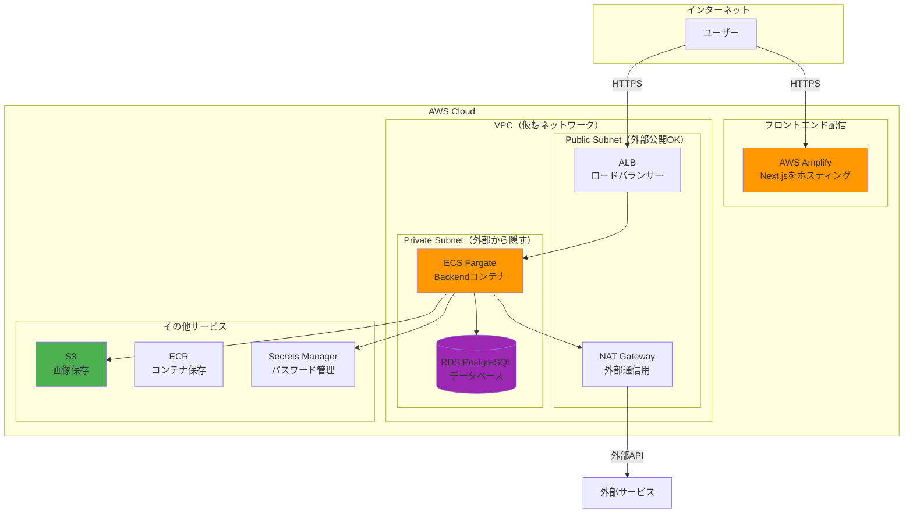
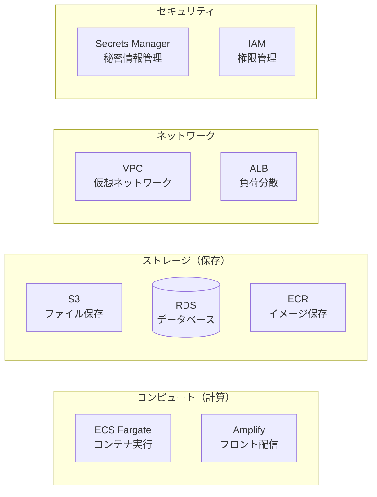
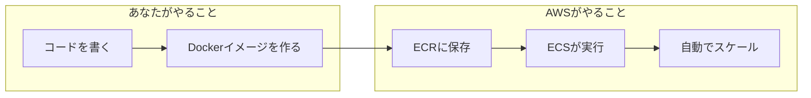
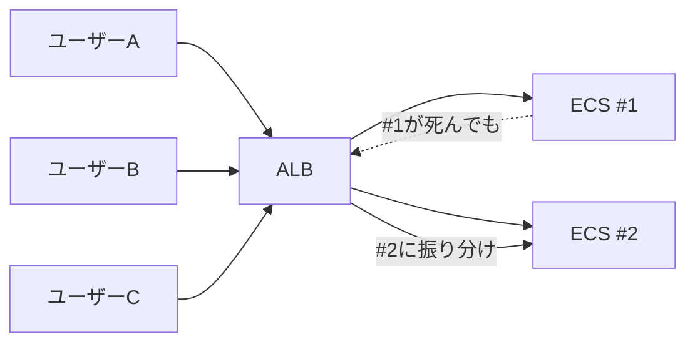
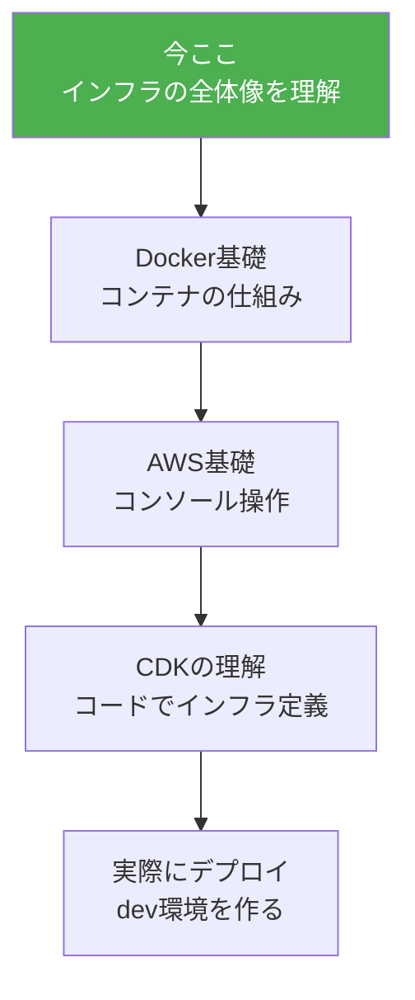

# インフラ入門 - ACRIQUEで学ぶ基礎知識

フロントエンドエンジニアのための、日常例から始めるインフラストラクチャ入門。
ACRIQUEプロジェクトを具体例として、デプロイに必要な知識を身につけよう。

---

## 目次

1. [インフラってそもそも何？](#1-インフラってそもそも何)
2. [Webアプリの「登場人物」を理解する](#2-webアプリの登場人物を理解する)
3. [開発環境 vs 本番環境](#3-開発環境-vs-本番環境)
4. [ACRIQUEの全体像](#4-acriqueの全体像)
5. [AWSの主要サービス解説](#5-awsの主要サービス解説)
6. [次のステップ](#6-次のステップ)

---

## 1. インフラってそもそも何？

### 日常の例で考える

**レストラン経営**に例えてみよう。

```
あなたがシェフ（開発者）だとして、
お客さんに料理を届けるには何が必要？

1. 厨房（開発環境）    → 料理を試作する場所
2. 店舗（サーバー）    → 実際にお客さんが来る場所
3. 看板・地図（DNS）   → お店を見つけてもらう仕組み
4. 冷蔵庫（データベース）→ 食材（データ）を保存する場所
5. 配達システム（CDN） → 遠くのお客さんにも届ける仕組み
```

**インフラ = 料理（アプリ）を作る以外の、全ての「お店の設備」**

### プログラミングの世界では



---

## 2. Webアプリの「登場人物」を理解する

### ACRIQUEで実際に使っている登場人物



### それぞれの役割（レストランに例えると）

| 登場人物 | ACRIQUEでの技術 | レストランでは |
|---------|----------------|---------------|
| **フロントエンド** | Next.js | ホール係（お客さんとやりとり） |
| **バックエンド** | FastAPI (Python) | 厨房（料理を作る） |
| **データベース** | PostgreSQL | 冷蔵庫・倉庫（食材を保管） |
| **オブジェクトストレージ** | S3 | ワインセラー（特別なものを保管） |
| **ロードバランサー** | ALB | 案内係（混雑時に席を振り分け） |

---

## 3. 開発環境 vs 本番環境

### なぜ2つの環境が必要？

```
開発環境 = 厨房の試作スペース
  → 失敗しても大丈夫
  → 自分だけが使う
  → 簡単に作り直せる

本番環境 = 実際の店舗
  → 失敗は許されない
  → 多くのお客さんが使う
  → 止まると売上に影響
```

### ACRIQUEの2つの環境



### 具体的な違い

| 項目 | 開発環境 | 本番環境 |
|-----|---------|---------|
| **どこで動く** | 自分のPC (Docker) | AWS (クラウド) |
| **アクセス** | localhost | https://acrique.jp |
| **データベース** | Docker内のPostgreSQL | AWS RDS |
| **コスト** | 無料 | 月額費用発生 |
| **信頼性** | 低い（PCの電源次第） | 高い（24時間稼働） |
| **スケール** | 1台のみ | 必要に応じて増減 |

---

## 4. ACRIQUEの全体像

### 本番環境のアーキテクチャ



### この図の重要ポイント

1. **VPC（仮想ネットワーク）** = 会社のビル
   - Public Subnet = 1階ロビー（外から入れる）
   - Private Subnet = オフィス階（社員しか入れない）

2. **なぜ分ける？**
   - データベースは直接外部からアクセスさせない
   - セキュリティを確保する

---

## 5. AWSの主要サービス解説

### ACRIQUEで使うサービス一覧



### 各サービスの役割（日常例で理解）

#### ECS Fargate（バックエンド実行環境）

```
コンテナ = 持ち運びできる厨房セット

ECS Fargate = 「厨房セットを置ける場所を貸してくれるサービス」

- コンテナを渡すと、自動で動かしてくれる
- サーバーの管理は不要（AWSがやってくれる）
- 使った分だけ課金
```



#### RDS（データベース）

```
RDS = 「データベースのレンタル倉庫」

- PostgreSQL/MySQLを簡単に使える
- バックアップは自動
- 障害時は自動で復旧
```

**開発環境（Docker）との違い**

| 項目 | Docker PostgreSQL | RDS PostgreSQL |
|-----|-------------------|----------------|
| 起動 | `docker compose up` | AWSコンソール or CDK |
| バックアップ | 手動 | 自動（毎日） |
| 障害時 | 自分で対応 | AWSが自動復旧 |
| 料金 | 無料 | 月$15〜 |

#### S3（ファイルストレージ）

```
S3 = 「無限に拡張できるクラウドの押入れ」

ACRIQUEでの用途：
- 商品画像の保存
- ユーザーが入稿したデータの保存
- 設定ファイルの保存
```

#### ALB（ロードバランサー）

```
ALB = 「優秀な受付係」

仕事：
1. ユーザーからのリクエストを受け取る
2. 複数のECSコンテナに振り分ける
3. 1つが壊れても、他に振り分ける
```



#### Amplify（フロントエンド配信）

```
Amplify = 「Next.jsを簡単に公開できるサービス」

特徴：
- GitHubと連携して自動デプロイ
- HTTPSが自動で設定される
- 世界中のCDNで高速配信
```

---

## 6. 次のステップ

### 学習ロードマップ



### 次に読むべきドキュメント

1. **02-Docker入門** - コンテナの仕組みを理解
2. **03-AWS基礎** - AWSコンソールの操作方法
3. **04-CDK入門** - ACRIQUEのinfraフォルダの読み方
4. **05-デプロイ実践** - 実際にデプロイしてみる

### 今日のまとめ

```
1. インフラ = アプリを動かすための「設備全般」

2. ACRIQUEの構成
   - Frontend: Next.js → Amplifyで配信
   - Backend: FastAPI → ECS Fargateで実行
   - Database: PostgreSQL → RDSで管理

3. 開発環境と本番環境は全く別物
   - 開発: Docker Compose（ローカル）
   - 本番: AWS（クラウド）

4. AWSのサービスは「役割分担」
   - 計算する人（ECS）
   - 保存する人（S3, RDS）
   - 交通整理する人（ALB, VPC）
```

---

**作成日**: 2025-01-06
**対象**: フロントエンドエンジニア（インフラ初心者）
**所要時間**: 約15分
