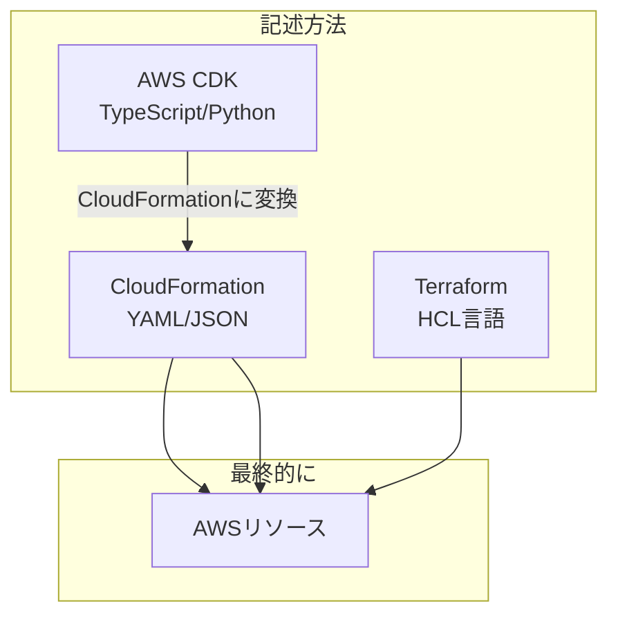
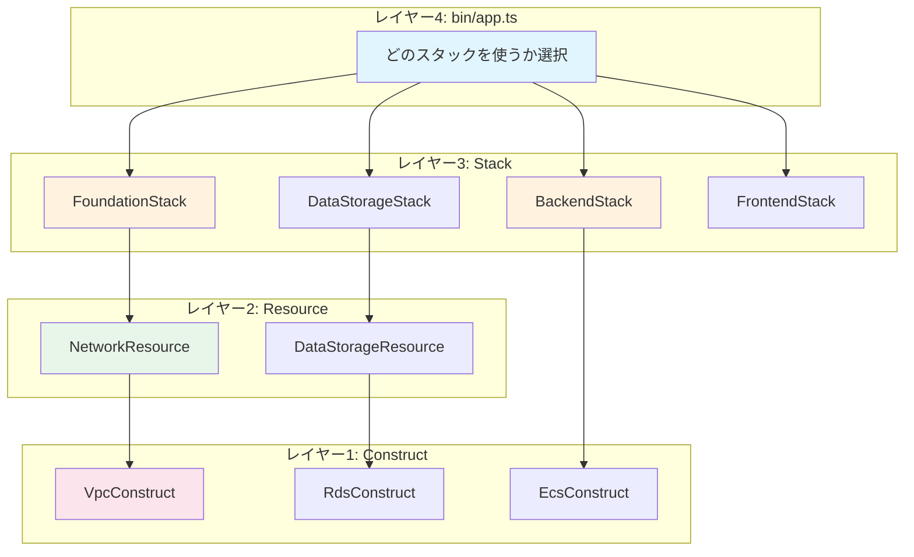
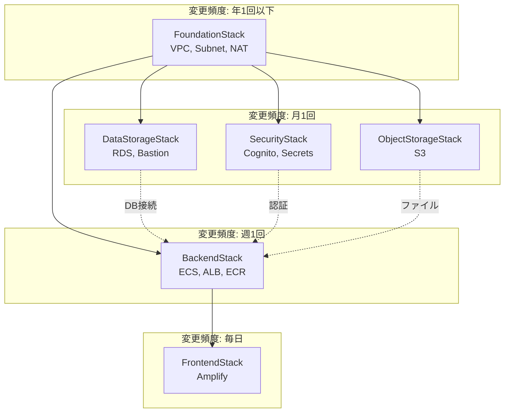
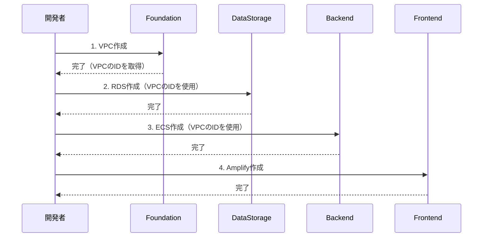
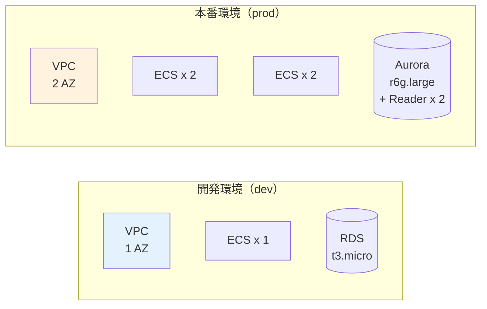
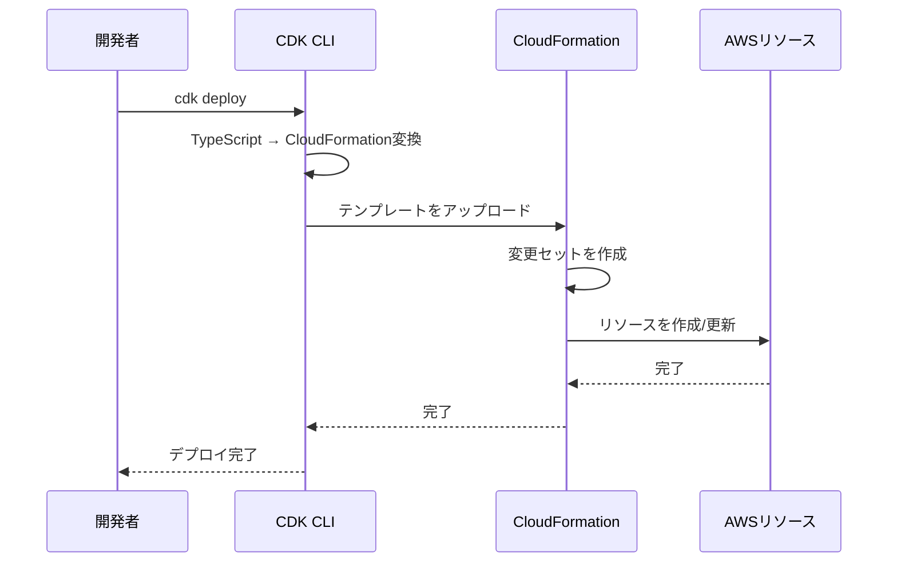
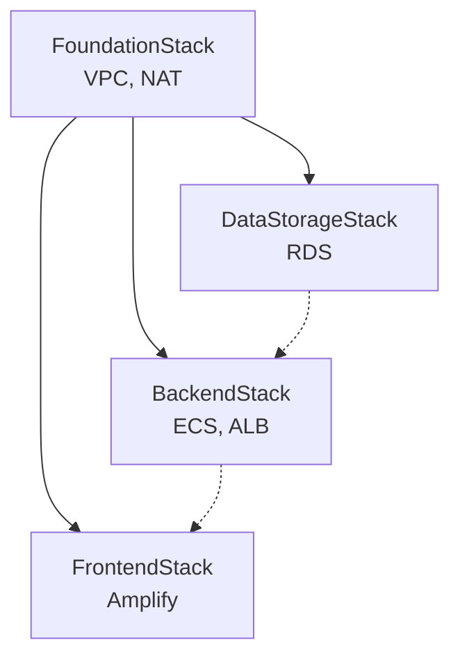

# CDK入門 - コードでインフラを定義

ACRIQUEの`infra/`フォルダにあるコードを読めるようになろう。
AWS CDKを使えば、インフラもコードで管理できる。

---

## 目次

1. [CDKとは何か](#1-cdkとは何か)
2. [ACRIQUEのinfraフォルダを読む](#2-acriqueのinfraフォルダを読む)
3. [スタックの依存関係](#3-スタックの依存関係)
4. [環境別設定の仕組み](#4-環境別設定の仕組み)
5. [デプロイの流れ](#5-デプロイの流れ)

---

## 1. CDKとは何か

### Infrastructure as Code (IaC)

```
従来のインフラ構築：
1. AWSコンソールにログイン
2. ぽちぽちクリック
3. 設定を入力
4. 「あれ、本番環境と開発環境の設定違ってた...」

IaCの世界：
1. コードを書く
2. git push
3. 同じインフラが何度でも再現可能
4. 差分はgit diffで確認
```

**IaC = インフラをコードで定義する考え方**

### CDK vs CloudFormation vs Terraform



| ツール | 記述 | 学習コスト | 特徴 |
|--------|------|-----------|------|
| CloudFormation | YAML/JSON | 高い | AWS純正、冗長 |
| Terraform | HCL | 中 | マルチクラウド対応 |
| **CDK** | TypeScript等 | **低い** | プログラミング言語で書ける |

### CDKの良いところ

```typescript
// CloudFormation (YAML) の場合：100行以上...

// CDK (TypeScript) の場合：
const bucket = new s3.Bucket(this, 'MyBucket', {
  versioned: true,
  encryption: s3.BucketEncryption.S3_MANAGED,
});
// → たった4行！
```

**フロントエンドエンジニアなら TypeScript で書ける = 学習コストが低い**

---

## 2. ACRIQUEのinfraフォルダを読む

### ディレクトリ構造

```
infra/
├── bin/              # レイヤー4: エントリーポイント
│   └── app.ts        # 「どのスタックを使うか」を決める
│
├── lib/
│   ├── construct/    # レイヤー1: 単一AWSリソース
│   │   ├── compute/  # ECS, Lambda等
│   │   ├── datastore/ # RDS, S3, DynamoDB等
│   │   └── networking/ # VPC, ALB等
│   │
│   ├── resource/     # レイヤー2: 機能単位の組み合わせ
│   │   ├── network-resource.ts
│   │   └── data-storage-resource.ts
│   │
│   └── stack/        # レイヤー3: デプロイ単位
│       ├── foundation/     # VPC等の基盤
│       ├── data-storage/   # RDS, S3等
│       ├── backend/        # ECS, ALB等
│       └── frontend/       # Amplify
│
└── config/           # 環境別設定
    ├── dev.ts
    ├── stg.ts
    └── prod.ts
```

### 4層レイヤードアーキテクチャ



**レストランに例えると**

| レイヤー | 役割 | 例 |
|---------|------|---|
| bin/ | オーナー（何を作るか決定） | 「東京に店を出す」 |
| stack/ | 店舗（デプロイ単位） | 「厨房」「ホール」「倉庫」 |
| resource/ | 設備セット | 「厨房セット一式」 |
| construct/ | 個別設備 | 「冷蔵庫」「コンロ」 |

---

### 各レイヤーの実際のコード

#### レイヤー1: Construct（単一リソース）

```typescript
// lib/construct/datastore/s3-construct.ts（簡略版）
export class S3Construct extends Construct {
  public readonly bucket: s3.Bucket;

  constructor(scope: Construct, id: string, props: S3ConstructProps) {
    super(scope, id);

    // S3バケットを作成（セキュアな設定付き）
    this.bucket = new s3.Bucket(this, 'Bucket', {
      bucketName: props.bucketName,
      versioned: true,                              // バージョニング有効
      encryption: s3.BucketEncryption.S3_MANAGED,  // 暗号化
      blockPublicAccess: s3.BlockPublicAccess.BLOCK_ALL,  // 公開ブロック
      removalPolicy: props.removalPolicy,
    });
  }
}
```

**Constructの役割**: 単一のAWSリソースをセキュアな設定で抽象化

---

#### レイヤー2: Resource（機能単位）

```typescript
// lib/resource/data-storage-resource.ts（簡略版）
export class DataStorageResource extends Construct {
  public readonly rdsInstance?: rds.DatabaseInstance;

  constructor(scope: Construct, id: string, props: DataStorageResourceProps) {
    super(scope, id);

    // RDSが有効なら作成
    if (props.enableRds) {
      const rdsConstruct = new RdsConstruct(this, 'Rds', {
        vpc: props.vpc,
        instanceType: props.instanceType,
        // ...
      });
      this.rdsInstance = rdsConstruct.instance;
    }
  }
}
```

**Resourceの役割**: 複数のConstructを組み合わせて1つの機能を提供

---

#### レイヤー3: Stack（デプロイ単位）

```typescript
// lib/stack/data-storage/data-storage-stack.ts（簡略版）
export class DataStorageStack extends Stack {
  public readonly rdsInstance?: rds.DatabaseInstance;

  constructor(scope: Construct, id: string, config: EnvironmentConfig, props: DataStorageStackProps) {
    super(scope, id, props);

    // データストレージリソースを作成
    const dataStorage = new DataStorageResource(this, 'DataStorage', {
      enableRds: config.database.enableRds,
      vpc: props.vpc,
      // ...
    });

    this.rdsInstance = dataStorage.rdsInstance;
  }
}
```

**Stackの役割**: CloudFormationスタック = デプロイの単位

---

#### レイヤー4: bin/app.ts（エントリーポイント）

```typescript
// bin/app.ts（簡略版）
const app = new cdk.App();
const envName = app.node.tryGetContext('env') || 'dev';
const config = getConfig(envName);

// 1. 基盤スタック（VPC等）
const foundationStack = new FoundationStack(app, `${envName}-FoundationStack`, config);

// 2. データストレージスタック（RDS等）
const dataStorageStack = new DataStorageStack(app, `${envName}-DataStorageStack`, config, {
  vpc: foundationStack.vpc,  // ← FoundationStackのVPCを渡す
});

// 3. バックエンドスタック（ECS等）
const backendStack = new BackendStack(app, `${envName}-BackendStack`, config, {
  vpc: foundationStack.vpc,
});

// 4. セキュリティグループ接続
dataStorageStack.allowConnectionsFrom(backendStack.ecsSecurityGroup);
```

**bin/app.tsの役割**: どのスタックを使うか、どう繋げるかを定義

---

## 3. スタックの依存関係

### ACRIQUEのスタック構成



### なぜスタックを分ける？

```
全部1つのスタックだと：
- フロントエンドを更新 → RDSも再作成される可能性
- デプロイに30分以上
- 影響範囲が大きすぎる

スタックを分けると：
- フロントエンドだけ更新 → 3分で完了
- 他のリソースは影響なし
- チームごとに独立作業可能
```

### デプロイ順序



---

## 4. 環境別設定の仕組み

### config/ディレクトリ

```
config/
├── environment.ts    # 型定義
├── dev.ts           # 開発環境
├── stg.ts           # ステージング環境
├── prod.ts          # 本番環境
└── index.ts         # 環境選択ロジック
```

### 開発環境の設定例

```typescript
// config/dev.ts
export const devConfig: EnvironmentConfig = {
  envName: 'dev',
  removalPolicy: RemovalPolicy.DESTROY,  // 削除可能

  vpc: {
    cidr: '10.0.0.0/16',
    maxAzs: 1,          // 1AZでコスト削減
    natGateways: 1,     // NAT Gatewayも1つ
  },

  database: {
    enableRds: true,
    instanceType: ec2.InstanceType.of(
      ec2.InstanceClass.T3,
      ec2.InstanceSize.MICRO  // 最小サイズ
    ),
    multiAz: false,           // 冗長化なし
  },

  ecs: {
    backend: {
      desiredCount: 1,   // コンテナ1台
      cpu: 256,          // 0.25 vCPU
      memory: 512,       // 512MB
    },
  },
};
```

### 本番環境の設定例

```typescript
// config/prod.ts
export const prodConfig: EnvironmentConfig = {
  envName: 'prod',
  removalPolicy: RemovalPolicy.RETAIN,  // 削除禁止！

  vpc: {
    cidr: '10.1.0.0/16',
    maxAzs: 2,          // 2AZで冗長化
    natGateways: 2,     // 各AZにNAT Gateway
  },

  database: {
    enableAurora: true,    // 高性能DB
    instanceType: ec2.InstanceType.of(
      ec2.InstanceClass.R6G,
      ec2.InstanceSize.LARGE
    ),
    readerCount: 2,        // 読み取りレプリカ2台
    multiAz: true,         // 冗長化あり
  },

  ecs: {
    backend: {
      desiredCount: 4,   // コンテナ4台
      cpu: 1024,         // 1 vCPU
      memory: 2048,      // 2GB
    },
  },
};
```

### 環境による違いを図解



---

## 5. デプロイの流れ

### CDKコマンドの基本

```bash
# 1. スタック一覧を表示
cdk list --context env=dev

# 出力例:
# dev-FoundationStack
# dev-DataStorageStack
# dev-BackendStack
# dev-FrontendStack
```

```bash
# 2. 変更内容を確認（実際には変更しない）
cdk diff dev-BackendStack --context env=dev

# 出力例:
# Resources
# [+] AWS::ECS::Service Backend/Service
```

```bash
# 3. CloudFormationテンプレートを生成
cdk synth --context env=dev

# → cdk.out/ フォルダにテンプレートが生成される
```

```bash
# 4. デプロイ実行
cdk deploy dev-BackendStack --context env=dev

# 5. 全スタックをデプロイ
cdk deploy --all --context env=dev
```

### デプロイの裏側



### 初回セットアップ

```bash
# 1. CDK CLIをインストール
npm install -g aws-cdk

# 2. infraフォルダに移動
cd infra

# 3. 依存関係をインストール
npm install

# 4. AWSアカウントの初期設定（初回のみ）
cdk bootstrap --context env=dev

# 5. デプロイ
cdk deploy --all --context env=dev
```

### よくあるエラーと対処

```
エラー: "This stack uses assets"
→ cdk bootstrap を実行していない

エラー: "Resource already exists"
→ 同名のリソースが既に存在する
→ 手動で削除するか、名前を変更

エラー: "Rate exceeded"
→ AWSのAPI制限
→ 少し待ってから再実行
```

---

## まとめ

### 今日学んだこと

```
1. CDK = TypeScriptでインフラを定義するツール
   → フロントエンドエンジニアにも親しみやすい

2. 4層アーキテクチャ
   - bin/: 何を作るか決める
   - stack/: デプロイの単位
   - resource/: 機能単位
   - construct/: 単一リソース

3. スタックを分ける理由
   → 変更頻度に応じた分離
   → 影響範囲の最小化

4. 環境別設定
   → dev: 最小構成でコスト削減
   → prod: 冗長化で高可用性
```

### ACRIQUEのスタック構成（復習）



### 次のステップ

```
1. infra/config/dev.ts を読んでみる
2. cdk list で何がデプロイされるか確認
3. cdk diff で変更内容を確認
4. 実際にデプロイしてみる → 05-デプロイ実践
```

---

**作成日**: 2025-01-06
**前提知識**: 01-03の各ドキュメント
**次のステップ**: 05-デプロイ実践
