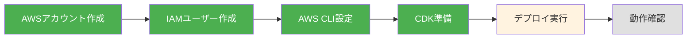

# デプロイ実践 - AWSアカウント作成からCDKデプロイまで

**実施日**: 2025-01-06
**目標**: ACRIQUEをAWSにデプロイしてインターネットからアクセスできるようにする

---

## 全体の流れ



---

## Step 1: AWSアカウント作成 ✅

### やったこと
1. https://aws.amazon.com/jp/ でアカウント作成
2. メールアドレス、クレジットカード、電話番号を登録
3. AWSコンソールにログイン

### 注意点
- ルートユーザーのメール・パスワードは超重要（控えておく）
- 最初の12ヶ月は無料枠あり

---

## Step 2: リージョンを東京に変更 ✅

### やったこと
- 右上の「アジアパシフィック（シドニー）」→「アジアパシフィック（東京）」に変更
- ACRIQUEは `ap-northeast-1`（東京）で動かす

---

## Step 3: IAMユーザー作成 ✅

### なぜ必要？
- ルートユーザー = 社長のマスターキー（危険）
- IAMユーザー = 社員カード（安全）
- CLI操作用に専用ユーザーを作るのがAWSの常識

### やったこと
1. AWSコンソールで「IAM」を検索
2. 左メニュー「ユーザー」→「ユーザーを作成」
3. ユーザー名: `acrique-deploy`
4. 許可の設定:
   - 「ポリシーを直接アタッチする」を選択
   - `AdministratorAccess` にチェック
5. 「ユーザーの作成」

---

## Step 4: アクセスキー発行 ✅

### やったこと
1. 作成した `acrique-deploy` ユーザーをクリック
2. 「セキュリティ認証情報」タブ
3. 「アクセスキーを作成」
4. 「コマンドラインインターフェイス (CLI)」を選択
5. `.csvファイルをダウンロード`（**この画面を閉じると二度と見れない**）

---

## Step 5: AWS CLIインストール ✅

### コマンド
```bash
# インストール（Mac）
brew install awscli

# 確認
aws --version
# 出力例: aws-cli/2.32.29 Python/3.13.11 Darwin/24.4.0 source/arm64
```

---

## Step 6: アクセスキーをPCに設定 ✅

### コマンド
```bash
aws configure
```

### 入力内容
```
AWS Access Key ID: （CSVのAccess key ID）
AWS Secret Access Key: （CSVのSecret access key）
Default region name: ap-northeast-1
Default output format: json
```

### 確認
```bash
aws sts get-caller-identity
```

### 出力例
```json
{
    "UserId": "AIDARV5YBM7W7G4K5EGXL",
    "Account": "115813214189",
    "Arn": "arn:aws:iam::115813214189:user/acrique-deploy"
}
```

---

## Step 7: CDK CLIインストール ✅

### コマンド
```bash
# グローバルインストール（どこでも実行OK）
npm install -g aws-cdk

# 確認
cdk --version
# 出力例: 2.1100.2 (build 3b11750)
```

---

## Step 8: infraフォルダの準備 ✅

### コマンド
```bash
# infraフォルダに移動
cd /Users/yamashitashota/Doc/ghoona/starup/dev/ec-site/acrique-v1/infra

# 依存関係をインストール
npm install
```

---

## Step 9: CDK Bootstrap ✅

### 何が起きる？
- CDK用のS3バケット作成（テンプレート保存用）
- CDK用のIAMロール作成
- 初回のみ必要

### コマンド
```bash
cdk bootstrap --context env=dev
```

### 確認方法
AWSコンソール →「CloudFormation」→ `CDKToolkit` スタックがあればOK

---

## Step 10: infra/config/dev.ts の設定 ✅

### 変更内容
GitHub連携の設定を追加:

```typescript
frontend: {
  type: 'amplify',
  githubRepo: 'ShotaGhoona/acrique-v1',  // ← 追加
  githubBranch: 'main',                   // ← 追加
  monorepoAppRoot: 'frontend',            // ← 追加
},
```

### ポイント
- この変更は**pushしなくてもデプロイできる**（CDKはローカルを読む）
- frontend/のコード変更は**pushが必要**（AmplifyがGitHubを見る）

---

## Step 11: デプロイ実行 ⏳（次はここ）

### コマンド
```bash
cdk deploy --all --context env=dev
```

### 所要時間
20〜30分（特にRDSが長い）

### 途中で聞かれること
「作っていい？(y/n)」→ `y` を入力

### 確認方法
AWSコンソール →「CloudFormation」でスタックが作成されていく様子が見れる

### 作成される8つのスタック
1. `dev-FoundationStack` - VPC, Subnet, NAT
2. `dev-DataStorageStack` - RDS
3. `dev-ObjectStorageStack` - S3
4. `dev-SecurityStack` - Cognito, Secrets
5. `dev-BackendStack` - ECS, ALB
6. `dev-FrontendStack` - Amplify
7. `dev-IntegrationStack` - SNS, SQS
8. `dev-ObservabilityStack` - CloudWatch

---

## 次にやること

デプロイ完了後:
1. 出力されたURLを確認
2. フロントエンドにアクセス
3. バックエンドの疎通確認

---

## トラブルシューティング

### エラー: "Resource already exists"
→ 同名のリソースが既に存在する。手動で削除するか名前を変更

### エラー: "Rate exceeded"
→ AWSのAPI制限。少し待ってから再実行

### デプロイが途中で失敗
→ CloudFormationでエラー内容を確認

---

**現在のステータス**: Step 11（デプロイ実行）の直前
