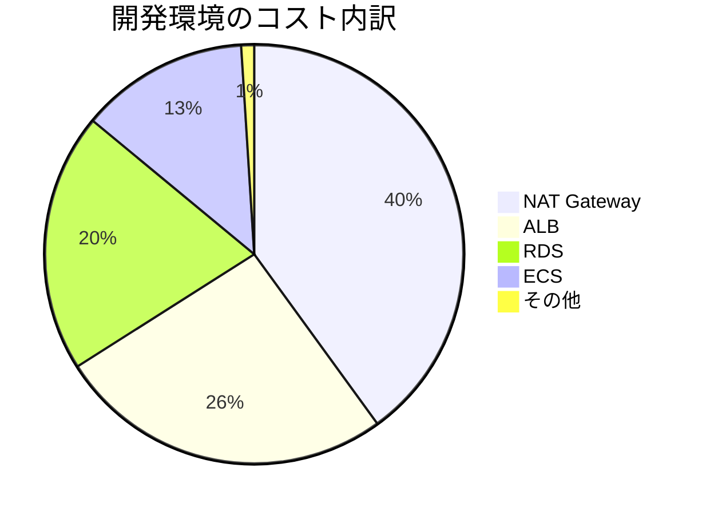

# AWSコスト最適化

ACRIQUEを運用する上で知っておくべきコストの話。

---

## 1. ACRIQUEの月額コスト概算

### 開発環境（dev）

| サービス | スペック | 月額目安 |
|---------|---------|---------|
| NAT Gateway | 1台 | ~$30 |
| RDS (t3.micro) | 1台 | ~$15 |
| ALB | 1台 | ~$20 |
| ECS Fargate | 0.25vCPU, 512MB | ~$10 |
| S3 | 数GB | ~$1 |
| **合計** | | **~$76/月** |

### 本番環境（prod）

| サービス | スペック | 月額目安 |
|---------|---------|---------|
| NAT Gateway | 2台 | ~$60 |
| Aurora | r6g.large x3 | ~$300 |
| ALB | 1台 | ~$25 |
| ECS Fargate | 1vCPU, 2GB x4 | ~$120 |
| S3 + CloudFront | | ~$20 |
| **合計** | | **~$525/月** |

---

## 2. コストの大きいサービス TOP3



### 1位: NAT Gateway（意外と高い）

```
$0.045/時間 × 24時間 × 30日 = $32.40/月
+ データ転送料 $0.045/GB
```

**対策:**
```typescript
// 開発環境はNAT 1台で十分
natGateways: 1

// 本番は2台（可用性のため）
natGateways: 2
```

### 2位: ALB

```
$0.0225/時間 = ~$16/月（固定）
+ LCU（処理量）による従量課金
```

**対策:** 開発環境でもALBは必要なので削減困難。

### 3位: RDS

```
t3.micro: ~$15/月
t3.small: ~$30/月
t3.medium: ~$60/月
```

**対策:**
```typescript
// 開発環境は最小サイズ
instanceType: ec2.InstanceType.of(
  ec2.InstanceClass.T3,
  ec2.InstanceSize.MICRO
)
```

---

## 3. 無料枠を活用

### 12ヶ月無料枠

| サービス | 無料枠 |
|---------|-------|
| EC2 | t2.micro 750時間/月 |
| RDS | db.t2.micro 750時間/月 |
| S3 | 5GB |
| Lambda | 100万リクエスト/月 |
| CloudFront | 1TB転送/月 |

### 常時無料

| サービス | 無料枠 |
|---------|-------|
| Lambda | 100万リクエスト/月 |
| DynamoDB | 25GB + 読み書き無料枠 |
| SNS | 100万通知/月 |
| CloudWatch | 基本メトリクス |

---

## 4. コスト削減テクニック

### 開発環境を使わない時は止める

```bash
# 全スタック削除（最強のコスト削減）
cdk destroy --all --context env=dev

# 必要な時に再デプロイ
cdk deploy --all --context env=dev
```

**注意:** RDSのデータは消える（スナップショット取っておく）

### Savings Plans / Reserved Instances

```
1年契約: 約30%OFF
3年契約: 約50%OFF

本番環境が安定したら検討
```

### スポットインスタンス（ECS）

```typescript
// Fargateの代わりにSpotを使う
// 最大70%OFF、ただし中断リスクあり
capacityProviders: ['FARGATE_SPOT']
```

---

## 5. コスト監視の設定

### Billing Alert（必須）

1. AWSコンソール → 「Billing」
2. 「Budgets」→「Create budget」
3. 月額 $100 超えたらメール通知


### Cost Explorer

1. AWSコンソール → 「Cost Explorer」
2. 「Enable Cost Explorer」
3. サービス別・日別のコストが見れる

---

## 6. 予期せぬ高額請求パターン

### パターン1: NATを通る大量通信

```
ECS → NAT → 外部API
      ↑
    $0.045/GB ここで課金

対策: VPC Endpointを使う（S3, DynamoDB等は無料）
```

### パターン2: CloudWatch Logs肥大化

```
ログを無制限に保存 → 容量課金

対策: 保持期間を設定
retentionDays: 30  // 30日で自動削除
```

### パターン3: 削除忘れ

```
検証用に作ったリソース → 放置 → 課金継続

対策: タグで管理
Environment: dev
DeleteAfter: 2025-01-31
```

---

## まとめ

```
開発環境で節約するポイント：
1. NAT Gateway は1台
2. RDS は t3.micro
3. ECS は最小スペック
4. 使わない時は destroy

本番環境で節約するポイント：
1. Savings Plans 検討
2. 適切なサイジング
3. スポットインスタンス活用
4. ログ保持期間の設定
```

---

**作成日**: 2025-01-06
**レベル**: 中級
