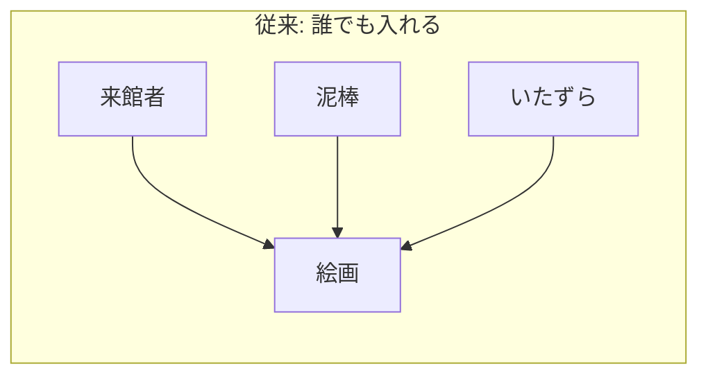
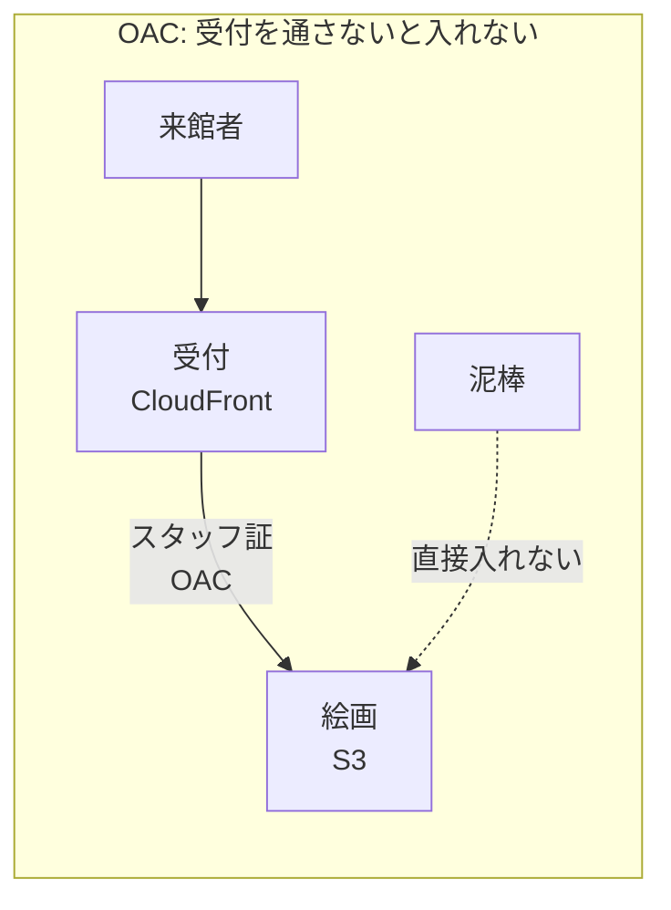
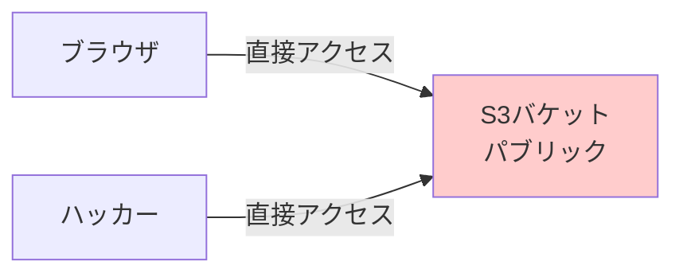
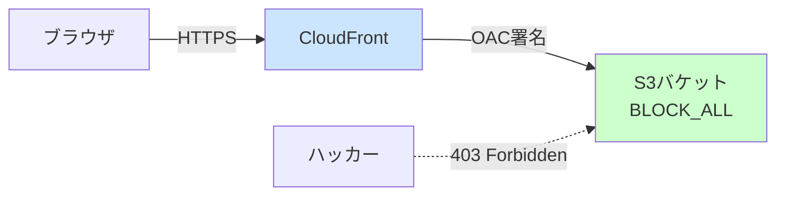
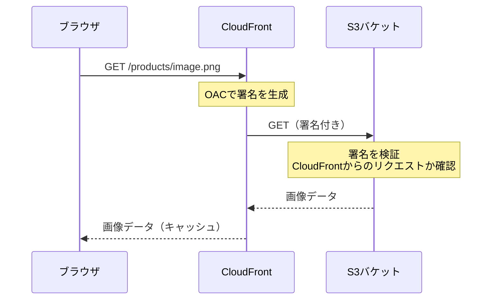
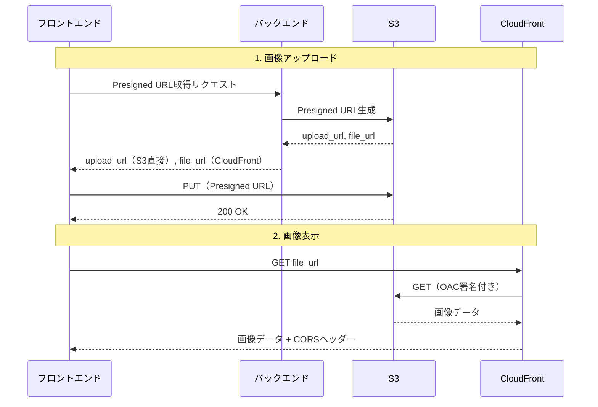

# 23: CloudFront + OAC - S3をプライベートに保ちつつ公開配信

## この文書で学べること

- S3を「誰でもアクセス可能」にせずに画像を公開する方法
- OAC（Origin Access Control）の仕組み
- CloudFrontがCORSヘッダーを付与する理由
- 実際のCDKコードの読み方

---

## 問題: S3の画像が403 Forbiddenで見れない！

### やりたいこと

```
商品画像をS3にアップロード → ブラウザで表示したい
```

### 素朴な解決策（危険）

```
S3バケットを「パブリック」に設定 → 誰でもアクセス可能
```

**問題点**:
- URLを知っていれば誰でもダウンロードし放題
- 悪意あるユーザーが大量アクセス → 高額請求
- セキュリティ監査で即NG

---

## 日常例で理解する「OAC」

### 美術館のたとえ





**ポイント**:
- **来館者** = ブラウザ
- **受付（CloudFront）** = 正規の入り口
- **スタッフ証（OAC）** = CloudFrontだけが持つS3へのアクセス権
- **絵画（S3）** = プライベートだが受付経由なら見れる

---

## アーキテクチャ図

### Before: S3直接公開（NG）



### After: CloudFront + OAC（推奨）



**BLOCK_ALL**: S3のパブリックアクセスを完全にブロック

---

## OACとは何か？

### 正式名称
**Origin Access Control** - オリジンアクセス制御

### 一言で
**「CloudFrontだけがS3にアクセスできる許可証」**

### 仕組み



### 従来のOAI（非推奨）との違い

| 項目 | OAI（古い） | OAC（新しい） |
|------|-------------|---------------|
| 正式名 | Origin Access Identity | Origin Access Control |
| S3暗号化 | SSE-KMS非対応 | 対応 |
| 署名方式 | 独自形式 | SigV4（AWS標準） |
| 推奨度 | 非推奨 | 推奨 |

**重要**: 新規実装では必ずOACを使う

---

## CORSヘッダーの役割

### 問題: 画像が読み込めない

```javascript
// フロントエンド（localhost:3005）

// ブラウザ: "CORSエラーで読み込めません"
```

### 原因

ブラウザの**同一オリジンポリシー**:
- `localhost:3005` と `xxx.cloudfront.net` は別オリジン
- 別オリジンからのリソース読み込みはデフォルトで拒否

### 解決

CloudFrontが**CORSヘッダー**を付与:

```http
Access-Control-Allow-Origin: http://localhost:3005
Access-Control-Allow-Methods: GET, HEAD
```

→ ブラウザ「このオリジンからのアクセスは許可されてるな」→ 表示OK

---

## 実装コード解説

### 1. DataCdnConstruct（CloudFront作成）

```typescript
// lib/construct/api/data-cdn-construct.ts

// CORSヘッダーを自動付与するポリシー
const responseHeadersPolicy = new cloudfront.ResponseHeadersPolicy(
  this,
  'CorsHeadersPolicy',
  {
    corsBehavior: {
      accessControlAllowOrigins: ['http://localhost:3005', 'https://本番URL'],
      accessControlAllowMethods: ['GET', 'HEAD'],
      accessControlMaxAge: Duration.seconds(86400), // 24時間キャッシュ
    },
  }
);

// CloudFront Distribution
this.distribution = new cloudfront.Distribution(this, 'Distribution', {
  defaultBehavior: {
    // ここがOACの設定！
    origin: origins.S3BucketOrigin.withOriginAccessControl(props.originBucket),

    // HTTPS強制
    viewerProtocolPolicy: cloudfront.ViewerProtocolPolicy.REDIRECT_TO_HTTPS,

    // キャッシュ最適化
    cachePolicy: cloudfront.CachePolicy.CACHING_OPTIMIZED,

    // CORSヘッダー付与
    responseHeadersPolicy: responseHeadersPolicy,
  },
});
```

### 2. S3バケット設定

```typescript
// lib/construct/datastore/s3-construct.ts

const bucket = new s3.Bucket(this, 'Bucket', {
  // パブリックアクセス完全ブロック
  blockPublicAccess: s3.BlockPublicAccess.BLOCK_ALL,

  // 暗号化
  encryption: s3.BucketEncryption.S3_MANAGED,
});
```

### 3. バックエンドでのURL生成

```python
# app/infrastructure/storage/s3_service.py

def generate_presigned_url(self, file_name: str, ...):
    # アップロード用のPresigned URLを生成
    upload_url = self._s3_client.generate_presigned_url(...)

    # 表示用URLはCloudFront経由
    if self._cdn_domain_name:
        file_url = f'https://{self._cdn_domain_name}/{s3_key}'
    else:
        file_url = f'https://{bucket}.s3.{region}.amazonaws.com/{s3_key}'

    return PresignedUrlResult(
        upload_url=upload_url,  # S3直接（署名付き）
        file_url=file_url,       # CloudFront経由
    )
```

---

## データフロー全体像



---

## デプロイ手順

### 1. CDKデプロイ

```bash
cd infra
npx cdk deploy dev-ObjectStorageStack
```

### 2. 出力を確認

```
Outputs:
  dev-ObjectStorageStack.CdnDomainName = d1234567890.cloudfront.net
  dev-ObjectStorageStack.CdnUrl = https://d1234567890.cloudfront.net
```

### 3. バックエンド設定

```bash
# backend/.env に追加
CDN_DOMAIN_NAME=d1234567890.cloudfront.net
```

### 4. 動作確認

```bash
# 直接S3アクセス → 403 Forbidden（正常）
curl https://bucket.s3.ap-northeast-1.amazonaws.com/products/test.png
# -> AccessDenied

# CloudFront経由 → 200 OK
curl https://d1234567890.cloudfront.net/products/test.png
# -> 画像データ
```

---

## セキュリティチェックリスト

| 項目 | 設定 | 確認方法 |
|------|------|----------|
| S3パブリックアクセス | BLOCK_ALL | AWSコンソール → S3 → アクセス許可 |
| CloudFront HTTPS | 強制 | viewerProtocolPolicy: REDIRECT_TO_HTTPS |
| OAC設定 | 有効 | CloudFront → オリジン → OAC |
| CORSオリジン | 本番URLのみ | ResponseHeadersPolicy設定 |

---

## トラブルシューティング

### 症状: 403 Forbidden

```
原因1: OACが設定されていない
→ CloudFrontコンソールでオリジン設定を確認

原因2: S3バケットポリシーが古い
→ CDK再デプロイでポリシー更新

原因3: CloudFrontキャッシュ
→ Invalidation実行: aws cloudfront create-invalidation --distribution-id XXX --paths "/*"
```

### 症状: CORSエラー

```
原因1: オリジンが許可リストにない
→ corsAllowedOrigins に追加

原因2: レスポンスヘッダーポリシーが適用されていない
→ CloudFront Behavior設定を確認
```

---

## まとめ

| 概念 | 役割 |
|------|------|
| **S3 BLOCK_ALL** | 直接アクセスを完全拒否 |
| **CloudFront** | 正規の入り口（CDN） |
| **OAC** | CloudFrontだけがS3にアクセスできる許可証 |
| **CORSヘッダー** | 別オリジンからの読み込みを許可 |

```
安全な画像配信 = S3プライベート + CloudFront + OAC + CORS
```

---

## 関連ドキュメント

- [16: CloudFront - CDNの仕組み](./16-CloudFront-CDNの仕組み.md) - CDNの基礎
- [14: セキュリティベストプラクティス](./14-セキュリティベストプラクティス.md) - AWS全般のセキュリティ
