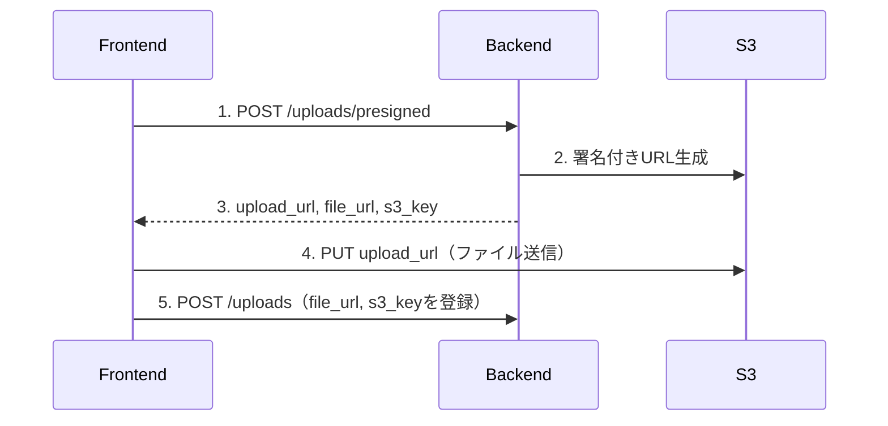
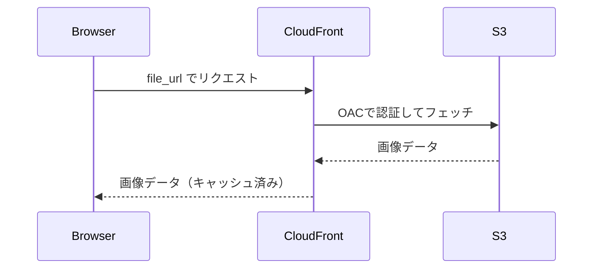

# 24: S3/CloudFrontのURL・パス完全理解

## この文書で学べること

- 画像関連で登場する3つのURL/パスの違い
- フロントエンドで使うべきURLはどれか
- アップロード時のフロー

---

## 3つのURL/パスを整理

| 名前 | 例 | 用途 |
|------|-----|------|
| **upload_url** | `https://bucket.s3.amazonaws.com/...?X-Amz-Signature=xxx` | S3へのアップロード専用（一時的） |
| **s3_key** | `uploads/user-123/abc.png` | S3内のファイルパス（DB保存用） |
| **file_url** | `https://cdn.acrique.jp/uploads/user-123/abc.png` | ブラウザ表示用（CloudFront経由） |

---

## URLの構造を分解

### S3 URL（upload_url）

```
https://dev-acrique-v1-data.s3.ap-northeast-1.amazonaws.com/products/a1b2c3d4.jpg?X-Amz-...
└─────────────────────────────────────────────────────────┘ └───────┘ └────────┘ └──────┘
                         ①                                    ②        ③         ④
```

| 部分 | 例 | 説明 |
|------|-----|------|
| ① ホスト | `dev-acrique-v1-data.s3.ap-northeast-1.amazonaws.com` | S3バケットのエンドポイント |
| ② フォルダ | `products` or `uploads` | 用途別のフォルダ |
| ③ ファイル名 | `a1b2c3d4.jpg` | UUID（元のファイル名ではない） |
| ④ 署名 | `?X-Amz-...` | 一時的なアクセス権限 |

### CloudFront URL（file_url）

```
https://d1234abcd.cloudfront.net/products/a1b2c3d4.jpg
└──────────────────────────────┘ └───────┘ └────────┘
              ①                     ②         ③
```

| 部分 | 例 | 説明 |
|------|-----|------|
| ① ホスト | `d1234abcd.cloudfront.net` | CloudFrontのドメイン（本番は独自ドメイン） |
| ② フォルダ | `products` or `uploads` | S3と同じパス構造 |
| ③ ファイル名 | `a1b2c3d4.jpg` | S3と同じファイル名 |

### s3_key

```
products/a1b2c3d4.jpg
└───────┘ └────────┘
   ①          ②
```

| 部分 | 説明 |
|------|------|
| ① フォルダ | 用途別のフォルダ |
| ② ファイル名 | UUIDベースのファイル名 |

> **ポイント**: `s3_key` は `file_url` の「ホスト以降」の部分と一致する

---

## Admin vs Consumer のパス構造

| 用途 | フォルダ | パス例 |
|------|----------|--------|
| Admin商品画像 | `products/` | `products/a1b2c3d4.jpg` |
| 消費者入稿 | `uploads/user-{id}/` | `uploads/user-123/b5c6d7e8.png` |

### なぜ分けるのか？

```
acrique-v1-data/
├── products/           ← Admin専用（商品画像）
│   ├── qr-cube-main.jpg
│   └── logo-sign-01.png
│
└── uploads/            ← 消費者専用（入稿データ）
    ├── user-123/       ← ユーザーごとにフォルダ分け
    │   ├── logo.ai
    │   └── qr-code.png
    └── user-456/
        └── photo.jpg
```

**理由:**
- アクセス権限を分けられる（Adminと消費者で別ポリシー）
- 消費者データはユーザー単位で管理しやすい
- 将来的にユーザーごとの容量制限も可能

---

## 図解：アップロードから表示まで

### アップロード時



### 表示時



---

## フロントエンドで覚えること

### アップロード時

```typescript
// 1. presigned URL取得
const { upload_url, file_url, s3_key } = await api.getPresignedUrl({
  file_name: file.name,
  content_type: file.type,
});

// 2. S3に直接アップロード（upload_urlを使用）
await fetch(upload_url, {
  method: 'PUT',
  body: file,
  headers: { 'Content-Type': file.type },
});

// 3. DBに登録（file_url, s3_keyを使用）
await api.registerUpload({
  file_name: file.name,
  file_url,   // ← 表示用URL
  s3_key,     // ← 削除時に必要
});
```

### 表示時

```tsx
// file_url をそのまま使うだけ

```

---

## よくある疑問

### Q: なぜS3のURLを直接使わないの？

**A:** セキュリティとパフォーマンス

| 直接S3 | CloudFront経由 |
|--------|----------------|
| バケットを公開する必要あり | バケットは非公開のまま |
| 毎回S3にアクセス | キャッシュで高速 |
| リージョン依存で遅い | エッジから配信で速い |

### Q: upload_url はなぜ長い？

**A:** 署名情報が含まれているから

```
https://bucket.s3.amazonaws.com/path/file.png
  ?X-Amz-Algorithm=AWS4-HMAC-SHA256    ← 署名アルゴリズム
  &X-Amz-Credential=AKIAXXXX/...       ← 認証情報
  &X-Amz-Date=20240115T100000Z         ← 発行日時
  &X-Amz-Expires=3600                  ← 有効期限（秒）
  &X-Amz-Signature=abcd1234...         ← 署名
```

この署名があるから、一時的にアップロード権限が与えられる。

### Q: s3_key は何に使う？

**A:** 削除時に必要

```python
# バックエンドでS3から削除する際に使用
s3.delete_object(Bucket="acrique", Key=upload.s3_key)
```

フロントエンドは基本的に `file_url` だけ意識すればOK。

---

## まとめ

| やること | 使うURL |
|----------|---------|
| S3にアップロード | `upload_url`（PUT） |
| ブラウザで表示 | `file_url` |
| DBに保存 | `file_url` + `s3_key` |
