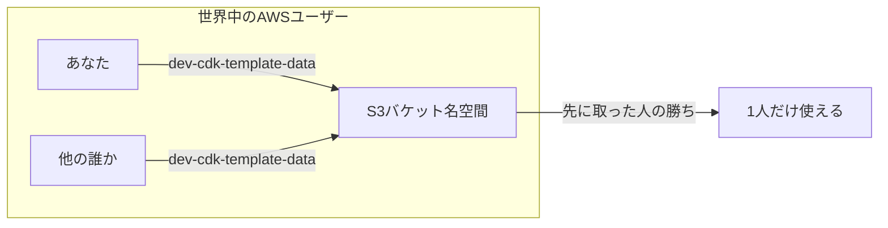
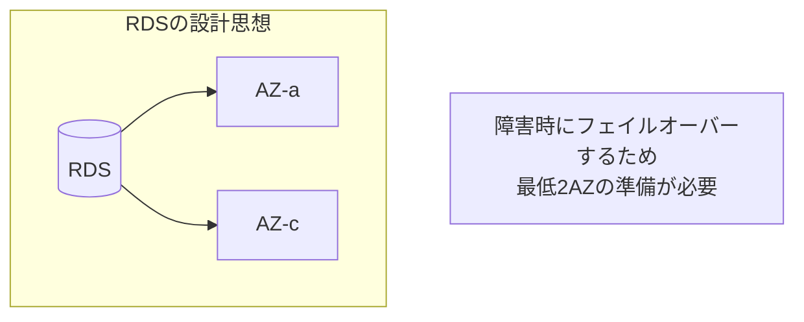
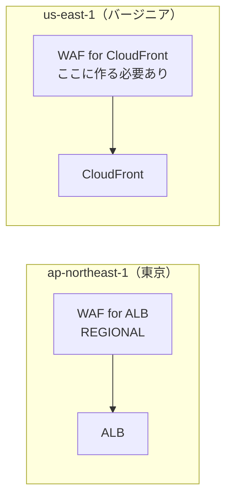

# AWSの制約と落とし穴

今日のデプロイで実際に遭遇したエラーを含む、知っておくべきAWSの制約。

---

## 1. S3バケット名はグローバルで一意

### 今日起きたこと

```
The requested bucket name is not available.
The bucket namespace is shared by all users of the system.
```

### なぜ？



### 対策

```
❌ dev-cdk-template-data     ← 汎用的すぎる
✅ dev-acrique-v1-data       ← プロジェクト固有
✅ dev-acrique-v1-data-115813214189  ← アカウントID付き（確実）
```

---

## 2. RDSは最低2つのAZが必要

### 今日起きたこと

```
The DB subnet group doesn't meet Availability Zone (AZ) coverage requirement.
Current AZ coverage: ap-northeast-1a
Add subnets to cover at least 2 AZs.
```

### なぜ？



**MultiAZ=falseでも、サブネットグループは2AZ必要。**

### 対策

```typescript
// ❌ コスト削減しすぎ
maxAzs: 1

// ✅ RDSを使うなら最低2AZ
maxAzs: 2
natGateways: 1  // NATは1つでコスト削減可能
```

---

## 3. リソース名の文字数制限

### よくあるエラー

```
Resource name must be between 1 and 63 characters
```

### 制限一覧

| リソース | 最大文字数 |
|---------|-----------|
| S3バケット | 63文字 |
| Lambda関数 | 64文字 |
| ECSクラスター | 255文字 |
| RDSインスタンス | 63文字 |
| IAMロール | 64文字 |

### 対策

```typescript
// ❌ 長すぎる
`${env}-my-super-long-project-name-backend-api-service`

// ✅ 短く
`${env}-acrique-api`
```

---

## 4. リージョン固有のサービス

### CloudFront + WAF の罠



**CloudFront用のWAFは `us-east-1` に作成が必須。**

---

## 5. 削除できないリソース

### RETAIN vs DESTROY

```typescript
// 開発環境：消せる
removalPolicy: RemovalPolicy.DESTROY

// 本番環境：消せない（安全のため）
removalPolicy: RemovalPolicy.RETAIN
```

### 消せないと困るケース

```
cdk destroy しても残る：
- S3バケット（中身が空でないと消せない）
- RDSスナップショット
- CloudWatch Logs
```

### 対策（開発環境）

```typescript
// S3バケットを強制削除可能に
new s3.Bucket(this, 'Bucket', {
  removalPolicy: RemovalPolicy.DESTROY,
  autoDeleteObjects: true,  // 中身も一緒に消す
});
```

---

## 6. VPCのIPアドレス枯渇

### 問題

```
/24 サブネット = 256 IP
- AWS予約: 5 IP
- 使える: 251 IP

ECSタスク50個 + Lambda100個 + RDS + etc...
→ 足りなくなる
```

### ACRIQUEの設計

```typescript
cidr: '10.0.0.0/16'  // 65,536 IP
// 各サブネットは /20 = 4,096 IP
```

**最初から余裕を持った設計が大事。後から変更は大変。**

---

## 7. API制限（スロットリング）

### よくあるエラー

```
Rate exceeded
Throttling: Rate exceeded
```

### 対策

```bash
# 失敗したら少し待って再実行
sleep 30 && cdk deploy --all --context env=dev
```

---

## まとめ：事前に知っておくべきこと

| 制約 | 対策 |
|-----|------|
| S3名はグローバル一意 | プロジェクト名+アカウントIDを含める |
| RDSは2AZ必要 | maxAzs: 2 以上 |
| リソース名の文字数 | 短く命名 |
| CloudFront WAFはus-east-1 | 別スタックで作成 |
| RETAINリソースは消せない | 開発環境はDESTROY |
| IPアドレス枯渇 | 最初から/16で設計 |

---

**作成日**: 2025-01-06
**レベル**: 中級
