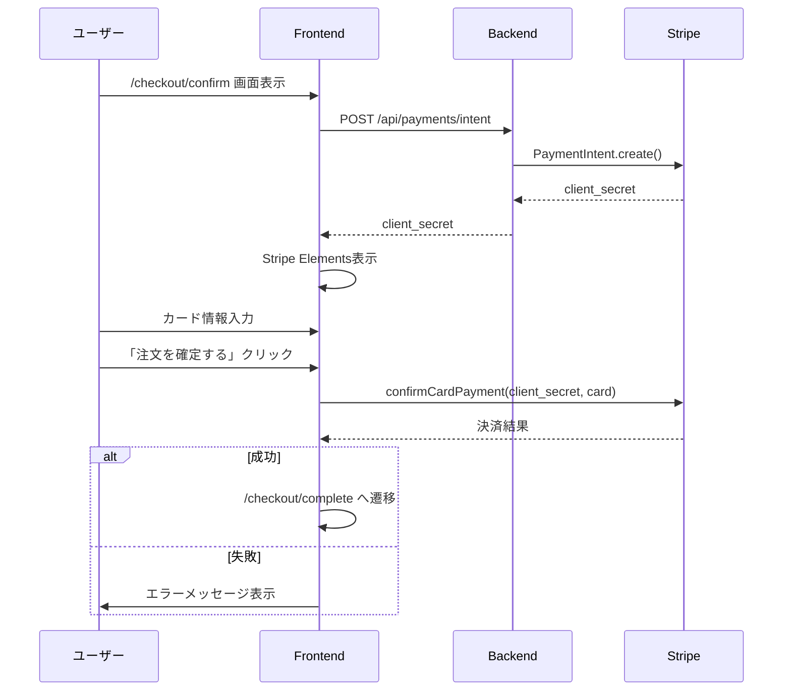

# Stripe Frontend実装 - カード入力フォームの作成

Next.jsでStripe Elementsを使ってセキュアなカード入力フォームを作成する方法。
ACRIQUEのチェックアウト画面（`/checkout/confirm`）を具体例として解説。

---

## 目次

1. [チェックアウトフロー全体像](#1-チェックアウトフロー全体像)
2. [Stripe Elementsとは](#2-stripe-elementsとは)
3. [ファイル構成](#3-ファイル構成)
4. [実装手順](#4-実装手順)
5. [エラーハンドリング](#5-エラーハンドリング)
6. [スタイリング](#6-スタイリング)

---

## 1. チェックアウトフロー全体像

### 画面遷移

```mermaid
graph LR
    A[/cart<br/>カート] --> B[/checkout<br/>配送先・支払方法選択]
    B --> C[/checkout/upload<br/>データ入稿]
    C --> D[/checkout/confirm<br/>注文確認 + 決済]
    D --> E[/checkout/complete<br/>注文完了]

    style D fill:#4caf50,color:#fff
```

**ポイント:** `/checkout/confirm`でStripe Elementsを表示し、「注文を確定する」ボタンで決済を実行。

### 決済シーケンス



---

## 2. Stripe Elementsとは

### Stripe Elementsの役割

```
┌─────────────────────────────────────────────────────────────┐
│  あなたが作るもの                                            │
│  ・チェックアウトフォーム（配送先、金額表示等）              │
│  ・注文確認画面のUI                                          │
└─────────────────────────────────────────────────────────────┘
                              ↓
┌─────────────────────────────────────────────────────────────┐
│  Stripe Elements（Stripeが提供）                            │
│  ・CardElement（カード入力欄）                              │
│  ・セキュリティ（PCI DSS準拠）                              │
│  ・バリデーション（カード番号チェック）                     │
│  ・UI（カードブランド表示）                                 │
└─────────────────────────────────────────────────────────────┘
```

### なぜStripe Elementsを使う？

| 自前実装 | Stripe Elements |
|---------|-----------------|
| カード番号がサーバーを通過 → PCI DSS準拠が必要 | カード情報は直接Stripeに送信 → PCI DSS準拠不要 |
| セキュリティリスクが高い | Stripeがセキュリティを担保 |
| カードブランドの検出を自分で実装 | カードブランド自動検出 |
| バリデーションも自分で実装 | リアルタイムバリデーション |

---

## 3. ファイル構成

ACRIQUEのFSD（Feature-Sliced Design）に沿った配置:

```
frontend/src/
├── shared/
│   └── lib/
│       └── stripe.ts                    # Stripe初期化
├── entities/
│   └── payment/
│       ├── api/
│       │   └── payment-api.ts           # API呼び出し
│       └── model/
│           └── types.ts                 # 型定義
├── features/
│   └── payment/
│       └── create-payment-intent/
│           └── lib/
│               ├── use-create-payment-intent.ts
│               └── error-messages.ts    # エラーメッセージ
├── widgets/
│   └── payment/
│       └── card-form/
│           └── ui/
│               └── CardForm.tsx         # カードフォーム
├── page-components/
│   └── checkout/
│       └── confirm/
│           └── ui/
│               └── CheckoutConfirmContainer.tsx
└── app/
    └── (public)/
        └── checkout/
            └── confirm/
                └── page.tsx             # 注文確認ページ
```

### FSD配置ルール

| 層 | 配置するもの |
|----|-------------|
| `entities/payment/` | API呼び出し、型定義 |
| `features/payment/` | ビジネスロジック、React Hooks |
| `widgets/payment/` | 再利用可能なUIコンポーネント |
| `page-components/` | ページ固有のコンテナ |

---

## 4. 実装手順

### Step 1: パッケージインストール

```bash
cd frontend
npm install @stripe/stripe-js @stripe/react-stripe-js
```

### Step 2: 環境変数設定

```bash
# frontend/.env.local
NEXT_PUBLIC_STRIPE_PUBLISHABLE_KEY=pk_test_xxxxx
```

### Step 3: Stripe初期化

```typescript
// frontend/src/shared/lib/stripe.ts
import { loadStripe, Stripe } from '@stripe/stripe-js';

let stripePromise: Promise<Stripe | null>;

export const getStripe = () => {
  if (!stripePromise) {
    stripePromise = loadStripe(
      process.env.NEXT_PUBLIC_STRIPE_PUBLISHABLE_KEY!
    );
  }
  return stripePromise;
};
```

### Step 4: 型定義（Entities層）

```typescript
// frontend/src/entities/payment/model/types.ts
export interface CreatePaymentIntentResponse {
  client_secret: string;
  payment_intent_id: string;
  amount: number;
}

export interface PaymentError {
  code: string;
  message: string;
}
```

### Step 5: API呼び出し（Entities層）

```typescript
// frontend/src/entities/payment/api/payment-api.ts
import { apiClient } from '@/shared/api/client';
import { CreatePaymentIntentResponse } from '../model/types';

export const paymentApi = {
  createPaymentIntent: async (
    orderId: number
  ): Promise<CreatePaymentIntentResponse> => {
    const response = await apiClient.post('/payments/intent', {
      order_id: orderId,
    });
    return response.data;
  },
};
```

### Step 6: React Query Hook（Features層）

```typescript
// frontend/src/features/payment/create-payment-intent/lib/use-create-payment-intent.ts
import { useMutation } from '@tanstack/react-query';
import { paymentApi } from '@/entities/payment/api/payment-api';

export function useCreatePaymentIntent() {
  return useMutation({
    mutationFn: paymentApi.createPaymentIntent,
  });
}
```

### Step 7: カードフォームコンポーネント（Widgets層）

```tsx
// frontend/src/widgets/payment/card-form/ui/CardForm.tsx
'use client';

import { CardElement, useStripe, useElements } from '@stripe/react-stripe-js';
import { useState } from 'react';
import { Button } from '@/shared/ui/shadcn/ui/button';
import { getErrorMessage } from '@/features/payment/create-payment-intent/lib/error-messages';

interface CardFormProps {
  clientSecret: string;
  amount: number;
  onSuccess: () => void;
  onError: (message: string) => void;
}

const CARD_ELEMENT_OPTIONS = {
  style: {
    base: {
      fontSize: '16px',
      fontFamily: '"Helvetica Neue", Helvetica, sans-serif',
      color: '#1a1a1a',
      letterSpacing: '0.025em',
      '::placeholder': {
        color: '#9ca3af',
      },
    },
    invalid: {
      color: '#dc2626',
      iconColor: '#dc2626',
    },
  },
  hidePostalCode: true, // 日本では郵便番号不要
};

export function CardForm({
  clientSecret,
  amount,
  onSuccess,
  onError,
}: CardFormProps) {
  const stripe = useStripe();
  const elements = useElements();
  const [isProcessing, setIsProcessing] = useState(false);
  const [cardError, setCardError] = useState<string | null>(null);

  const handleSubmit = async (e: React.FormEvent) => {
    e.preventDefault();

    if (!stripe || !elements) {
      return;
    }

    const cardElement = elements.getElement(CardElement);
    if (!cardElement) return;

    setIsProcessing(true);

    try {
      const { error, paymentIntent } = await stripe.confirmCardPayment(
        clientSecret,
        {
          payment_method: {
            card: cardElement,
          },
        }
      );

      if (error) {
        const message = getErrorMessage(error.code ?? 'unknown');
        onError(message);
      } else if (paymentIntent.status === 'succeeded') {
        onSuccess();
      }
    } catch {
      onError('予期せぬエラーが発生しました');
    } finally {
      setIsProcessing(false);
    }
  };

  const formatPrice = (price: number) => {
    return new Intl.NumberFormat('ja-JP', {
      style: 'currency',
      currency: 'JPY',
    }).format(price);
  };

  return (
    <form onSubmit={handleSubmit}>
      <div className="space-y-4">
        <div>
          <label className="block text-sm font-medium text-gray-700 mb-2">
            カード情報
          </label>
          <div className="border border-gray-300 rounded-lg p-4 focus-within:ring-2 focus-within:ring-black focus-within:border-black">
            <CardElement
              options={CARD_ELEMENT_OPTIONS}
              onChange={(event) => {
                if (event.error) {
                  setCardError(event.error.message);
                } else {
                  setCardError(null);
                }
              }}
            />
          </div>
          {cardError && (
            <p className="mt-2 text-sm text-red-600">{cardError}</p>
          )}
        </div>

        <Button
          type="submit"
          disabled={!stripe || isProcessing}
          className="w-full py-4 text-lg"
        >
          {isProcessing
            ? '処理中...'
            : `${formatPrice(amount)}を支払う`}
        </Button>
      </div>
    </form>
  );
}
```

### Step 8: 注文確認ページ（Page-Components層 + App層）

```tsx
// frontend/src/page-components/checkout/confirm/ui/CheckoutConfirmContainer.tsx
'use client';

import { useEffect, useState } from 'react';
import { useRouter } from 'next/navigation';
import { Elements } from '@stripe/react-stripe-js';
import { getStripe } from '@/shared/lib/stripe';
import { CardForm } from '@/widgets/payment/card-form/ui/CardForm';
import { useCreatePaymentIntent } from '@/features/payment/create-payment-intent/lib/use-create-payment-intent';
import { useCheckoutStore } from '@/features/checkout/model/store';
import { toast } from 'sonner';

export function CheckoutConfirmContainer() {
  const router = useRouter();
  const [clientSecret, setClientSecret] = useState<string | null>(null);
  const [amount, setAmount] = useState<number>(0);
  const { orderId } = useCheckoutStore();
  const createPaymentIntent = useCreatePaymentIntent();

  useEffect(() => {
    if (!orderId) {
      router.push('/checkout');
      return;
    }

    createPaymentIntent.mutate(orderId, {
      onSuccess: (data) => {
        setClientSecret(data.client_secret);
        setAmount(data.amount);
      },
      onError: () => {
        toast.error('決済の準備に失敗しました');
        router.push('/checkout');
      },
    });
  }, [orderId]);

  const handleSuccess = () => {
    router.push('/checkout/complete');
  };

  const handleError = (message: string) => {
    toast.error(message);
  };

  if (!clientSecret) {
    return (
      <div className="flex items-center justify-center min-h-screen">
        <div className="animate-spin rounded-full h-8 w-8 border-b-2 border-black" />
      </div>
    );
  }

  return (
    <div className="max-w-2xl mx-auto px-4 py-12">
      <h1 className="text-2xl font-bold mb-8">注文確認</h1>

      {/* 注文サマリー */}
      <div className="mb-8 p-6 bg-gray-50 rounded-lg">
        <h2 className="font-medium mb-4">ご注文内容</h2>
        {/* 注文内容の表示（省略） */}
        <div className="border-t pt-4 mt-4">
          <div className="flex justify-between text-lg font-bold">
            <span>合計（税込）</span>
            <span>¥{amount.toLocaleString()}</span>
          </div>
        </div>
      </div>

      {/* カード入力フォーム */}
      <div className="bg-white border rounded-lg p-6">
        <h2 className="font-medium mb-4">お支払い情報</h2>
        <Elements stripe={getStripe()}>
          <CardForm
            clientSecret={clientSecret}
            amount={amount}
            onSuccess={handleSuccess}
            onError={handleError}
          />
        </Elements>
      </div>

      {/* テストカード情報（開発環境のみ） */}
      {process.env.NODE_ENV === 'development' && (
        <div className="mt-6 p-4 bg-blue-50 rounded-lg text-sm">
          <p className="font-bold mb-2">テスト用カード</p>
          <p>番号: 4242 4242 4242 4242</p>
          <p>有効期限: 12/30（未来の日付）</p>
          <p>CVC: 123</p>
        </div>
      )}
    </div>
  );
}
```

**App層（page.tsx）:**

```tsx
// frontend/src/app/(public)/checkout/confirm/page.tsx
import { CheckoutConfirmContainer } from '@/page-components/checkout/confirm/ui/CheckoutConfirmContainer';

export default function CheckoutConfirmPage() {
  return <CheckoutConfirmContainer />;
}
```

---

## 5. エラーハンドリング

### エラーメッセージ定義

```typescript
// frontend/src/features/payment/create-payment-intent/lib/error-messages.ts
const ERROR_MESSAGES: Record<string, string> = {
  card_declined: 'カードが拒否されました。別のカードをお試しください。',
  expired_card: 'カードの有効期限が切れています。',
  incorrect_cvc: 'セキュリティコードが正しくありません。',
  processing_error: '処理中にエラーが発生しました。もう一度お試しください。',
  insufficient_funds: '残高が不足しています。',
  incorrect_number: 'カード番号が正しくありません。',
  invalid_expiry_month: '有効期限（月）が正しくありません。',
  invalid_expiry_year: '有効期限（年）が正しくありません。',
};

export const getErrorMessage = (code: string): string => {
  return ERROR_MESSAGES[code] ?? '決済に失敗しました。もう一度お試しください。';
};
```

### 3Dセキュア認証

```typescript
// 3Dセキュアが必要な場合、confirmCardPaymentが自動的に処理
const { error, paymentIntent } = await stripe.confirmCardPayment(
  clientSecret,
  { payment_method: { card: cardElement } }
);

// paymentIntent.status が 'requires_action' の場合
// Stripeが自動的に3Dセキュア画面を表示
// ユーザーが認証を完了すると、confirmCardPaymentが解決される
```

---

## 6. スタイリング

### ACRIQUEブランドに合わせたスタイル

```tsx
const CARD_ELEMENT_OPTIONS = {
  style: {
    base: {
      fontSize: '16px',
      fontFamily: '"Helvetica Neue", Helvetica, sans-serif',
      color: '#1a1a1a',           // ACRIQUE: ダークテキスト
      letterSpacing: '0.025em',
      '::placeholder': {
        color: '#9ca3af',
      },
    },
    invalid: {
      color: '#dc2626',
      iconColor: '#dc2626',
    },
  },
  hidePostalCode: true,
};
```

### 完成イメージ

```
┌─────────────────────────────────────────────────────────────┐
│  注文確認                                                    │
├─────────────────────────────────────────────────────────────┤
│                                                              │
│  ┌─────────────────────────────────────────────────────┐   │
│  │ ご注文内容                                           │   │
│  │ QRキューブ × 1     ¥15,000                          │   │
│  │ ─────────────────────────────────────────────────── │   │
│  │ 合計（税込）                           ¥16,500      │   │
│  └─────────────────────────────────────────────────────┘   │
│                                                              │
│  ┌─────────────────────────────────────────────────────┐   │
│  │ お支払い情報                                         │   │
│  │                                                      │   │
│  │ カード情報                                           │   │
│  │ ┌──────────────────────────────────────────────┐   │   │
│  │ │ 4242 4242 4242 4242    12/30    123    💳    │   │   │
│  │ └──────────────────────────────────────────────┘   │   │
│  │                                                      │   │
│  │ [          ¥16,500を支払う          ]               │   │
│  └─────────────────────────────────────────────────────┘   │
│                                                              │
└─────────────────────────────────────────────────────────────┘
```

---

## チェックリスト

```
□ @stripe/stripe-js, @stripe/react-stripe-js をインストール
□ 環境変数 NEXT_PUBLIC_STRIPE_PUBLISHABLE_KEY を設定
□ shared/lib/stripe.ts でStripeを初期化
□ entities/payment/ に型定義とAPI呼び出しを配置
□ features/payment/ にReact Query Hookを配置
□ widgets/payment/ にCardFormを配置
□ <Elements> でフォームをラップ
□ <CardElement> を配置
□ confirmCardPayment() で決済処理
□ エラーハンドリングを実装
□ テストカードで動作確認
```

---

## 次のステップ


**次に読むドキュメント:**
- **04-Stripe Backend実装** - FastAPIでPaymentIntent APIを作る

---

**作成日**: 2025-01-10
**更新日**: 2026-01-10
**対象**: Stripe未経験のフロントエンド開発者
