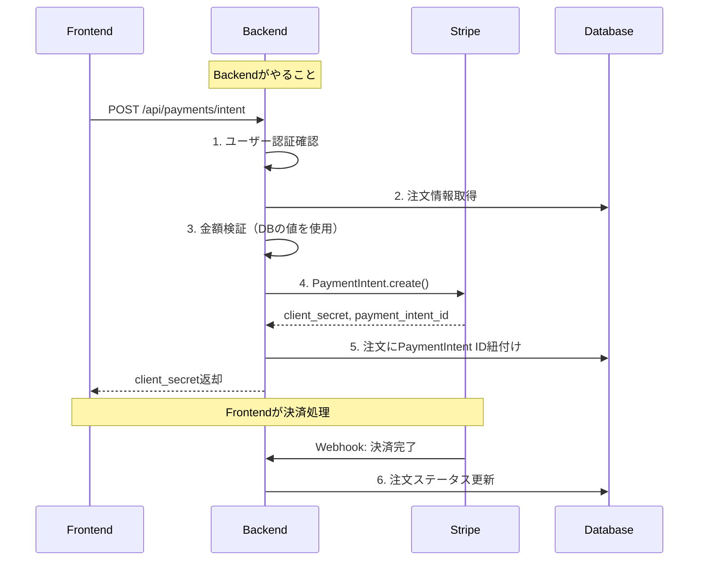
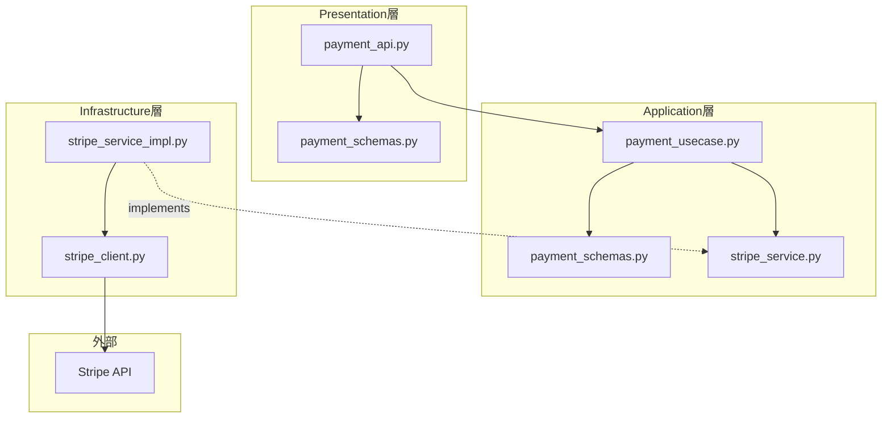

# Stripe Backend実装 - PaymentIntent APIの作成

FastAPIでStripe決済のバックエンドAPIを実装する方法。
ACRIQUEのオニオンアーキテクチャに沿った実装パターンを解説。

---

## 目次

1. [バックエンドの役割](#1-バックエンドの役割)
2. [レイヤー構成](#2-レイヤー構成)
3. [実装手順](#3-実装手順)
4. [顧客（Customer）管理](#4-顧客customer管理)
5. [セキュリティ考慮事項](#5-セキュリティ考慮事項)
6. [テストの書き方](#6-テストの書き方)

---

## 1. バックエンドの役割

### 決済フローにおけるバックエンドの責務



### バックエンドが処理すべきこと

| やること | やらないこと |
|---------|-------------|
| PaymentIntentの作成 | カード情報の処理（Stripeが行う） |
| 金額の検証（Frontendを信用しない） | カードの検証（Stripeが行う） |
| 顧客情報の管理 | |
| 注文データの管理 | |
| Webhookの受信と処理 | |

---

## 2. レイヤー構成

### ACRIQUEでのファイル配置

```
backend/app/
├── domain/
│   ├── entities/
│   │   └── payment.py               # 決済ドメインエンティティ（必要に応じて）
│   └── exceptions/
│       └── payment.py               # 決済例外
├── application/
│   ├── interfaces/
│   │   └── stripe_service.py        # Stripeサービスインターフェース
│   ├── schemas/
│   │   └── payment_schemas.py       # 入出力スキーマ（DTO）
│   └── use_cases/
│       └── payment_usecase.py       # 決済ユースケース
├── infrastructure/
│   └── stripe/
│       ├── stripe_client.py         # Stripe SDK初期化
│       └── stripe_service_impl.py   # Stripeサービス実装
├── presentation/
│   ├── api/
│   │   └── payment_api.py           # 決済APIエンドポイント
│   └── schemas/
│       └── payment_schemas.py       # リクエスト/レスポンススキーマ
└── di/
    └── payment.py                   # 依存性注入
```

### 依存関係



---

## 3. 実装手順

### Step 1: パッケージインストール

```bash
cd backend
pip install stripe
# または poetry add stripe
```

### Step 2: 環境変数設定

```bash
# backend/.env
STRIPE_SECRET_KEY=sk_test_xxxxx
STRIPE_WEBHOOK_SECRET=whsec_xxxxx
```

```python
# backend/app/config.py
from pydantic_settings import BaseSettings

class Settings(BaseSettings):
    # 既存の設定...

    # Stripe
    stripe_secret_key: str
    stripe_webhook_secret: str

    class Config:
        env_file = ".env"
```

### Step 3: Stripe クライアント初期化

```python
# backend/app/infrastructure/stripe/stripe_client.py
import stripe
from app.config import get_settings

settings = get_settings()

# Stripe APIキーの設定
stripe.api_key = settings.stripe_secret_key
```

### Step 4: ドメイン例外

```python
# backend/app/domain/exceptions/payment.py
from app.domain.exceptions.base import DomainException

class PaymentError(DomainException):
    """決済エラーの基底クラス"""
    pass

class PaymentIntentCreationError(PaymentError):
    """PaymentIntent作成エラー"""
    def __init__(self, detail: str = "決済の準備に失敗しました"):
        super().__init__(detail)

class OrderNotPendingError(PaymentError):
    """注文が支払い待ち状態でない"""
    def __init__(self):
        super().__init__("この注文は支払いできる状態ではありません")

class PaymentAlreadyProcessedError(PaymentError):
    """既に決済処理済み"""
    def __init__(self):
        super().__init__("この注文は既に決済済みです")
```

### Step 5: Stripeサービスインターフェース

```python
# backend/app/application/interfaces/stripe_service.py
from abc import ABC, abstractmethod
from dataclasses import dataclass
from typing import Optional

@dataclass
class PaymentIntentResult:
    """PaymentIntent作成結果"""
    payment_intent_id: str
    client_secret: str
    amount: int
    status: str

class IStripeService(ABC):
    """Stripeサービスインターフェース"""

    @abstractmethod
    def create_payment_intent(
        self,
        amount: int,
        currency: str = "jpy",
        customer_id: Optional[str] = None,
        metadata: Optional[dict] = None,
    ) -> PaymentIntentResult:
        """PaymentIntentを作成"""
        pass

    @abstractmethod
    def retrieve_payment_intent(
        self, payment_intent_id: str
    ) -> PaymentIntentResult:
        """PaymentIntentを取得"""
        pass

    @abstractmethod
    def create_customer(
        self,
        email: str,
        name: Optional[str] = None,
        metadata: Optional[dict] = None,
    ) -> str:
        """Stripe顧客を作成してIDを返す"""
        pass
```

### Step 6: Stripeサービス実装

```python
# backend/app/infrastructure/stripe/stripe_service_impl.py
import stripe
from typing import Optional

from app.application.interfaces.stripe_service import (
    IStripeService,
    PaymentIntentResult,
)
from app.domain.exceptions.payment import PaymentIntentCreationError

# stripe_client.pyでAPIキーが設定済み
import app.infrastructure.stripe.stripe_client  # noqa: F401


class StripeServiceImpl(IStripeService):
    """Stripe操作を行うサービス実装"""

    def create_payment_intent(
        self,
        amount: int,
        currency: str = "jpy",
        customer_id: Optional[str] = None,
        metadata: Optional[dict] = None,
    ) -> PaymentIntentResult:
        """
        PaymentIntentを作成

        Args:
            amount: 金額（日本円の場合は整数）
            currency: 通貨コード
            customer_id: Stripe顧客ID
            metadata: メタデータ（注文IDなど）

        Returns:
            PaymentIntentResult
        """
        try:
            params: dict = {
                "amount": amount,
                "currency": currency,
                "automatic_payment_methods": {"enabled": True},
            }

            if customer_id:
                params["customer"] = customer_id

            if metadata:
                params["metadata"] = metadata

            payment_intent = stripe.PaymentIntent.create(**params)

            return PaymentIntentResult(
                payment_intent_id=payment_intent.id,
                client_secret=payment_intent.client_secret,
                amount=payment_intent.amount,
                status=payment_intent.status,
            )

        except stripe.error.StripeError as e:
            raise PaymentIntentCreationError(str(e))

    def retrieve_payment_intent(
        self, payment_intent_id: str
    ) -> PaymentIntentResult:
        """PaymentIntentを取得"""
        payment_intent = stripe.PaymentIntent.retrieve(payment_intent_id)
        return PaymentIntentResult(
            payment_intent_id=payment_intent.id,
            client_secret=payment_intent.client_secret,
            amount=payment_intent.amount,
            status=payment_intent.status,
        )

    def create_customer(
        self,
        email: str,
        name: Optional[str] = None,
        metadata: Optional[dict] = None,
    ) -> str:
        """Stripe顧客を作成"""
        params: dict = {"email": email}

        if name:
            params["name"] = name

        if metadata:
            params["metadata"] = metadata

        customer = stripe.Customer.create(**params)
        return customer.id
```

### Step 7: アプリケーション層スキーマ（DTO）

```python
# backend/app/application/schemas/payment_schemas.py
from dataclasses import dataclass

@dataclass
class CreatePaymentIntentInputDTO:
    """PaymentIntent作成入力DTO"""
    order_id: int

@dataclass
class CreatePaymentIntentOutputDTO:
    """PaymentIntent作成出力DTO"""
    client_secret: str
    payment_intent_id: str
    amount: int
```

### Step 8: ユースケース

```python
# backend/app/application/use_cases/payment_usecase.py
from app.application.interfaces.stripe_service import IStripeService
from app.application.schemas.payment_schemas import (
    CreatePaymentIntentInputDTO,
    CreatePaymentIntentOutputDTO,
)
from app.domain.entities.order import OrderStatus
from app.domain.exceptions.common import PermissionDeniedError
from app.domain.exceptions.order import OrderNotFoundError
from app.domain.exceptions.payment import (
    OrderNotPendingError,
    PaymentAlreadyProcessedError,
)
from app.domain.repositories.order_repository import IOrderRepository
from app.domain.repositories.user_repository import IUserRepository


class PaymentUsecase:
    """決済ユースケース"""

    def __init__(
        self,
        stripe_service: IStripeService,
        order_repository: IOrderRepository,
        user_repository: IUserRepository,
    ):
        self.stripe_service = stripe_service
        self.order_repository = order_repository
        self.user_repository = user_repository

    def create_payment_intent(
        self, user_id: int, input_dto: CreatePaymentIntentInputDTO
    ) -> CreatePaymentIntentOutputDTO:
        """
        PaymentIntentを作成

        1. 注文の存在確認・権限確認
        2. 注文ステータス確認
        3. Stripe PaymentIntentを作成
        4. 注文にPaymentIntent IDを紐付け
        """
        # 1. 注文の存在確認
        order = self.order_repository.get_by_id(input_dto.order_id)
        if order is None:
            raise OrderNotFoundError()

        # 権限確認（自分の注文か）
        if order.user_id != user_id:
            raise PermissionDeniedError("この注文の決済を行う")

        # 2. 注文ステータス確認
        if order.stripe_payment_intent_id and order.status == OrderStatus.PAID:
            raise PaymentAlreadyProcessedError()

        if order.status not in [OrderStatus.PENDING, OrderStatus.AWAITING_PAYMENT]:
            raise OrderNotPendingError()

        # ユーザー情報取得（Stripe Customer ID用）
        user = self.user_repository.get_by_id(user_id)

        # 3. Stripe PaymentIntentを作成
        # 金額はDBから取得（Frontendを信用しない！）
        result = self.stripe_service.create_payment_intent(
            amount=order.total,
            currency="jpy",
            customer_id=user.stripe_customer_id if user else None,
            metadata={
                "order_id": str(order.id),
                "order_number": order.order_number,
                "user_id": str(user_id),
            },
        )

        # 4. 注文にPaymentIntent IDを紐付け
        order.stripe_payment_intent_id = result.payment_intent_id
        order.status = OrderStatus.AWAITING_PAYMENT
        self.order_repository.update(order)

        return CreatePaymentIntentOutputDTO(
            client_secret=result.client_secret,
            payment_intent_id=result.payment_intent_id,
            amount=result.amount,
        )
```

### Step 9: プレゼンテーション層スキーマ

```python
# backend/app/presentation/schemas/payment_schemas.py
from pydantic import BaseModel, Field

from app.application.schemas.payment_schemas import (
    CreatePaymentIntentInputDTO,
    CreatePaymentIntentOutputDTO,
)


class CreatePaymentIntentRequest(BaseModel):
    """PaymentIntent作成リクエスト"""
    order_id: int = Field(..., description="注文ID")

    def to_dto(self) -> CreatePaymentIntentInputDTO:
        return CreatePaymentIntentInputDTO(order_id=self.order_id)


class CreatePaymentIntentResponse(BaseModel):
    """PaymentIntent作成レスポンス"""
    client_secret: str = Field(..., description="クライアントシークレット")
    payment_intent_id: str = Field(..., description="PaymentIntent ID")
    amount: int = Field(..., description="決済金額")

    @classmethod
    def from_dto(cls, dto: CreatePaymentIntentOutputDTO) -> "CreatePaymentIntentResponse":
        return cls(
            client_secret=dto.client_secret,
            payment_intent_id=dto.payment_intent_id,
            amount=dto.amount,
        )
```

### Step 10: 依存性注入

```python
# backend/app/di/payment.py
from fastapi import Depends
from sqlalchemy.orm import Session

from app.application.use_cases.payment_usecase import PaymentUsecase
from app.infrastructure.db.session import get_db
from app.infrastructure.db.repositories.order_repository_impl import (
    OrderRepositoryImpl,
)
from app.infrastructure.db.repositories.user_repository_impl import (
    UserRepositoryImpl,
)
from app.infrastructure.stripe.stripe_service_impl import StripeServiceImpl


def get_payment_usecase(db: Session = Depends(get_db)) -> PaymentUsecase:
    return PaymentUsecase(
        stripe_service=StripeServiceImpl(),
        order_repository=OrderRepositoryImpl(db),
        user_repository=UserRepositoryImpl(db),
    )
```

### Step 11: APIエンドポイント

```python
# backend/app/presentation/api/payment_api.py
from fastapi import APIRouter, Depends, status

from app.application.use_cases.payment_usecase import PaymentUsecase
from app.di.payment import get_payment_usecase
from app.infrastructure.security.security_service_impl import (
    User,
    get_current_user_from_cookie,
)
from app.presentation.schemas.payment_schemas import (
    CreatePaymentIntentRequest,
    CreatePaymentIntentResponse,
)

router = APIRouter(prefix="/payments", tags=["決済"])


@router.post(
    "/intent",
    response_model=CreatePaymentIntentResponse,
    status_code=status.HTTP_200_OK,
)
def create_payment_intent(
    request: CreatePaymentIntentRequest,
    current_user: User = Depends(get_current_user_from_cookie),
    usecase: PaymentUsecase = Depends(get_payment_usecase),
) -> CreatePaymentIntentResponse:
    """
    PaymentIntentを作成

    - 注文の金額からPaymentIntentを作成
    - client_secretを返却（Frontendで使用）
    """
    output_dto = usecase.create_payment_intent(
        user_id=current_user.id,
        input_dto=request.to_dto(),
    )
    return CreatePaymentIntentResponse.from_dto(output_dto)
```

### Step 12: ルーターの登録

```python
# backend/app/main.py
from app.presentation.api.payment_api import router as payment_router

# 他のルーターと一緒に登録
app.include_router(payment_router, prefix="/api")
```

---

## 4. 顧客（Customer）管理

### ユーザー登録時にStripe Customerを作成

```python
# backend/app/application/use_cases/auth_usecase.py の register メソッドに追加
class AuthUsecase:
    def __init__(
        self,
        # 既存の依存...
        stripe_service: IStripeService,
    ):
        self.stripe_service = stripe_service
        # ...

    def register(self, input_dto: RegisterInputDTO) -> RegisterOutputDTO:
        # 1. DBにユーザーを作成
        user = self.user_repository.create(
            email=input_dto.email,
            password_hash=self._hash_password(input_dto.password),
            name=input_dto.name,
        )

        # 2. Stripe Customerを作成
        stripe_customer_id = self.stripe_service.create_customer(
            email=input_dto.email,
            name=input_dto.name,
            metadata={"acrique_user_id": str(user.id)},
        )

        # 3. Stripe Customer IDをユーザーに紐付け
        user.stripe_customer_id = stripe_customer_id
        self.user_repository.update(user)

        return RegisterOutputDTO(...)
```

---

## 5. セキュリティ考慮事項

### 金額の検証

```python
# ❌ 悪い例：Frontendからの金額を信用
@router.post("/intent")
def create_payment_intent(request: CreatePaymentIntentRequest):
    payment_intent = stripe.PaymentIntent.create(
        amount=request.amount,  # ← 改ざんされる可能性
        currency="jpy",
    )

# ✅ 良い例：Backend側でDBから金額を取得
@router.post("/intent")
def create_payment_intent(request: CreatePaymentIntentRequest):
    order = order_repository.get_by_id(request.order_id)
    payment_intent = stripe.PaymentIntent.create(
        amount=order.total,  # ← DBから取得した金額
        currency="jpy",
    )
```

### メタデータの活用

```python
result = self.stripe_service.create_payment_intent(
    amount=order.total,
    currency="jpy",
    metadata={
        "order_id": str(order.id),           # 注文追跡用
        "order_number": order.order_number,  # 管理画面での識別用
        "user_id": str(user_id),             # ユーザー追跡用
    },
)
```

### APIキーの管理

```python
# ❌ 悪い例：ハードコード
stripe.api_key = "sk_live_xxxxx"

# ✅ 良い例：環境変数から読み込み（Pydantic Settingsで管理）
from app.config import get_settings
settings = get_settings()
stripe.api_key = settings.stripe_secret_key
```

---

## 6. テストの書き方

### モックを使ったユニットテスト

```python
# backend/tests/unit/use_cases/test_payment_usecase.py
import pytest
from unittest.mock import Mock

from app.application.schemas.payment_schemas import CreatePaymentIntentInputDTO
from app.application.use_cases.payment_usecase import PaymentUsecase
from app.application.interfaces.stripe_service import PaymentIntentResult
from app.domain.entities.order import Order, OrderStatus


class TestPaymentUsecase:
    def test_create_payment_intent_success(self):
        # Arrange
        mock_stripe_service = Mock()
        mock_stripe_service.create_payment_intent.return_value = PaymentIntentResult(
            payment_intent_id="pi_test_123",
            client_secret="pi_test_123_secret_xxx",
            amount=16500,
            status="requires_payment_method",
        )

        mock_order_repo = Mock()
        mock_order_repo.get_by_id.return_value = Order(
            id=1,
            user_id=1,
            order_number="ACQ-240101-001",
            status=OrderStatus.PENDING,
            total=16500,
        )

        mock_user_repo = Mock()
        mock_user_repo.get_by_id.return_value = Mock(
            id=1,
            stripe_customer_id="cus_test_123",
        )

        usecase = PaymentUsecase(
            stripe_service=mock_stripe_service,
            order_repository=mock_order_repo,
            user_repository=mock_user_repo,
        )

        # Act
        result = usecase.create_payment_intent(
            user_id=1,
            input_dto=CreatePaymentIntentInputDTO(order_id=1),
        )

        # Assert
        assert result.client_secret == "pi_test_123_secret_xxx"
        assert result.payment_intent_id == "pi_test_123"
        assert result.amount == 16500

        mock_stripe_service.create_payment_intent.assert_called_once_with(
            amount=16500,
            currency="jpy",
            customer_id="cus_test_123",
            metadata={
                "order_id": "1",
                "order_number": "ACQ-240101-001",
                "user_id": "1",
            },
        )

    def test_create_payment_intent_order_not_found(self):
        # Arrange
        mock_stripe_service = Mock()
        mock_order_repo = Mock()
        mock_order_repo.get_by_id.return_value = None
        mock_user_repo = Mock()

        usecase = PaymentUsecase(
            stripe_service=mock_stripe_service,
            order_repository=mock_order_repo,
            user_repository=mock_user_repo,
        )

        # Act & Assert
        with pytest.raises(OrderNotFoundError):
            usecase.create_payment_intent(
                user_id=1,
                input_dto=CreatePaymentIntentInputDTO(order_id=999),
            )

    def test_create_payment_intent_permission_denied(self):
        # Arrange
        mock_stripe_service = Mock()
        mock_order_repo = Mock()
        mock_order_repo.get_by_id.return_value = Order(
            id=1,
            user_id=2,  # 別のユーザーの注文
            status=OrderStatus.PENDING,
            total=16500,
        )
        mock_user_repo = Mock()

        usecase = PaymentUsecase(
            stripe_service=mock_stripe_service,
            order_repository=mock_order_repo,
            user_repository=mock_user_repo,
        )

        # Act & Assert
        with pytest.raises(PermissionDeniedError):
            usecase.create_payment_intent(
                user_id=1,
                input_dto=CreatePaymentIntentInputDTO(order_id=1),
            )
```

### 統合テスト（Stripeテストモード使用）

```python
# backend/tests/integration/api/test_payment_api.py
import pytest
from fastapi.testclient import TestClient


class TestPaymentAPI:
    def test_create_payment_intent(
        self,
        client: TestClient,
        auth_headers: dict,
        test_order: Order,
    ):
        # Act
        response = client.post(
            "/api/payments/intent",
            json={"order_id": test_order.id},
            headers=auth_headers,
        )

        # Assert
        assert response.status_code == 200
        data = response.json()
        assert "client_secret" in data
        assert data["client_secret"].startswith("pi_")
        assert data["amount"] == test_order.total

    def test_create_payment_intent_unauthorized(self, client: TestClient):
        response = client.post(
            "/api/payments/intent",
            json={"order_id": 1},
        )
        assert response.status_code == 401
```

---

## チェックリスト

```
□ stripe パッケージをインストール
□ 環境変数 STRIPE_SECRET_KEY を設定
□ domain/exceptions/payment.py を作成
□ application/interfaces/stripe_service.py を作成
□ infrastructure/stripe/stripe_service_impl.py を作成
□ application/use_cases/payment_usecase.py を作成
□ presentation/api/payment_api.py を作成
□ di/payment.py で依存性注入を設定
□ main.py でルーターを登録
□ 金額計算をBackend側（DBから取得）で行う
□ メタデータに order_id, user_id を設定
□ ユニットテストを作成
```

---

## 次のステップ


**次に読むドキュメント:**
- **05-Stripe Webhook実装** - 決済完了を確実に処理する

---

**作成日**: 2025-01-10
**更新日**: 2026-01-10
**対象**: Stripe未経験のバックエンド開発者
