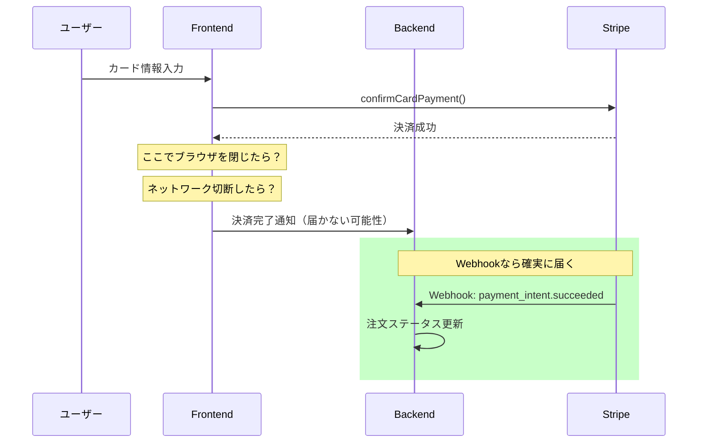
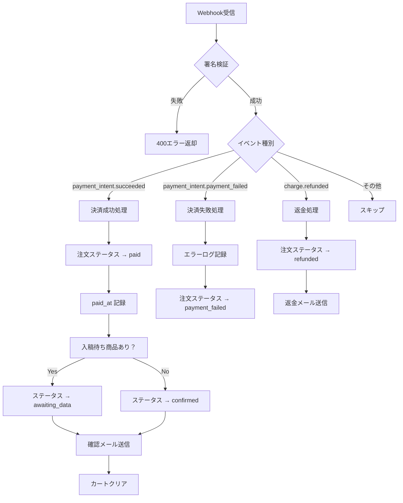
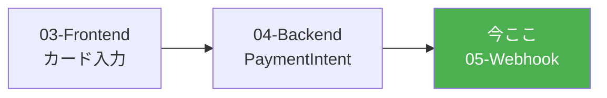

# Stripe Webhook実装 - 決済完了処理

Stripe Webhookを使って決済完了を確実に処理する方法。
ACRIQUEのオニオンアーキテクチャに沿った実装パターンを解説。

---

## 目次

1. [Webhookとは](#1-webhookとは)
2. [処理すべきイベント](#2-処理すべきイベント)
3. [実装手順](#3-実装手順)
4. [セキュリティ](#4-セキュリティ)
5. [ローカル開発環境でのテスト](#5-ローカル開発環境でのテスト)
6. [本番環境の設定](#6-本番環境の設定)
7. [エラーハンドリングとリトライ](#7-エラーハンドリングとリトライ)

---

## 1. Webhookとは

### なぜWebhookが必要か



### Webhookの信頼性

| 方式 | 信頼性 | 問題点 |
|-----|-------|-------|
| Frontendからの通知 | 低い | ブラウザ閉じ、ネットワーク切断で失われる |
| Webhook | 高い | Stripeが確実に配信、リトライあり |

---

## 2. 処理すべきイベント

### ACRIQUEで必要なイベント

| イベント | 発生タイミング | 処理内容 |
|---------|--------------|---------|
| `payment_intent.succeeded` | 決済成功時 | 注文ステータス → `paid`、確認メール送信 |
| `payment_intent.payment_failed` | 決済失敗時 | ログ記録、（オプション）失敗通知 |
| `charge.refunded` | 返金時 | 注文ステータス → `refunded` |

### イベントフロー



---

## 3. 実装手順

### ファイル構成

```
backend/app/
├── application/
│   ├── interfaces/
│   │   └── email_service.py          # 既存
│   ├── schemas/
│   │   └── webhook_schemas.py        # Webhook用DTO
│   └── use_cases/
│       └── webhook_usecase.py        # Webhookユースケース
├── infrastructure/
│   └── stripe/
│       └── webhook_handler.py        # Webhookハンドラー
├── presentation/
│   └── api/
│       └── webhook_api.py            # WebhookAPIエンドポイント
└── di/
    └── webhook.py                    # 依存性注入
```

### Step 1: 環境変数（04で設定済み）

```bash
# backend/.env
STRIPE_SECRET_KEY=sk_test_xxxxx
STRIPE_WEBHOOK_SECRET=whsec_xxxxx  # ← Webhookエンドポイント作成後に取得
```

### Step 2: Webhookハンドラー

```python
# backend/app/infrastructure/stripe/webhook_handler.py
import stripe
from fastapi import Request, HTTPException

from app.config import get_settings

settings = get_settings()


async def verify_webhook_signature(request: Request) -> stripe.Event:
    """
    Webhook署名を検証してイベントを返す

    Args:
        request: FastAPIリクエスト

    Returns:
        検証済みのStripeイベント

    Raises:
        HTTPException: 署名検証失敗時
    """
    payload = await request.body()
    sig_header = request.headers.get("stripe-signature")

    if not sig_header:
        raise HTTPException(status_code=400, detail="Missing stripe-signature header")

    try:
        event = stripe.Webhook.construct_event(
            payload,
            sig_header,
            settings.stripe_webhook_secret,
        )
        return event
    except ValueError:
        raise HTTPException(status_code=400, detail="Invalid payload")
    except stripe.error.SignatureVerificationError:
        raise HTTPException(status_code=400, detail="Invalid signature")
```

### Step 3: アプリケーション層スキーマ

```python
# backend/app/application/schemas/webhook_schemas.py
from dataclasses import dataclass
from typing import Optional


@dataclass
class PaymentSucceededDTO:
    """決済成功イベントDTO"""
    payment_intent_id: str
    amount: int
    metadata: dict


@dataclass
class PaymentFailedDTO:
    """決済失敗イベントDTO"""
    payment_intent_id: str
    error_message: Optional[str]
    metadata: dict


@dataclass
class RefundedDTO:
    """返金イベントDTO"""
    charge_id: str
    payment_intent_id: str
    amount_refunded: int
    metadata: dict
```

### Step 4: ユースケース

```python
# backend/app/application/use_cases/webhook_usecase.py
from datetime import datetime
from typing import Optional
import logging

from app.application.interfaces.email_service import IEmailService
from app.application.schemas.webhook_schemas import (
    PaymentFailedDTO,
    PaymentSucceededDTO,
    RefundedDTO,
)
from app.domain.entities.order import OrderStatus
from app.domain.repositories.cart_item_repository import ICartItemRepository
from app.domain.repositories.order_repository import IOrderRepository

logger = logging.getLogger(__name__)


class WebhookUsecase:
    """Webhook処理ユースケース"""

    def __init__(
        self,
        order_repository: IOrderRepository,
        cart_item_repository: ICartItemRepository,
        email_service: IEmailService,
    ):
        self.order_repository = order_repository
        self.cart_item_repository = cart_item_repository
        self.email_service = email_service

    def handle_payment_succeeded(self, dto: PaymentSucceededDTO) -> None:
        """
        決済成功時の処理

        1. PaymentIntent IDから注文を検索
        2. 注文ステータスを更新
        3. 確認メールを送信
        4. カートをクリア
        """
        logger.info(f"Processing payment_intent.succeeded: {dto.payment_intent_id}")

        # 1. 注文を検索
        order = self.order_repository.get_by_payment_intent_id(dto.payment_intent_id)
        if order is None:
            logger.warning(
                f"Order not found for payment_intent: {dto.payment_intent_id}"
            )
            return

        # 既に処理済みの場合はスキップ（冪等性）
        if order.status == OrderStatus.PAID:
            logger.info(f"Order {order.id} already paid, skipping")
            return

        # 2. ステータス更新
        order.status = OrderStatus.PAID
        order.paid_at = datetime.now()

        # 入稿待ち商品があるかチェック
        has_upload_required = any(
            item.requires_upload for item in order.items
        ) if hasattr(order, 'items') else False

        if has_upload_required:
            order.status = OrderStatus.AWAITING_DATA
        else:
            order.status = OrderStatus.CONFIRMED

        self.order_repository.update(order)
        logger.info(f"Order {order.id} status updated to {order.status}")

        # 3. 確認メール送信
        try:
            self.email_service.send_order_confirmation(
                to_email=order.user.email,
                order_number=order.order_number,
                total=order.total,
            )
        except Exception as e:
            logger.error(f"Failed to send confirmation email: {e}")

        # 4. カートクリア
        self.cart_item_repository.delete_all_by_user_id(order.user_id)
        logger.info(f"Cart cleared for user {order.user_id}")

    def handle_payment_failed(self, dto: PaymentFailedDTO) -> None:
        """
        決済失敗時の処理

        1. PaymentIntent IDから注文を検索
        2. エラーログ記録
        3. 注文ステータスを更新（オプション）
        """
        logger.warning(
            f"Payment failed: {dto.payment_intent_id}, error: {dto.error_message}"
        )

        order = self.order_repository.get_by_payment_intent_id(dto.payment_intent_id)
        if order is None:
            logger.warning(
                f"Order not found for payment_intent: {dto.payment_intent_id}"
            )
            return

        # ステータスは変更しない（ユーザーが再試行できるように）
        # 必要に応じて失敗回数をカウントするなどの処理を追加

    def handle_refunded(self, dto: RefundedDTO) -> None:
        """
        返金時の処理

        1. PaymentIntent IDから注文を検索
        2. 注文ステータスを更新
        3. 返金メールを送信
        """
        logger.info(f"Processing refund: {dto.charge_id}")

        order = self.order_repository.get_by_payment_intent_id(dto.payment_intent_id)
        if order is None:
            logger.warning(
                f"Order not found for payment_intent: {dto.payment_intent_id}"
            )
            return

        # ステータス更新
        order.status = OrderStatus.REFUNDED
        self.order_repository.update(order)
        logger.info(f"Order {order.id} status updated to refunded")

        # 返金メール送信
        try:
            self.email_service.send_refund_notification(
                to_email=order.user.email,
                order_number=order.order_number,
                amount=dto.amount_refunded,
            )
        except Exception as e:
            logger.error(f"Failed to send refund email: {e}")
```

### Step 5: 依存性注入

```python
# backend/app/di/webhook.py
from fastapi import Depends
from sqlalchemy.orm import Session

from app.application.use_cases.webhook_usecase import WebhookUsecase
from app.infrastructure.db.session import get_db
from app.infrastructure.db.repositories.cart_item_repository_impl import (
    CartItemRepositoryImpl,
)
from app.infrastructure.db.repositories.order_repository_impl import (
    OrderRepositoryImpl,
)
from app.infrastructure.email.resend_email_service import ResendEmailService


def get_webhook_usecase(db: Session = Depends(get_db)) -> WebhookUsecase:
    return WebhookUsecase(
        order_repository=OrderRepositoryImpl(db),
        cart_item_repository=CartItemRepositoryImpl(db),
        email_service=ResendEmailService(),
    )
```

### Step 6: APIエンドポイント

```python
# backend/app/presentation/api/webhook_api.py
from fastapi import APIRouter, Depends, Request, status
import logging

from app.application.schemas.webhook_schemas import (
    PaymentFailedDTO,
    PaymentSucceededDTO,
    RefundedDTO,
)
from app.application.use_cases.webhook_usecase import WebhookUsecase
from app.di.webhook import get_webhook_usecase
from app.infrastructure.stripe.webhook_handler import verify_webhook_signature

logger = logging.getLogger(__name__)

router = APIRouter(prefix="/payments", tags=["決済"])


@router.post("/webhook", status_code=status.HTTP_200_OK)
async def stripe_webhook(
    request: Request,
    usecase: WebhookUsecase = Depends(get_webhook_usecase),
):
    """
    Stripe Webhookエンドポイント

    - 署名を検証
    - イベントタイプに応じて処理を実行
    """
    # 署名検証
    event = await verify_webhook_signature(request)

    event_type = event["type"]
    data = event["data"]["object"]

    logger.info(f"Received webhook: {event_type}")

    # イベントタイプに応じた処理
    if event_type == "payment_intent.succeeded":
        dto = PaymentSucceededDTO(
            payment_intent_id=data["id"],
            amount=data["amount"],
            metadata=data.get("metadata", {}),
        )
        usecase.handle_payment_succeeded(dto)

    elif event_type == "payment_intent.payment_failed":
        error = data.get("last_payment_error", {})
        dto = PaymentFailedDTO(
            payment_intent_id=data["id"],
            error_message=error.get("message"),
            metadata=data.get("metadata", {}),
        )
        usecase.handle_payment_failed(dto)

    elif event_type == "charge.refunded":
        dto = RefundedDTO(
            charge_id=data["id"],
            payment_intent_id=data.get("payment_intent", ""),
            amount_refunded=data["amount_refunded"],
            metadata=data.get("metadata", {}),
        )
        usecase.handle_refunded(dto)

    else:
        logger.info(f"Unhandled event type: {event_type}")

    return {"status": "ok"}
```

### Step 7: OrderRepositoryに検索メソッド追加

```python
# backend/app/domain/repositories/order_repository.py に追加
from abc import abstractmethod

class IOrderRepository(ABC):
    # 既存のメソッド...

    @abstractmethod
    def get_by_payment_intent_id(self, payment_intent_id: str) -> Optional[Order]:
        """PaymentIntent IDで注文を検索"""
        pass
```

```python
# backend/app/infrastructure/db/repositories/order_repository_impl.py に追加
class OrderRepositoryImpl(IOrderRepository):
    # 既存のメソッド...

    def get_by_payment_intent_id(self, payment_intent_id: str) -> Optional[Order]:
        """PaymentIntent IDで注文を検索"""
        model = (
            self.db.query(OrderModel)
            .filter(OrderModel.stripe_payment_intent_id == payment_intent_id)
            .first()
        )
        if model is None:
            return None
        return self._to_entity(model)
```

### Step 8: ルーターの登録

```python
# backend/app/main.py
from app.presentation.api.webhook_api import router as webhook_router

# payment_apiと同じルーターを使用するか、別途登録
app.include_router(webhook_router, prefix="/api")
```

---

## 4. セキュリティ

### 署名検証の重要性

```python
# ❌ 悪い例：署名検証なし
@router.post("/webhook")
async def stripe_webhook(request: Request):
    payload = await request.json()
    # 誰でも偽のWebhookを送れてしまう！

# ✅ 良い例：署名検証あり
@router.post("/webhook")
async def stripe_webhook(request: Request):
    event = await verify_webhook_signature(request)
    # Stripeからの正規のリクエストのみ処理
```

### 冪等性（べきとうせい）の確保

```python
def handle_payment_succeeded(self, dto: PaymentSucceededDTO) -> None:
    order = self.order_repository.get_by_payment_intent_id(dto.payment_intent_id)

    # 既に処理済みならスキップ（同じWebhookが複数回届いても安全）
    if order.status == OrderStatus.PAID:
        logger.info(f"Order {order.id} already paid, skipping")
        return

    # 処理続行...
```

---

## 5. ローカル開発環境でのテスト

### Stripe CLIのインストール

```bash
# macOS
brew install stripe/stripe-cli/stripe

# Windows
scoop install stripe

# ログイン
stripe login
```

### Webhookの転送

```bash
# ローカルサーバーにWebhookを転送
stripe listen --forward-to localhost:8000/api/payments/webhook

# 出力例:
# > Ready! Your webhook signing secret is whsec_xxxxx
# ↑ この値を .env の STRIPE_WEBHOOK_SECRET に設定
```

### テストイベントの送信

```bash
# 決済成功イベントを送信
stripe trigger payment_intent.succeeded

# 決済失敗イベントを送信
stripe trigger payment_intent.payment_failed

# 返金イベントを送信
stripe trigger charge.refunded
```

### 開発時のワークフロー

```
Terminal 1: バックエンドサーバー起動
$ cd backend && uvicorn app.main:app --reload

Terminal 2: Stripe CLI でWebhook転送
$ stripe listen --forward-to localhost:8000/api/payments/webhook

Terminal 3: テストイベント送信
$ stripe trigger payment_intent.succeeded
```

---

## 6. 本番環境の設定

### Stripe Dashboardでの設定

1. [Stripe Dashboard](https://dashboard.stripe.com/webhooks) にアクセス
2. 「エンドポイントを追加」をクリック
3. 設定値を入力:

| 項目 | 値 |
|-----|-----|
| エンドポイントURL | `https://api.acrique.jp/api/payments/webhook` |
| リッスンするイベント | `payment_intent.succeeded`, `payment_intent.payment_failed`, `charge.refunded` |

4. 作成後、「署名シークレットを表示」で `whsec_xxxxx` を取得
5. 本番環境の環境変数に設定

### 環境変数の設定（AWS）

```bash
# AWS Systems Manager Parameter Store
aws ssm put-parameter \
  --name "/acrique/prod/STRIPE_WEBHOOK_SECRET" \
  --value "whsec_xxxxx" \
  --type "SecureString"
```

---

## 7. エラーハンドリングとリトライ

### Stripeのリトライポリシー

Stripeは以下の場合にWebhookを再送信:

- 5xxエラー（サーバーエラー）
- タイムアウト（20秒以上応答なし）
- ネットワークエラー

リトライ間隔:
```
1回目: 即座
2回目: 5分後
3回目: 30分後
4回目: 2時間後
...
最大72時間まで
```

### 適切なレスポンス

```python
@router.post("/webhook", status_code=status.HTTP_200_OK)
async def stripe_webhook(request: Request, usecase: WebhookUsecase = Depends(get_webhook_usecase)):
    try:
        event = await verify_webhook_signature(request)

        # 処理...

        return {"status": "ok"}  # 200を返すとStripeはリトライしない

    except HTTPException:
        raise  # 400エラー: 署名検証失敗、リトライ不要

    except Exception as e:
        logger.error(f"Webhook processing error: {e}")
        raise HTTPException(status_code=500, detail="Internal error")
        # 500エラー: Stripeがリトライする
```

### エラー通知

```python
def handle_payment_succeeded(self, dto: PaymentSucceededDTO) -> None:
    try:
        # 処理...
    except Exception as e:
        logger.error(f"Critical error in payment processing: {e}")
        # Slack/PagerDuty等に通知
        self.notification_service.send_alert(
            title="決済処理エラー",
            message=f"PaymentIntent: {dto.payment_intent_id}\nError: {str(e)}",
        )
        raise  # 500を返してStripeにリトライさせる
```

---

## チェックリスト

```
□ 環境変数 STRIPE_WEBHOOK_SECRET を設定
□ infrastructure/stripe/webhook_handler.py を作成
□ application/use_cases/webhook_usecase.py を作成
□ presentation/api/webhook_api.py を作成
□ OrderRepository に get_by_payment_intent_id を追加
□ 署名検証を実装
□ 冪等性を確保（重複処理の防止）
□ Stripe CLIでローカルテスト
□ 本番環境でWebhookエンドポイントを登録
□ エラー通知を設定
```

---

## 完成！



これでStripe決済の実装は完了です！

### 全体の流れ

```
1. ユーザーが /checkout/confirm でカード情報を入力
2. Frontend が Backend の POST /api/payments/intent を呼び出し
3. Backend が Stripe PaymentIntent を作成、client_secret を返却
4. Frontend が Stripe.confirmCardPayment() で決済実行
5. Stripe が Webhook で決済結果を通知
6. Backend が注文ステータスを更新、確認メール送信
```

---

**作成日**: 2026-01-10
**対象**: Stripe未経験のバックエンド開発者
