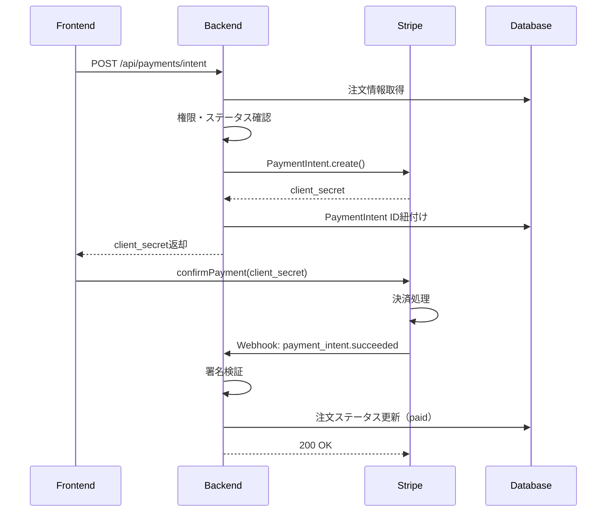

# 43. Payment Backend 実装レポート

## 概要

Stripe決済のバックエンドAPIを実装しました。FastAPIのオニオンアーキテクチャに従い、PaymentIntent作成とWebhook処理のエンドポイントを提供します。

**実装日**: 2026-01-10
**ブランチ**: feat/payment

---

## 実装内容

### APIエンドポイント

| Method | Endpoint | 説明 | 認証 |
|--------|----------|------|------|
| POST | `/api/payments/intent` | PaymentIntent作成 | 必須 |
| POST | `/api/payments/webhook` | Stripe Webhook受信 | 不要（署名検証） |

### POST `/api/payments/intent`

**リクエスト:**
```json
{
  "order_id": 123
}
```

**レスポンス:**
```json
{
  "client_secret": "pi_xxx_secret_xxx",
  "payment_intent_id": "pi_xxx",
  "amount": 16500
}
```

**処理フロー:**
1. ユーザー認証確認
2. 注文の存在確認・権限確認
3. 注文ステータス確認（pending/awaiting_payment のみ許可）
4. DBから金額を取得（Frontendの値は信用しない）
5. Stripe PaymentIntent作成
6. 注文にPaymentIntent IDを紐付け
7. client_secretを返却

### POST `/api/payments/webhook`

**処理するイベント:**
- `payment_intent.succeeded` - 決済成功 → 注文ステータスを`paid`に更新
- `payment_intent.payment_failed` - 決済失敗 → ログ記録
- `charge.refunded` - 返金 → ログ記録

---

## ファイル構成

```
backend/app/
├── config.py                                    # [編集] Stripe設定追加
├── main.py                                      # [編集] ルーター登録
├── domain/
│   └── exceptions/
│       └── payment.py                           # [新規] 決済例外
├── application/
│   ├── interfaces/
│   │   └── stripe_service.py                    # [新規] Stripeインターフェース
│   ├── schemas/
│   │   └── payment_schemas.py                   # [新規] 決済スキーマ（DTO）
│   └── use_cases/
│       └── payment_usecase.py                   # [新規] 決済ユースケース
├── infrastructure/
│   └── stripe/
│       ├── __init__.py                          # [新規]
│       ├── stripe_client.py                     # [新規] Stripeクライアント
│       └── stripe_service_impl.py               # [新規] Stripeサービス実装
├── presentation/
│   ├── api/
│   │   └── payment_api.py                       # [新規] APIエンドポイント
│   └── exception_handlers.py                    # [編集] 決済例外追加
└── di/
    └── payment.py                               # [新規] 依存性注入
```

---

## レイヤー構成

```
┌─────────────────────────────────────────────────────────────┐
│                    Presentation層                            │
│  payment_api.py (Router)                                     │
│  payment_schemas.py (Request/Response)                       │
└─────────────────────────────────────────────────────────────┘
                              │
                              ▼
┌─────────────────────────────────────────────────────────────┐
│                    Application層                             │
│  payment_usecase.py (UseCase)                                │
│  payment_schemas.py (DTO)                                    │
│  stripe_service.py (Interface)                               │
└─────────────────────────────────────────────────────────────┘
                              │
                              ▼
┌─────────────────────────────────────────────────────────────┐
│                   Infrastructure層                           │
│  stripe_service_impl.py (Stripeサービス実装)                  │
│  order_repository_impl.py (注文リポジトリ)                    │
│  user_repository_impl.py (ユーザーリポジトリ)                  │
└─────────────────────────────────────────────────────────────┘
                              │
                              ▼
┌─────────────────────────────────────────────────────────────┐
│                      Domain層                                │
│  order.py (Entity)                                           │
│  payment.py (Exceptions)                                     │
└─────────────────────────────────────────────────────────────┘
```

---

## 新規作成ファイル詳細

### 1. domain/exceptions/payment.py

決済関連のドメイン例外を定義。

| 例外クラス | 説明 | HTTPステータス |
|-----------|------|---------------|
| `PaymentError` | 決済エラー基底クラス | 400 |
| `PaymentIntentCreationError` | PaymentIntent作成失敗 | 400 |
| `OrderNotPendingError` | 注文が支払い可能状態でない | 400 |
| `PaymentAlreadyProcessedError` | 既に決済済み | 400 |
| `WebhookSignatureError` | Webhook署名検証失敗 | 400 |

### 2. application/interfaces/stripe_service.py

Stripeサービスの抽象インターフェース。

```python
class IStripeService(ABC):
    def create_payment_intent(...) -> PaymentIntentResult
    def retrieve_payment_intent(...) -> PaymentIntentResult
    def create_customer(...) -> str
    def construct_webhook_event(...) -> dict
```

### 3. application/use_cases/payment_usecase.py

決済ビジネスロジックを実装。

**主要メソッド:**
- `create_payment_intent()` - PaymentIntent作成
- `handle_webhook()` - Webhook処理
- `_handle_payment_succeeded()` - 決済成功処理
- `_handle_payment_failed()` - 決済失敗処理
- `_handle_refund()` - 返金処理

### 4. infrastructure/stripe/stripe_service_impl.py

Stripe SDKを使用したサービス実装。

**セキュリティ対策:**
- APIキーは環境変数から取得
- Webhook署名検証を実装
- 金額はDBから取得（Frontendを信用しない）

---

## 編集ファイル詳細

### 1. config.py

Stripe関連の設定を追加。

```python
# Stripe settings
stripe_secret_key: str = ''
stripe_webhook_secret: str = ''
```

### 2. main.py

決済ルーターを登録。

```python
from app.presentation.api.payment_api import router as payment_router
app.include_router(payment_router, prefix='/api')
```

### 3. presentation/exception_handlers.py

決済例外のHTTPステータスマッピングを追加。

```python
OrderNotPendingError: 400,
PaymentAlreadyProcessedError: 400,
PaymentIntentCreationError: 400,
WebhookSignatureError: 400,
```

---

## セットアップ手順

### 1. パッケージインストール

```bash
cd backend
poetry add stripe
```

### 2. 環境変数設定

```bash
# backend/.env
STRIPE_SECRET_KEY=sk_test_xxxxx
STRIPE_WEBHOOK_SECRET=whsec_xxxxx
```

### 3. Stripe Webhookエンドポイント設定

Stripeダッシュボードで以下のエンドポイントを登録：
- URL: `https://your-domain.com/api/payments/webhook`
- イベント: `payment_intent.succeeded`, `payment_intent.payment_failed`, `charge.refunded`

---

## セキュリティ考慮事項

### 1. 金額の検証

```python
# ❌ 悪い例：Frontendからの金額を信用
amount=request.amount

# ✅ 良い例：DBから金額を取得
order = self.order_repository.get_by_id(input_dto.order_id)
amount=order.total
```

### 2. 権限確認

```python
# 自分の注文のみ決済可能
if order.user_id != user_id:
    raise PermissionDeniedError('この注文の決済を行う')
```

### 3. ステータス検証

```python
# 既に決済済みの場合はエラー
if order.stripe_payment_intent_id and order.status == OrderStatus.PAID:
    raise PaymentAlreadyProcessedError()

# 支払い可能な状態のみ許可
if order.status not in [OrderStatus.PENDING, OrderStatus.AWAITING_PAYMENT]:
    raise OrderNotPendingError()
```

### 4. Webhook署名検証

```python
event = stripe.Webhook.construct_event(
    payload,
    sig_header,
    self.webhook_secret,
)
```

---

## 決済フロー



---

## 次のステップ

- [ ] Webhook実装（05-Stripe-Webhook実装）
- [ ] Stripe Customer作成（ユーザー登録時）
- [ ] 返金処理の詳細実装
- [ ] 決済履歴の管理画面表示

---

## 関連ドキュメント

- [04-Stripe-Backend実装-PaymentIntent-APIの作成](../../learning/stripe/04-Stripe-Backend実装-PaymentIntent-APIの作成.md)
- [05-Stripe-Webhook実装-決済完了処理](../../learning/stripe/05-Stripe-Webhook実装-決済完了処理.md)
- [13-API設計](../../../requirements/13-API設計.md)
