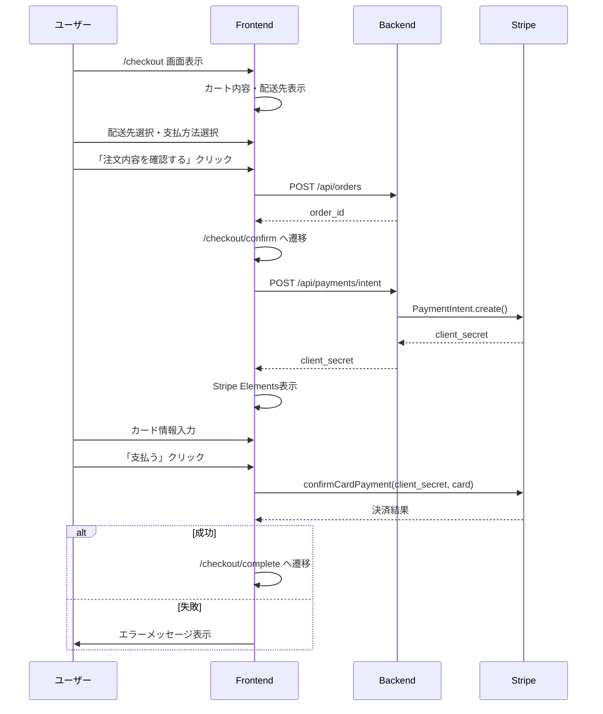

# 44. Payment Frontend 実装レポート

## 概要

Stripe決済のフロントエンドを実装しました。FSD（Feature-Sliced Design）に従い、entity、feature、widget、page-componentsの各層にコードを配置しています。

**実装日**: 2026-01-10
**ブランチ**: feat/payment

---

## 実装内容

### ページ一覧

| Path | ページ名 | 状況 |
|------|---------|------|
| `/checkout` | 購入手続き | 完了 |
| `/checkout/confirm` | 注文確認・決済 | 完了 |
| `/checkout/complete` | 注文完了 | 完了 |

### 決済フロー



---

## ファイル構成

```
frontend/src/
├── shared/
│   └── lib/
│       └── stripe.ts                    # [新規] Stripe初期化
├── entities/
│   └── payment/
│       ├── api/
│       │   └── payment-api.ts           # [新規] API呼び出し
│       └── model/
│           └── types.ts                 # [新規] 型定義
├── features/
│   └── payment/
│       └── create-payment-intent/
│           └── lib/
│               ├── use-create-payment-intent.ts  # [新規] Hook
│               └── error-messages.ts             # [新規] エラーメッセージ
├── widgets/
│   └── payment/
│       └── card-form/
│           └── ui/
│               └── CardForm.tsx         # [新規] カード入力フォーム
├── page-components/
│   └── purchase/
│       └── checkout/
│           ├── home/ui/
│           │   └── CheckoutContainer.tsx         # [新規] 購入手続き
│           ├── confirm/
│           │   └── ui/
│           │       └── CheckoutConfirmContainer.tsx  # [新規] 決済
│           └── complete/
│               └── ui/
│                   └── CheckoutCompleteContainer.tsx # [新規] 完了
└── app/
    └── (purchase)/
        └── checkout/
            ├── page.tsx                 # [新規] /checkout
            ├── confirm/
            │   └── page.tsx             # [新規] /checkout/confirm
            └── complete/
                └── page.tsx             # [新規] /checkout/complete
```

---

## 各層の責務

### Entities層 (`entities/payment/`)

**型定義とAPI呼び出し**

```typescript
// model/types.ts
export interface CreatePaymentIntentRequest {
  order_id: number;
}

export interface CreatePaymentIntentResponse {
  client_secret: string;
  payment_intent_id: string;
  amount: number;
}

// api/payment-api.ts
export const paymentApi = {
  createPaymentIntent: async (data) => {
    const response = await httpClient.post('/api/payments/intent', data);
    return response.data;
  },
};
```

### Features層 (`features/payment/`)

**ビジネスロジック（React Query Hook）**

```typescript
// use-create-payment-intent.ts
export function useCreatePaymentIntent() {
  return useMutation({
    mutationFn: (orderId: number) =>
      paymentApi.createPaymentIntent({ order_id: orderId }),
  });
}

// error-messages.ts
export function getErrorMessage(code: string): string {
  const messages = {
    card_declined: 'カードが拒否されました。',
    expired_card: 'カードの有効期限が切れています。',
    // ...
  };
  return messages[code] ?? '決済に失敗しました。';
}
```

### Widgets層 (`widgets/payment/`)

**再利用可能なUIコンポーネント**

```tsx
// CardForm.tsx
export function CardForm({ clientSecret, amount, onSuccess, onError }) {
  const stripe = useStripe();
  const elements = useElements();

  const handleSubmit = async (e) => {
    const { error, paymentIntent } = await stripe.confirmCardPayment(
      clientSecret,
      { payment_method: { card: elements.getElement(CardElement) } }
    );
    // ...
  };

  return (
    <form onSubmit={handleSubmit}>
      <CardElement />
      <Button>{formatPrice(amount)}を支払う</Button>
    </form>
  );
}
```

### Page-Components層

**ページ固有のコンテナ**

| ファイル | 責務 |
|---------|------|
| `CheckoutContainer.tsx` | 配送先・支払方法選択、注文作成 |
| `CheckoutConfirmContainer.tsx` | 注文内容確認、Stripe Elements表示、決済実行 |
| `CheckoutCompleteContainer.tsx` | 注文完了表示、次のステップ案内 |

---

## 新規インストールパッケージ

```bash
npm install @stripe/stripe-js @stripe/react-stripe-js
```

---

## 環境変数

```bash
# frontend/.env.local
NEXT_PUBLIC_STRIPE_PUBLISHABLE_KEY=pk_test_xxxxx
```

---

## 画面詳細

### 1. /checkout（購入手続き）

**機能:**
- カート内容の表示
- 配送先の選択（ラジオボタン）
- 支払い方法の選択
- 注文作成（POST /api/orders）

**UI構成:**
```
┌─────────────────────────────────────────────────────────────┐
│  購入手続き                                                  │
├─────────────────────────────────────────────────────────────┤
│                                                              │
│  ┌─────────────────────────────────────┐  ┌──────────────┐ │
│  │ 配送先                               │  │ ご注文内容   │ │
│  │ ○ 山田太郎                          │  │              │ │
│  │   〒100-0001 東京都...              │  │ 商品A × 1    │ │
│  │ ○ 田中花子                          │  │ ¥15,000     │ │
│  │   〒200-0002 大阪府...              │  │              │ │
│  ├─────────────────────────────────────┤  │ 小計 ¥15,000│ │
│  │ お支払い方法                         │  │ 税   ¥1,500 │ │
│  │ ● クレジットカード                   │  │ 送料 計算中  │ │
│  │   Visa, Mastercard, AMEX, JCB      │  │              │ │
│  └─────────────────────────────────────┘  │ [注文確認へ] │ │
│                                           └──────────────┘ │
└─────────────────────────────────────────────────────────────┘
```

### 2. /checkout/confirm（注文確認・決済）

**機能:**
- 注文内容の最終確認
- PaymentIntent作成（POST /api/payments/intent）
- Stripe Elements表示
- 決済実行（confirmCardPayment）

**UI構成:**
```
┌─────────────────────────────────────────────────────────────┐
│  注文確認・お支払い                                          │
├─────────────────────────────────────────────────────────────┤
│                                                              │
│  ┌─────────────────────────────────────┐  ┌──────────────┐ │
│  │ ご注文内容                           │  │ 安全な支払い │ │
│  │ 商品A × 1           ¥15,000        │  │              │ │
│  │ ─────────────────────────────────── │  │ カード情報は │ │
│  │ 小計               ¥15,000         │  │ Stripeで処理 │ │
│  │ 送料               ¥500            │  │              │ │
│  │ 消費税             ¥1,550          │  │ 注文番号:    │ │
│  │ 合計               ¥17,050         │  │ ORD-XXXXX   │ │
│  ├─────────────────────────────────────┤  └──────────────┘ │
│  │ お支払い情報                         │                   │
│  │ カード情報                           │                   │
│  │ ┌─────────────────────────────────┐ │                   │
│  │ │ 4242 4242 4242 4242  12/30  123 │ │                   │
│  │ └─────────────────────────────────┘ │                   │
│  │                                      │                   │
│  │ [        ¥17,050を支払う        ]   │                   │
│  └─────────────────────────────────────┘                   │
└─────────────────────────────────────────────────────────────┘
```

### 3. /checkout/complete（注文完了）

**機能:**
- 注文完了メッセージ表示
- 注文情報の表示
- 次のステップ案内
- マイページへのリンク

**UI構成:**
```
┌─────────────────────────────────────────────────────────────┐
│                         ✓                                   │
│              ご注文ありがとうございます                      │
│       確認メールをお送りしましたのでご確認ください           │
│                                                              │
│  ┌─────────────────────────────────────────────────────┐   │
│  │ ご注文情報                                           │   │
│  │ 注文番号: ORD-XXXXX                                 │   │
│  │ ご注文日: 2026/01/10                                │   │
│  │ お支払い金額: ¥17,050                               │   │
│  │                                                      │   │
│  │ ご注文商品                                           │   │
│  │ 商品A × 1                           ¥15,000        │   │
│  └─────────────────────────────────────────────────────┘   │
│                                                              │
│  ┌─────────────────────────────────────────────────────┐   │
│  │ 今後の流れ                                           │   │
│  │ 1. ご注文確認メールをお送りします                    │   │
│  │ 2. 入稿データが必要な商品は、マイページから入稿を    │   │
│  │ 3. 商品の準備ができ次第、発送いたします              │   │
│  └─────────────────────────────────────────────────────┘   │
│                                                              │
│        [注文詳細を確認]    [トップページへ戻る]             │
└─────────────────────────────────────────────────────────────┘
```

---

## エラーハンドリング

### Stripeエラーメッセージ

| コード | 日本語メッセージ |
|--------|------------------|
| `card_declined` | カードが拒否されました。別のカードをお試しください。 |
| `expired_card` | カードの有効期限が切れています。 |
| `incorrect_cvc` | セキュリティコードが正しくありません。 |
| `incorrect_number` | カード番号が正しくありません。 |
| `insufficient_funds` | 残高が不足しています。 |
| `processing_error` | 処理中にエラーが発生しました。もう一度お試しください。 |

---

## 未実装項目

- [ ] `/checkout/upload`（データ入稿ページ）
- [ ] 3Dセキュア認証後のUI改善
- [ ] 決済失敗時のリトライUI

---

## テスト用カード

開発環境では、テストカード情報が自動表示されます:

```
番号: 4242 4242 4242 4242
有効期限: 12/30（未来の日付）
CVC: 123
```

---

## 関連ドキュメント

- [43-payment-backend.md](./43-payment-backend.md) - バックエンド実装レポート
- [03-Stripe-Frontend実装-カード入力フォームの作成](../learning/stripe/03-Stripe-Frontend実装-カード入力フォームの作成.md) - 学習ドキュメント
- [13-API設計](../../requirements/13-API設計.md) - API設計書
