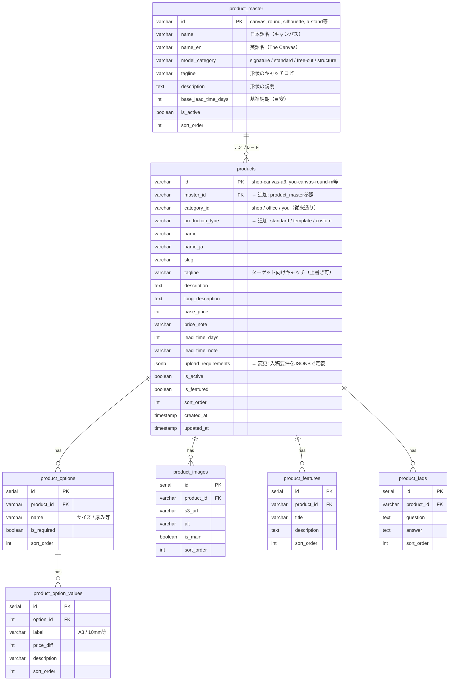

# Product Master 設計（シンプル版）

## コンセプト

```
product_master = 形状テンプレート（Canvas, Round等）+ モデル分類タグ
       ↓ 参照
products = 実際の販売商品（ターゲット・価格・説明は従来通り）
```

**既存設計をほぼ維持し、product_master を1テーブル追加するだけ。**

---

## ER図



---

## 変更点まとめ

| 項目 | 変更内容 |
|------|---------|
| **追加** | `product_master` テーブル |
| **追加** | `products.master_id` カラム |
| **追加** | `products.production_type` カラム |
| **変更** | `requires_upload` + `upload_type` + `upload_note` → `upload_requirements` (JSONB) に統合 |
| **維持** | 他のテーブルは全て既存のまま |

---

## upload_requirements 型定義

```typescript
// products.upload_requirements の型
type UploadRequirements = {
  inputs: UploadInput[]
} | null  // standard の場合は null

type UploadInput =
  | TextInput
  | UrlInput
  | DateInput
  | FileInput

type TextInput = {
  type: 'text'
  key: string           // フォームのキー（例: "groom_name"）
  label: string         // 表示ラベル（例: "新郎のお名前"）
  required: boolean
  placeholder?: string
  maxLength?: number
}

type UrlInput = {
  type: 'url'
  key: string
  label: string
  required: boolean
  placeholder?: string
}

type DateInput = {
  type: 'date'
  key: string
  label: string
  required: boolean
}

type FileInput = {
  type: 'file'
  key: string
  label: string
  required: boolean
  accept: string        // MIMEタイプ or 拡張子（例: "image/*", ".ai,.eps,.pdf"）
  maxSizeMB?: number
  note?: string         // 入稿時の注意書き
}
```

---

## 各テーブルの役割

### product_master（形状テンプレート）

| カラム | 用途 |
|--------|------|
| `model_category` | 形状分類タグ（signature/standard/free-cut/structure） |
| `base_lead_time_days` | 基準納期（目安） |

### products（実際の販売商品）

| カラム | 用途 |
|--------|------|
| `category_id` | ターゲット（shop/office/you） |
| `production_type` | 製作タイプ（standard/template/custom） |
| `upload_requirements` | 入稿要件（JSONB、standardはnull） |

**production_type の定義：**
| 値 | 意味 | 入稿 | 価格 |
|----|------|------|------|
| `standard` | 標準デザイン（固定） | なし | 安め |
| `template` | テンプレートカスタム | テキスト/URL入力 | 中間 |
| `custom` | フルカスタム | ファイル入稿 | 高め |

**入稿要否の判定ロジック：**
```typescript
const requiresUpload = product.production_type !== 'standard'
// または
const requiresUpload = product.upload_requirements !== null
```

---

## データ例

### product_master（形状のみ定義）

| id | name | model_category |
|----|------|----------------|
| canvas | キャンバス | signature |
| round | ラウンド | standard |
| arch | アーチ | standard |
| silhouette | シルエット | free-cut |
| typography | タイポグラフィ | free-cut |
| a-stand | Aスタンド | structure |

### products（同じ形状でも製作タイプが異なる）

| id | master_id | category_id | production_type | name_ja | upload_requirements |
|----|-----------|-------------|-----------------|---------|---------------------|
| you-canvas-art | canvas | you | standard | アートキャンバス | `null` |
| you-canvas-wedding | canvas | you | template | 結婚証明書キャンバス | 下記JSON参照 |
| you-canvas-photo | canvas | you | custom | フォトキャンバス | 下記JSON参照 |
| shop-a-stand-qr | a-stand | shop | template | QR Aスタンド | 下記JSON参照 |
| office-silhouette-logo | silhouette | office | custom | ロゴサイン | 下記JSON参照 |

### upload_requirements JSON例

```jsonc
// standard: アートキャンバス（入稿なし）
null

// template: 結婚証明書キャンバス
{
  "inputs": [
    { "type": "text", "key": "groom_name", "label": "新郎のお名前", "required": true, "placeholder": "例: 山田 太郎" },
    { "type": "text", "key": "bride_name", "label": "新婦のお名前", "required": true, "placeholder": "例: 鈴木 花子" },
    { "type": "date", "key": "wedding_date", "label": "挙式日", "required": true }
  ]
}

// template: QR Aスタンド
{
  "inputs": [
    { "type": "url", "key": "qr_url", "label": "QRコードのURL", "required": true, "placeholder": "https://..." }
  ]
}

// custom: フォトキャンバス
{
  "inputs": [
    {
      "type": "file",
      "key": "photo",
      "label": "写真",
      "required": true,
      "accept": "image/*",
      "maxSizeMB": 50,
      "note": "300dpi以上推奨。JPG/PNG形式。"
    }
  ]
}

// custom: ロゴサイン
{
  "inputs": [
    {
      "type": "file",
      "key": "logo",
      "label": "ロゴデータ",
      "required": true,
      "accept": ".ai,.eps,.pdf,.svg",
      "note": "ベクターデータ（AI/EPS/PDF/SVG）推奨。"
    }
  ]
}

// custom + template 混合: ロゴ + テキスト
{
  "inputs": [
    { "type": "file", "key": "logo", "label": "ロゴデータ", "required": true, "accept": ".ai,.eps,.pdf,.svg" },
    { "type": "text", "key": "company_name", "label": "会社名", "required": false, "placeholder": "ロゴ下に表示（任意）" }
  ]
}
```

---

## 使い方のイメージ

### 1. 管理画面での商品作成フロー

```
1. product_master を選択（Canvas, Round等）
2. ターゲット（category_id）を選択（shop/office/you）
3. 製作タイプ（production_type）を選択
4. production_type に応じて upload_requirements を設定
5. 価格・オプションを設定
```

### 2. フロントでの入稿フォーム生成

```typescript
// upload_requirements から動的にフォームを生成
function renderUploadForm(requirements: UploadRequirements) {
  if (!requirements) return null // standard

  return requirements.inputs.map(input => {
    switch (input.type) {
      case 'text': return <TextInput {...input} />
      case 'url': return <UrlInput {...input} />
      case 'date': return <DateInput {...input} />
      case 'file': return <FileInput {...input} />
    }
  })
}
```

### 3. フロントでの表示

```
/shop → category_id = "shop" の products を表示
/you  → category_id = "you" の products を表示

商品詳細では master_id を使って
「他のターゲット向け同形状商品」を関連表示することも可能
```

---

## メリット

1. **既存設計をほぼ維持** - 移行コストが低い
2. **柔軟性** - 入稿要件を商品ごとに自由に定義
3. **シンプル** - 3カラム → 1カラム（JSONB）に統合
4. **拡張性** - 新しい入力タイプ（select等）も追加しやすい

---

## 決定事項

### Q1: オプション（サイズ等）は master 側？ products 側？

**決定: products 側で個別管理**

- 各商品ごとに `product_options` を設定
- ターゲットや製作タイプによってオプションを自由に変えられる
- 管理の手間より柔軟性を優先

```
shop-canvas-menu:    A2/A3/A4（大きめ中心）
you-canvas-photo:    A3/A4/A5（小さめ中心）
you-canvas-wedding:  A4のみ（固定）
```

### Q2: standard の在庫管理は？

**決定: 在庫は持たない（都度製作）**

- standard もデザイン固定なだけで、都度製作
- stock カラムは不要
- 将来在庫品を扱う場合は再検討
