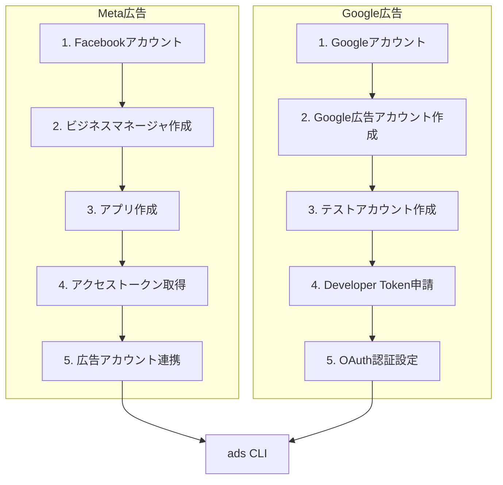
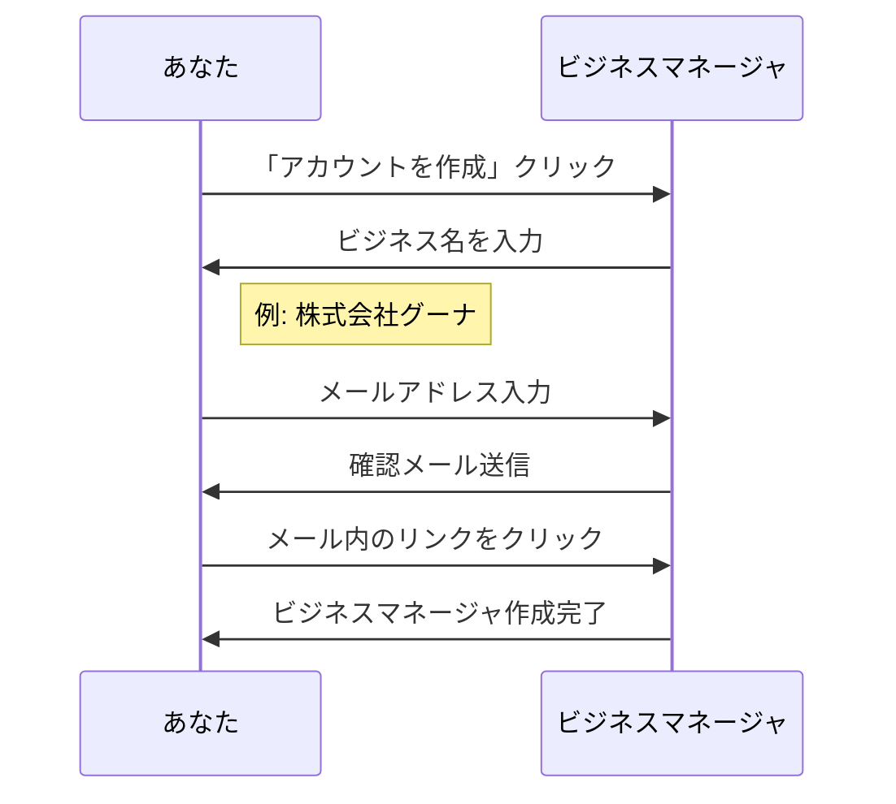
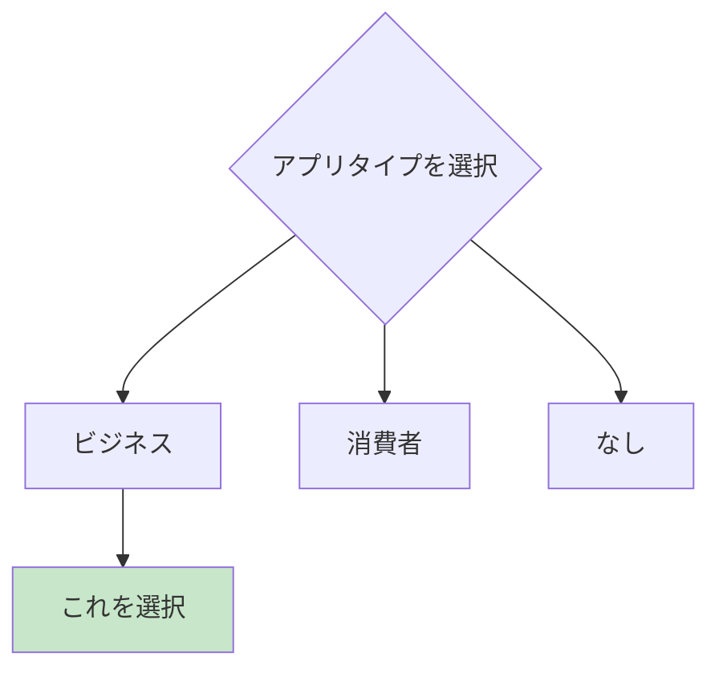
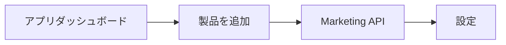
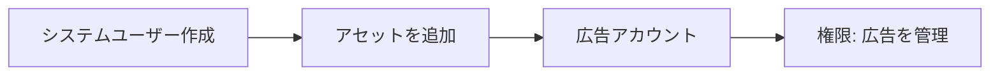
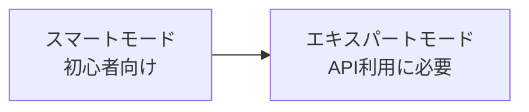
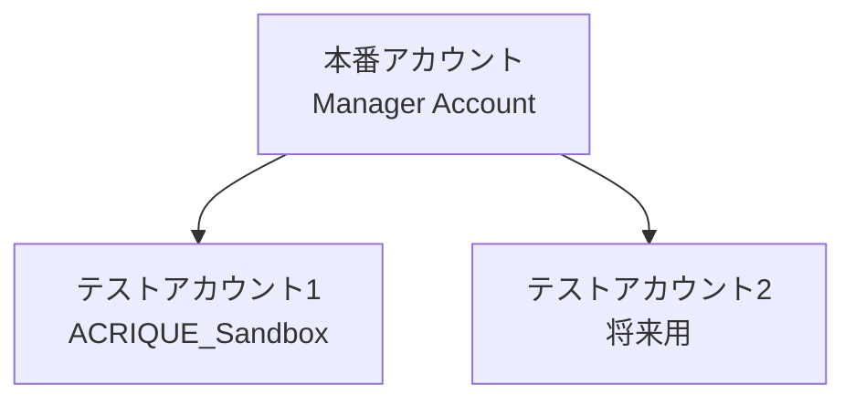
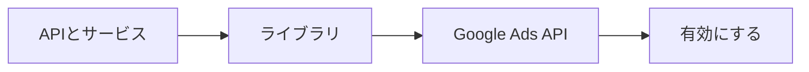
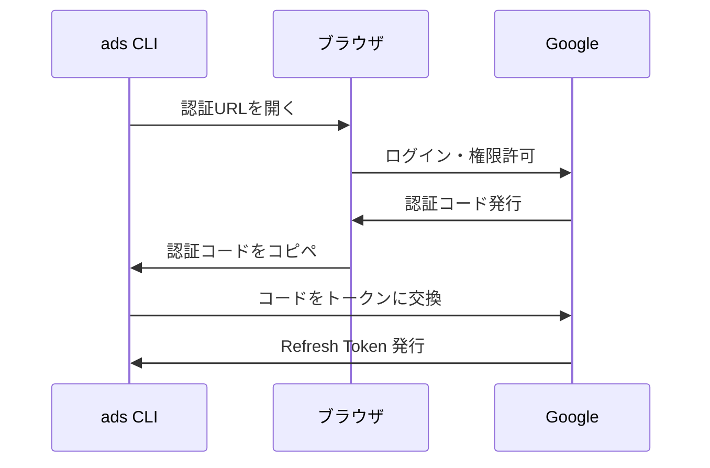

# API認証セットアップ

Meta広告・Google広告のAPI認証情報を取得する手順。

---

## 全体像



---

# Part 1: Meta広告 API認証

## Step 1: Facebookアカウント確認

個人のFacebookアカウントが必要です。なければ作成してください。

```
URL: https://www.facebook.com/
```

---

## Step 2: ビジネスマネージャ作成

```
URL: https://business.facebook.com/
```



### 入力項目

| 項目 | 入力例 |
|------|--------|
| ビジネス名 | 株式会社グーナ |
| あなたの名前 | 山下翔太 |
| 仕事用メールアドレス | ads@ghoona.co.jp |

---

## Step 3: Metaアプリ作成

### 3-1. Meta for Developers にアクセス

```
URL: https://developers.facebook.com/
```

1. 右上の「マイアプリ」をクリック
2. 「アプリを作成」をクリック

### 3-2. アプリタイプ選択



| 選択肢 | 説明 |
|--------|------|
| **ビジネス** | Marketing API を使う場合 ← **これ** |
| 消費者 | 一般ユーザー向けアプリ |
| なし | テスト用 |

### 3-3. アプリ詳細入力

| 項目 | 入力例 |
|------|--------|
| アプリ名 | ACRIQUE Ads CLI |
| アプリの連絡先メール | ads@ghoona.co.jp |
| ビジネスアカウント | Step 2で作成したもの |

### 3-4. Marketing API を追加

アプリ作成後、ダッシュボードで：

1. 「アプリに製品を追加」セクションを探す
2. 「Marketing API」の「設定」をクリック



---

## Step 4: アクセストークン取得

### 4-1. システムユーザー作成

```
URL: https://business.facebook.com/settings/system-users
```

1. ビジネスマネージャ → 設定 → システムユーザー
2. 「追加」をクリック
3. 名前を入力（例: `acrique-ads-bot`）
4. 役割: **管理者** を選択



### 4-2. アセット（広告アカウント）を割り当て

1. 作成したシステムユーザーをクリック
2. 「アセットを追加」→「広告アカウント」
3. 広告アカウントを選択し、「広告を管理」権限を付与

### 4-3. トークン生成

1. システムユーザーの「トークンを生成」をクリック
2. アプリを選択（Step 3で作成したもの）
3. 必要な権限を選択：

| 権限 | 用途 |
|------|------|
| `ads_management` | 広告の作成・編集・削除 |
| `ads_read` | 広告の読み取り |
| `business_management` | ビジネス設定の管理 |

4. 「トークンを生成」をクリック

### 4-4. トークンを保存

```
⚠️ 重要: トークンは一度しか表示されません！必ずコピーして安全な場所に保存してください
```

```yaml
# environments/sandbox.yaml に後で設定
meta:
  app_id: "123456789012345"
  app_secret: "abcdef1234567890abcdef1234567890"
  access_token: "EAAG..."  # ← このトークン
  ad_account_id: "act_123456789"
```

---

## Step 5: 広告アカウントID確認

### サンドボックス（テスト）広告アカウント

```
URL: https://business.facebook.com/settings/ad-accounts
```

1. ビジネスマネージャ → 設定 → 広告アカウント
2. 「追加」→「新しい広告アカウントを作成」

| 項目 | 入力例 |
|------|--------|
| 広告アカウント名 | ACRIQUE_Sandbox |
| タイムゾーン | 日本時間 |
| 通貨 | JPY |

### 広告アカウントIDの確認

広告アカウント一覧で、IDを確認します。
形式: `act_123456789012345`

---

## Meta広告 認証情報まとめ

最終的に必要な情報：

| 項目 | 取得場所 | 例 |
|------|---------|-----|
| App ID | アプリ → 設定 → ベーシック | `123456789012345` |
| App Secret | アプリ → 設定 → ベーシック | `abcdef1234...` |
| Access Token | システムユーザー → トークン生成 | `EAAG...` |
| Ad Account ID | ビジネスマネージャ → 広告アカウント | `act_123456789` |

---

# Part 2: Google広告 API認証

## Step 1: Googleアカウント確認

Googleアカウントが必要です。なければ作成してください。

---

## Step 2: Google広告アカウント作成

```
URL: https://ads.google.com/
```

1. 「今すぐ開始」をクリック
2. 初回セットアップをスキップ or 完了

### エキスパートモードに切り替え



1. 右上の「ツールと設定」→「エキスパートモードに切り替える」

---

## Step 3: テストアカウント作成

### 3-1. 管理画面からテストアカウント作成

```
URL: https://ads.google.com/aw/accountaccess/testaccounts
```

または

1. ツールと設定 → 設定 → テストアカウント
2. 「テストアカウントを作成」



### 3-2. テストアカウントの特徴

| 項目 | 本番アカウント | テストアカウント |
|------|--------------|----------------|
| 広告配信 | される | **されない** |
| 課金 | される | **されない** |
| API操作 | 可能 | **可能** |
| データ | 本物 | ダミー |

---

## Step 4: Developer Token 申請

### 4-1. Google Ads API センターにアクセス

```
ツールと設定 → 設定 → API センター
```

### 4-2. Developer Token を確認

| トークンレベル | 説明 | 用途 |
|--------------|------|------|
| テストアカウント用 | 即時発行 | **サンドボックス用（これ）** |
| ベーシック | 審査必要 | 本番用（後で申請） |
| 標準 | 審査必要 | 大規模運用 |

```
⚠️ テストアカウント用のDeveloper Tokenは即時発行されます
⚠️ 本番用は審査に数日〜数週間かかります
```

### 4-3. Developer Token を保存

形式: `ABCdEfGhIjKlMnOp-1234567`

---

## Step 5: OAuth 認証設定

### 5-1. Google Cloud Console にアクセス

```
URL: https://console.cloud.google.com/
```

### 5-2. プロジェクト作成

1. 上部の「プロジェクトを選択」→「新しいプロジェクト」
2. プロジェクト名: `acrique-ads-cli`
3. 「作成」をクリック

### 5-3. Google Ads API を有効化



1. 左メニュー「APIとサービス」→「ライブラリ」
2. 「Google Ads API」を検索
3. 「有効にする」をクリック

### 5-4. OAuth 同意画面設定

1. 「APIとサービス」→「OAuth 同意画面」
2. User Type: **外部** を選択（内部はGoogle Workspace用）
3. アプリ情報を入力：

| 項目 | 入力例 |
|------|--------|
| アプリ名 | ACRIQUE Ads CLI |
| ユーザーサポートメール | ads@ghoona.co.jp |
| デベロッパーの連絡先 | ads@ghoona.co.jp |

4. スコープ追加は不要（後で設定）
5. テストユーザーに自分のGmailを追加

### 5-5. OAuth クライアントID作成

1. 「APIとサービス」→「認証情報」
2. 「認証情報を作成」→「OAuthクライアントID」
3. アプリケーションの種類: **デスクトップアプリ**
4. 名前: `acrique-ads-cli`
5. 「作成」をクリック

### 5-6. クライアントIDとシークレットを保存

```
⚠️ 表示されたClient IDとClient Secretを必ず保存してください
```

JSONをダウンロードすることも可能です。

---

## Step 6: Refresh Token 取得

### 6-1. OAuth 認証フロー



### 6-2. google-ads-python の認証ヘルパーを使う

後で実装するCLIで以下のコマンドを実行：

```bash
# 認証フローを実行
docker compose run ads auth google
```

または、Google公式の認証スクリプト：

```bash
pip install google-ads
python -c "from google_ads.client import GoogleAdsClient; GoogleAdsClient.load_from_storage()"
```

初回実行時にブラウザが開き、認証後に `refresh_token` が取得できます。

---

## Google広告 認証情報まとめ

最終的に必要な情報：

| 項目 | 取得場所 | 例 |
|------|---------|-----|
| Developer Token | Google広告 → API センター | `ABCdEfGhI...` |
| Client ID | Google Cloud → 認証情報 | `123456789.apps.googleusercontent.com` |
| Client Secret | Google Cloud → 認証情報 | `GOCSPX-...` |
| Refresh Token | OAuth認証フロー | `1//0abc...` |
| Customer ID | Google広告アカウント | `123-456-7890` |
| Login Customer ID | 管理者アカウントID（MCC使用時） | `123-456-7890` |

---

# Part 3: 認証情報の管理

## environments/sandbox.yaml の形式

```yaml
# Meta広告
meta:
  app_id: "123456789012345"
  app_secret: "abcdef1234567890abcdef1234567890"
  access_token: "EAAG..."
  ad_account_id: "act_123456789"

# Google広告
google:
  developer_token: "ABCdEfGhIjKlMnOp-1234567"
  client_id: "123456789.apps.googleusercontent.com"
  client_secret: "GOCSPX-..."
  refresh_token: "1//0abc..."
  customer_id: "1234567890"  # ハイフンなし
  login_customer_id: "1234567890"  # MCC使用時
```

## セキュリティ注意事項

```
⚠️ 重要: 認証情報は絶対にGitにコミットしないこと！
```

### .gitignore に追加

```gitignore
# 広告CLI認証情報
ads/environments/*.yaml
!ads/environments/*.example.yaml
```

### 環境変数での管理（推奨）

本番環境では環境変数を使用：

```bash
export META_APP_ID="123456789012345"
export META_APP_SECRET="abcdef..."
export META_ACCESS_TOKEN="EAAG..."
export GOOGLE_DEVELOPER_TOKEN="ABCd..."
# ...
```

---

# チェックリスト

## Meta広告

- [ ] Facebookアカウント作成済み
- [ ] ビジネスマネージャ作成済み
- [ ] Metaアプリ作成済み
- [ ] Marketing API 追加済み
- [ ] システムユーザー作成済み
- [ ] アクセストークン取得済み
- [ ] 広告アカウント（サンドボックス）作成済み
- [ ] 広告アカウントID確認済み

## Google広告

- [ ] Googleアカウント作成済み
- [ ] Google広告アカウント作成済み
- [ ] エキスパートモード切り替え済み
- [ ] テストアカウント作成済み
- [ ] Developer Token 取得済み
- [ ] Google Cloud プロジェクト作成済み
- [ ] Google Ads API 有効化済み
- [ ] OAuth 同意画面設定済み
- [ ] OAuth クライアントID作成済み
- [ ] Refresh Token 取得済み

---

# 次のステップ

認証情報が揃ったら、ads CLI の実装に進みます。

1. `ads/` ディレクトリ構造の作成
2. Docker環境のセットアップ
3. 認証テスト（各プラットフォームへの接続確認）
